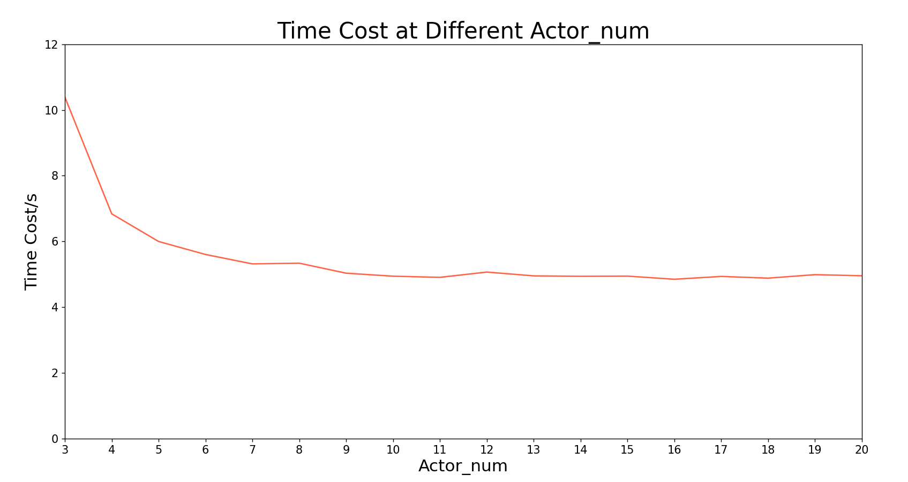
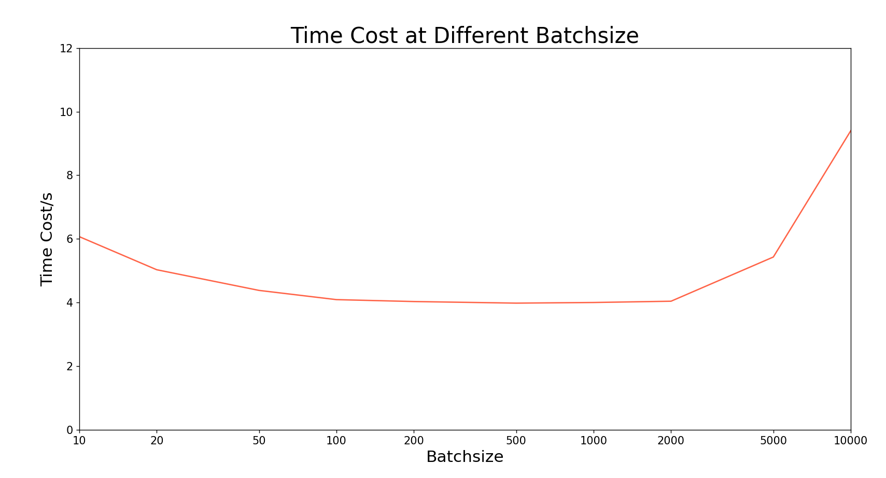
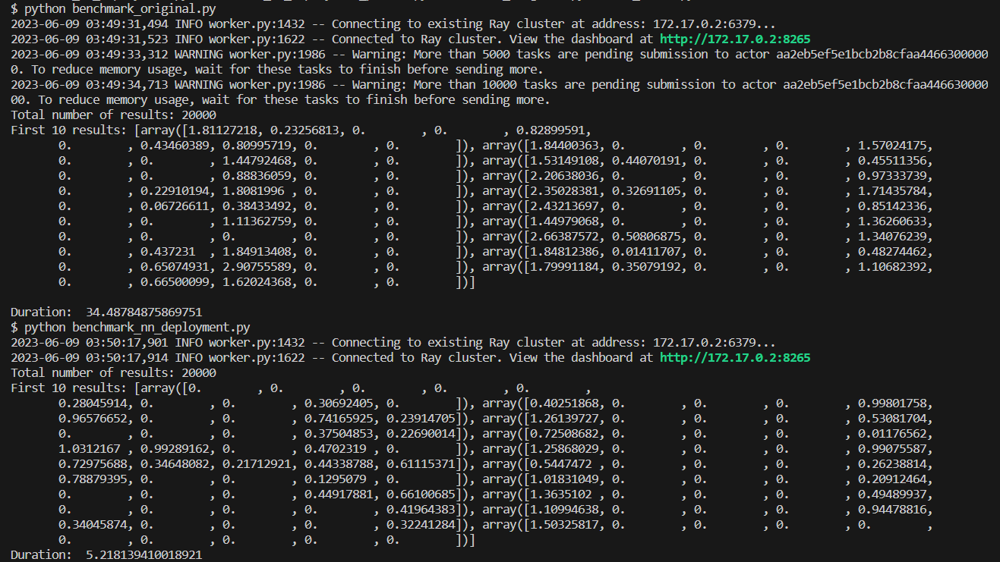

# 性能测试与分析

## 测试所用benchmark任务
随着深度学习近年来的繁荣发展，神经网络训练及部署已经成为当前Ray等分布式计算系统最重要的应用场景之一。因此，此次实验中我们选择了神经网络部署的场景，来编写测试程序。

我们的测试场景如下：假定我们有一个输入大小为784，输出大小为10，中间两隐含层大小为500与300的全连接层神经网络（约55万参数），其参数已经训练完毕，即将部署到生产场景中。我们将其部署到Ray上，用以处理一批总量为20000的输入数据，得到20000个长度为10的神经网络输出向量。

我们选择的任务可用代码描述如下（以下代码经过简化）：

```python
ray.init(dashboard_host="0.0.0.0")

size=[784,500,300,10]
nn=NN.remote(size) #NN为一神经网络类

# Launch four parallel square tasks.
futures = [nn.forward.remote(np.random.random(784)) for _ in range(20000)]

# Retrieve results.
print("Total number of results:",len(ray.get(futures)))
print("First 10 results:", ray.get(futures)[0:10])
```

运行结果如下：


我们将此程序作为Ray的测试样例，基于此进行部署、优化、测试。

（官网上有不少测试样例，同样可用于测试，有需要者可访问：https://docs.ray.io/en/latest/ray-air/benchmarks.html）


## 测试性能指标

- 资源使用率（如CPU、内存、GPU使用率）
- 吞吐率（单位时间处理的任务数）
- 单任务响应时间（每个任务从提交到完成的平均时间）
- 任务运行时调用的Actor数量（反映并行性）
- I/O与网络负载（I/O与网络的吞吐率大小）
- 任务执行成功率（没有特殊情况应该保证绝对地为100%）

由于吞吐率是分布式计算框架最重要的性能指标之一，我们将毫无疑问地选择它作为测试指标。同时，资源使用率是评价Ray硬件调度有效性的重要指标，而由于本任务为CPU密集型（未在GPU上计算），其它硬件负载较小，运行任务时较平时利用率无明显变化，我们将选择CPU利用率作为性能指标。CPU利用率高，说明CPU闲置率小，被更有效地调度以完成计算任务。综上所述，我们选择的性能测试指标为吞吐率和CPU使用率。

吞吐率计算方式为：运行大量任务，得到运行时间，再将任务数除以运行时间得到吞吐率，重复5次求平均。CPU利用率计算方式为：运行大量任务，使Ray稳定运行一段时间（约2分钟），用Grafana获取明显处在稳定运行期间（图像的平台区）的多个CPU利用率数据点（两数据点间间隔15秒），对它们求平均。

单机测试所用电脑为CPU16核，内存16GB。多机测试加上了一台CPU24核，内存32GB的电脑。

## 性能测试结果与分析

### 单机部署

对优化前的程序进行测试，任务参数为：任务量20000，未分组，测得吞吐率如下：

| 组别  | 用时/s | 吞吐率/任务数每秒 |
| :---: | :----: | :---------------: |
|   1   | 35.64  |       561.2       |
|   2   | 35.44  |       564.3       |
|   3   | 34.77  |       575.2       |
|   4   | 35.36  |       565.6       |
|   5   | 34.02  |       587.9       |
| 平均  | 35.05  |       570.8       |

为测得CPU使用率，我们应加大任务量至80000，以使Ray稳定运行一段时间（约2分钟），获得稳定的CPU使用率数据。

测得有效数据点如下：


其图像如下：


则CPU使用率平均为13.6%。


### 单机优化

我们注意到，一个类只能启动一个Actor，所以我们为神经网络类套了一层壳，写成一个新的类Actor。这样，我们可以同时启动多个Actor，并行运算，大幅提高性能，这些Actor使用同样的神经网络及参数。

同时，我们可以将多个任务并为一组提交，这样提交到Ray的Tasks数量就不会过多，省去大量Tasks的包装成本。

我们以20000任务量，每组10个任务，由10个Actor分摊作为默认配置（以与分布式部署进行对比），测试得到如下结果：

| 组别  | 用时/s | 吞吐率/任务数每秒 |
| :---: | :----: | :---------------: |
|   1   |  6.12  |      3268.0       |
|   2   |  6.22  |      3215.4       |
|   3   |  6.18  |      3236.2       |
|   4   |  6.10  |      3278.7       |
|   5   |  6.19  |      3231.0       |
| 平均  |  6.16  |      3245.9       |

为测得CPU使用率，我们应加大任务量至500000，以使Ray稳定运行一段时间（约2分钟），获得稳定的CPU使用率数据。

测得有效数据点如下：


其图像如下：


则CPU使用率平均为79.0%，维持在一个较高的水平。

我们再接着寻找最优配置。默认配置下，调节Actor数得到如下结果：



则我们当前的Actor数已是最优，无需调整。

接着，调节每组任务数得到如下结果：



则我们可以将每组任务数设为500。

我们将配置设为20000任务量，每组500个任务，由10个Actor分摊，以此测定最优配置下的性能。

| 组别  | 用时/s | 吞吐率/任务数每秒 |
| :---: | :----: | :---------------: |
|   1   |  5.11  |      3913.9       |
|   2   |  5.13  |      3898.6       |
|   3   |  5.15  |      3883.5       |
|   4   |  5.06  |      3952.6       |
|   5   |  5.09  |      3929.3       |
| 平均  |  5.11  |      3915.6       |

用同样方法测量CPU使用率，测得有效数据点如下：


其图像如下：


则CPU使用率为70.8%。注意，由于每组任务数变大，提交的每组输入也相应变大，故内存与对象存储空间的使用率大幅增加。（`ray.put`提交的对象使用对象存储空间存储）

由此，我们可以发现，我们的优化措施可以使得其性能变为原来的近7倍：

|                   | 优化前 | 优化后默认配置  |  优化后最优配置   |
| :---------------: | :----: | :-------------: | :---------------: |
| 吞吐率/任务数每秒 | 570.8  |  3245.9(+469%)  | **3915.6(+586%)** |
|    CPU使用率/%    |  13.6  | **79.0(+481%)** |    70.8(+421%)    |

截图证明如下：




### 分布式部署

我们以20000任务量，每组10个任务，由10个Actor分摊的默认配置进行测试（函数参数规模过大时，会导致Ray报错，无法正常运行，故此处只能设为每组10个任务）

| 组别  | 用时/s | 吞吐率/任务数每秒 |
| :---: | :----: | :---------------: |
|   1   |  9.62  |      2079.0       |
|   2   | 11.06  |      1808.3       |
|   3   | 13.15  |      1520.9       |
|   4   |  8.68  |      2304.1       |
|   5   |  9.61  |      2081.2       |
| 平均  | 10.42  |      1958.7       |

可以看到，分布式条件下，性能的波动明显变大。

我们注意到，默认配置下吞吐率甚至不如此次连接所用任意一台单机的吞吐率（第二台机器性能见附录）！

在第一台机器吞吐率为3245.9，第二台机器吞吐率为19754.2，且Actor基本均分给两台机器的情况下，分布式部署的吞吐率仅为两台单机吞吐率之和的8.5%！即使加大任务量和Actor数后，吞吐率也未能超过单机。

我们可以看到，在运行分布式任务时，网络负载已经达到了5MB/s以上，故此任务在分布式运行时的性能瓶颈可能来源于网络，其性能低于单机性能的主要原因也可能在此。


为测得集群的CPU使用率，我们应加大任务量至250000，以使Ray稳定运行一段时间（约2分钟），获得稳定的CPU使用率数据。
测得有效数据点如下：


其图像如下：


则整个集群的CPU使用率平均为31.0%。

## 附：第二台机器单机测试结果
由于第二台机器性能过高，20000的任务量可以在1.4s内跑完，故此处改用250000的任务量，其余配置仍为默认配置（每组10个任务，由10个Actor分摊）
| 组别  | 用时/s | 吞吐率/任务数每秒 |
| :---: | :----: | :---------------: |
|   1   | 11.97  |      20885.5      |
|   2   | 13.18  |      18968.1      |
|   3   | 13.02  |      19201.2      |
|   4   | 12.16  |      20559.2      |
|   5   | 13.05  |      19157.1      |
| 平均  | 12.68  |      19754.2      |

## 附：测试所用benchmark代码（优化后）
```python
import ray
import numpy as np
import time
import sys
import copy

def relu(x):
    if x > 0:
        return x
    else:
        return 0.0


class NN:  # neural network
    def __init__(self, size):
        # 搭建神经网络
        self.weight = []  # 神经网络权重
        # self.sum_adjust_weight=[]#神经网络反向传播中对权重求导所得导数
        # self.layer=[]#神经网络输入层、各隐含层和输出层
        self.bias = []  # 神经网络各层偏置
        # self.sum_adjust_bias=[]#神经网络反向传播中对偏置求导所得导数
        self.size = size  # 神经网络各层神经元数量

        self.total_loss = 0.0  # 用来计算神经网络损失函数
        # self.total_correct=0
        for i in range(len(size)):
            # self.layer.append(np.zeros(size[i],dtype=np.float16))
            self.bias.append(np.zeros(size[i], dtype=np.float16))
        for i in range(len(size) - 1):
            self.weight.append(
                np.random.normal(
                    0, 2.0 / np.sqrt(size[i] + size[i + 1]), size=(size[i], size[i + 1])
                )
            )  # Xavier初始化
    def set_weight_and_bias(self, weight, bias): #复制神经网络参数，请保证神经网络架构不变
        self.weight=weight
        self.bias=bias

    def get_weight_and_bias(self): #获取神经网络参数
        return self.weight, self.bias

    def forward(self, layer_inputs):  # 由输入求神经网络输出结果
        result = []
        for layer_input in layer_inputs:
            x = np.array(layer_input)
            for i in range(1, len(size)):
                x = x @ self.weight[i - 1]
                for j in range(len(x)):
                    x[j] = relu(x[j] + self.bias[i][j])
            result.append(x)

        return result

size = [784, 500, 300, 10]
nn = NN(size)

@ray.remote
class Actor:
    def __init__(self):
        self.nn=nn
    
    def forward(self, layer_inputs):
        return self.nn.forward(layer_inputs)


if __name__ == "__main__":
    ray.init(address='auto', dashboard_host="0.0.0.0")

    if len(sys.argv) < 2:
        task_num = 20000
    else:
        task_num = int(sys.argv[1])

    if len(sys.argv) < 3:
        batch_size = 10 #表示每批任务的task数
    else:
        batch_size = int(sys.argv[2])

    start = time.time()

    actor_num=10
    nn_actor=[Actor.remote() for _ in range(actor_num)]


    # Launch four parallel square tasks.
    #batch_size必须被task_num整除
    futures = []
    for i in range(task_num // batch_size):
        nn_input=[np.random.random(784) for _ in range(int(batch_size))]
        #nn_input_ref=ray.put(nn_input)
        futures.append(
            nn_actor[i % actor_num].forward.remote(nn_input)
        )

    # Retrieve results.
    results = ray.get(futures)
    print("Total number of results:", sum([len(result) for result in results]))
    print("First 10 results:", results[0][0:10])

    print("Duration: ", time.time() - start)

```


