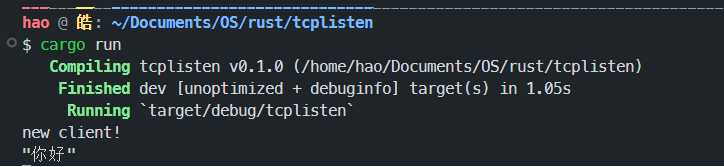

# 5-14 

## 尝试连接

进行SSH和TCP尝试，得到如下结果



接收者代码如下

```rust
use std::io::{prelude::*, BufReader};
use std::net::{TcpListener, TcpStream};

fn handle_client(mut stream: TcpStream) {
    loop {
        let buf_reader = BufReader::new(&mut stream);
        let line = match buf_reader.lines().next() {
            Some(Ok(line)) => line,
            _ => return,
        };
        println!("{:?}", line);
    }
}

fn main() -> std::io::Result<()> {
    let listener = TcpListener::bind("0.0.0.0:8081")?;
    for stream in listener.incoming() {
        match stream {
            Ok(stream) => {
                println!("new client!");
                handle_client(stream);
            }
            Err(e) => {
                println!("Error: {}", e);
            }
        }
    }
    Ok(())
}
```

发送者代码如下

```rust
use std::io::{Read, Write};
use std::net::{TcpStream};

fn main() -> std::io::Result<()> {
    let mut stream = TcpStream::connect("127.0.0.1:8080")?;
    stream.write_all(b"你好")?;
    Ok(())
}
```