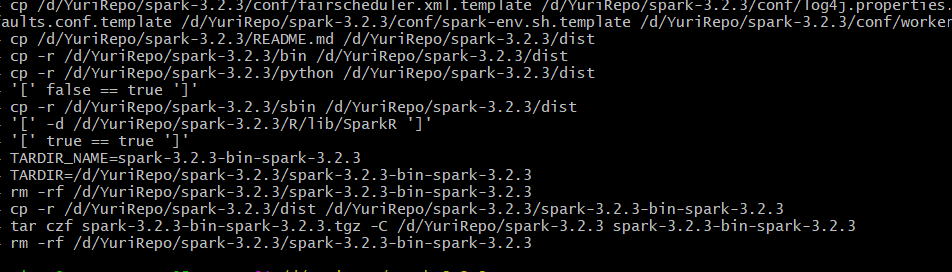

# Spark编译
源码下载:
https://spark.apache.org/downloads.html
注意:
1. Choose a Spark release:3.2.3(Nov 28,2022)
这里是3.2版本，之所以不选择3.3是因为3.3兼容性不好，各种支持，版本配置有许多问题，比如不适合Intelij
2. Choose a package type:Source Code
既然要魔改，自然是要用源码来编程
3. Download Spark:spark-3.2.3.tgz
下载在windows本地就行，编译是在windows上，运行考虑在linux上进行.
4. 安装InteliJ,有学生版免费，直接下ultimate,不用扣扣索索用社区版
5. 需要配置java 1.8.0,直接在IDEA里面自助下载环境就行,scala支持在插件里面下载,sbt那些不要管,maven命令会自己给你下好，scala要用最新的.

官方编译文档:
https://spark.apache.org/docs/latest/building-spark.html#building-a-runnable-distribution

[^1]Spark参考教程
请先按这个参考教程配置POM,否则编译必错无疑，其中最为可恶的就是Failed to execute goal net.alchim31.maven:scala-maven-plugin

[^2]net.alchim31.maven报错
不要按这个参考教程来，你乱插dependency没用，而且语法也不对，这里主要是要在pom.xml里找net.alchim31.maven这个字段，只有三个条目，找到有version的地方，改成3.2.2即可.

编译命令:
在Spark源码根目录下打开GitBash

> ./build/mvn -Phadoop-3.2 -Pyarn -Dhadoop.version=3.2.2 -Phive -Phive-thriftserver -DskipTests clean package

此处需要20min，这个命令会自动将各种依赖包安装好，所以会占网络资源，需要在maven的settings里面配置阿里云镜像，参照[^3].

>./dev/make-distribution.sh \
--name spark-3.2.3 \
--tgz -Phive \
-Phive-thriftserver \
-Pyarn -Phadoop-3.2 \
-Dhadoop.version=3.2.2 \
-Dscala.version=2.12.14

此处需要15min

成功会在目录下产生spark-3.2.3-bin-spark-3.2.3.tgz，解压文件的目录下面就是编译成功的结果.

[^1]: https://blog.csdn.net/liweihope/article/details/122863127?ops_request_misc=%257B%2522request%255Fid%2522%253A%2522168126273516800182150439%2522%252C%2522scm%2522%253A%252220140713.130102334.pc%255Fall.%2522%257D&request_id=168126273516800182150439&biz_id=0&utm_medium=distribute.pc_search_result.none-task-blog-2~all~first_rank_ecpm_v1~times_rank-8-122863127-null-null.142^v82^insert_down1,201^v4^add_ask,239^v2^insert_chatgpt&utm_term=spark%E6%BA%90%E7%A0%81%E4%BF%AE%E6%94%B9%E9%A1%B9%E7%9B%AE&spm=1018.2226.3001.4187

[^2]:https://www.cnblogs.com/war3blog/p/7864804.html

[^3]:https://blog.csdn.net/ITzhangminpeng/article/details/79936598?ops_request_misc=%257B%2522request%255Fid%2522%253A%2522168126114516800226566956%2522%252C%2522scm%2522%253A%252220140713.130102334..%2522%257D&request_id=168126114516800226566956&biz_id=0&utm_medium=distribute.pc_search_result.none-task-blog-2~all~sobaiduend~default-1-79936598-null-null.142^v82^insert_down1,201^v4^add_ask,239^v2^insert_chatgpt&utm_term=maven%E4%BF%AE%E6%94%B9%E9%98%BF%E9%87%8C%E4%BA%91%E9%95%9C%E5%83%8F&spm=1018.2226.3001.4187