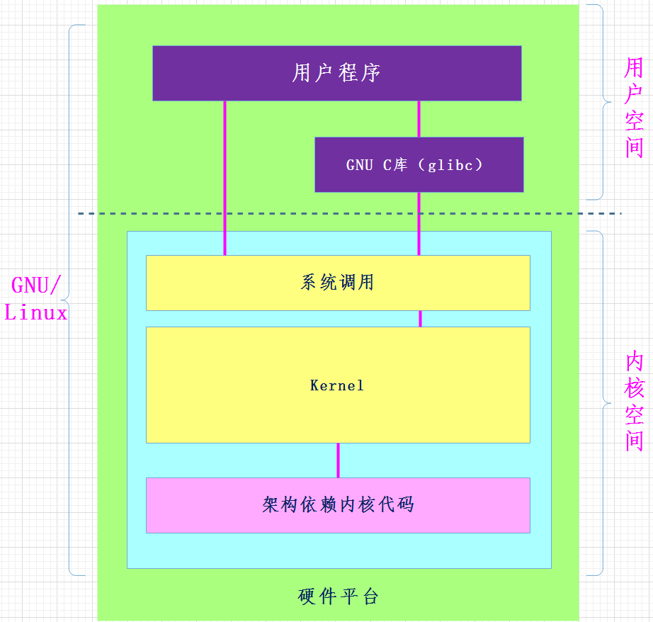

## 什么是POSIX
- 概念：POSIX:POSIX：可移植操作系统接口（Portable Operating System Interface of UNIX，缩写为 POSIX ）
- Linux下对文件操作有两种方式：系统调用（system call）和库函数调用（Library functions）。
- 1. 系统调用
系统调用是通向操作系统本身的接口，是面向底层硬件的。通过系统调用，可以使得用户态运行的进程与硬件设备(如CPU、磁盘、打印机等)进行交互，是操作系统留给应用程序的一个接口。

- 2. 库函数
库函数（Library function）是把函数放到库里，供别人使用的一种方式。

        方法是把一些常用到的函数编完放到一个文件里，供不同的人进行调用。一般放在.lib文件中。

        库函数调用则是面向应用开发的，库函数可分为两类，

        一类是C语言标准规定的库函数，
        一类是编译器特定的库函数。

POSIX兼容也就指定这些接口函数兼容，但是并不管API具体如何实现。

(1) 库函数是语言或应用程序的一部分，而系统调用是内核提供给应用程序的接口，属于系统的一部分

(2) 库函数在用户地址空间执行，系统调用是在内核地址空间执行，库函数运行时间属于用户时间，系统调用属于系统时间，库函数开销较小，系统调用开销较大

(3) 系统调用依赖于平台，库函数并不依赖

