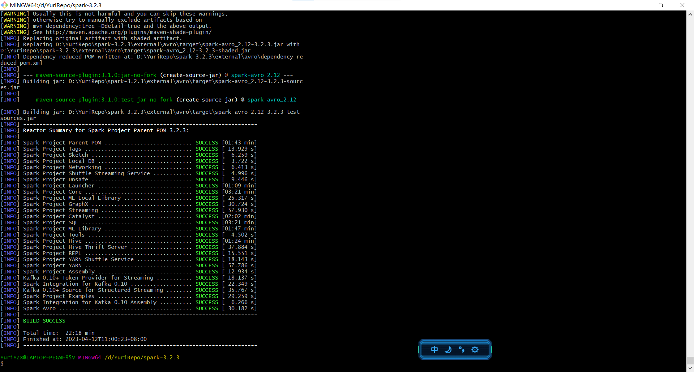
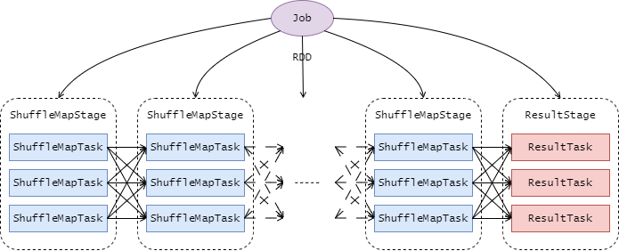
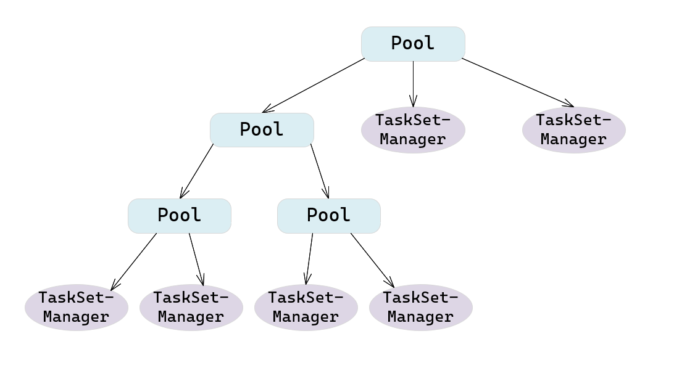
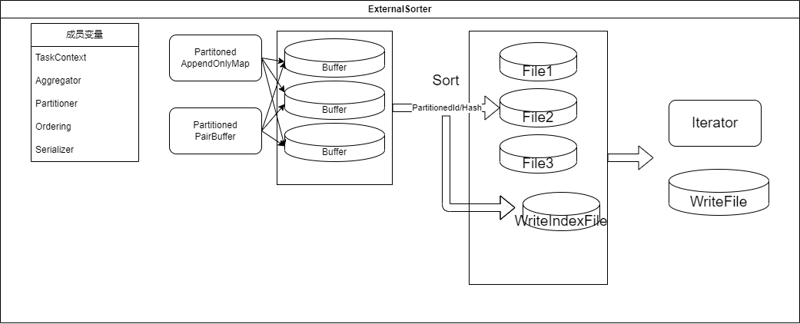
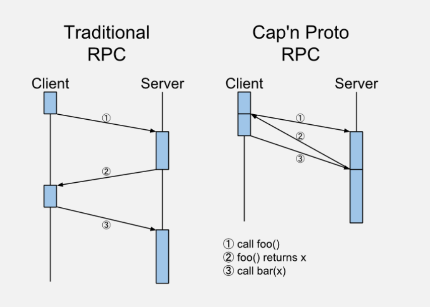

# 可行性报告 <!-- omit in toc -->

- [引言](#引言)
- [理论依据](#理论依据)
  - [可行方案](#可行方案)
    - [源码基础上对Spark性能瓶颈的Rust重写](#源码基础上对spark性能瓶颈的rust重写)
    - [基于不完善的Rust版Spark开源项目vega的实现](#基于不完善的rust版spark开源项目vega的实现)
  - [Spark build](#spark-build)
    - [Maven--用于Java项目的构建自动化工具](#maven--用于java项目的构建自动化工具)
  - [调度](#调度)
    - [DAG调度的过程](#dag调度的过程)
    - [调度算法](#调度算法)
    - [调度任务类](#调度任务类)
    - [调度部分可以改进的内容](#调度部分可以改进的内容)
    - [向调度部分添加内容时的注意事项](#向调度部分添加内容时的注意事项)
  - [ShuffleManager](#shufflemanager)
    - [ShuffleManager架构](#shufflemanager架构)
    - [可改进的点](#可改进的点)
  - [计算引擎核心类](#计算引擎核心类)
    - [ExternalSorter](#externalsorter)
    - [AppendOnlyMap/ExternalAppendOnlyMap](#appendonlymapexternalappendonlymap)
  - [Spark Streaming](#spark-streaming)
    - [架构](#架构)
    - [源码分析](#源码分析)
    - [可改进的内容](#可改进的内容)
- [技术依据](#技术依据)
  - [JNI交互](#jni交互)
    - [Rust调用Scala](#rust调用scala)
    - [Scala调用Rust](#scala调用rust)
  - [Cap'n Proto](#capn-proto)
    - [优势](#优势)
- [创新点](#创新点)
- [概要设计报告](#概要设计报告)
- [进度管理](#进度管理)

## 小组成员 <!-- omit in toc -->

闫泽轩 李牧龙 罗浩铭 汤皓宇 徐航宇

## 引言

本报告

## 理论依据

### 可行方案

为了实现对Spark瓶颈的优化，我们经过调研，找到了两条可行的路线，分别为直接在Apache Spark源码基础上进行重写，以及基于一个不完善的开源项目进行修改。

#### 源码基础上对Spark性能瓶颈的Rust重写

在源代码上进行修改，考虑使用Rust重写其中的性能瓶颈模块，特别是内存密集型、CPU密集型的部分，同时保留源码的非关键部分，尤其是Spark中原生的丰富API，以此达到以小范围的修改达到较为显著的性能提升的效果。

在Spark的Scala源码与Rust代码间的交互是这一方案中需要特别关注的点，主要是由于scala基于JVM，与非JVM语言的Rust之间，有较大的交互困难。我们考虑使用Scala的JNI(Java Native Interface)与Rust进行交互，我们这里使用jni crate来实现两种语言间的交互。

优势：Spark文档比较详细，编译相对较为方便，且没有无法使用的风险。

缺陷：Spark代码庞杂，显然无法全部重写，只能考虑回调，但从Rust回调scala又极少有人进行尝试，需要自行探索。

#### 基于不完善的Rust版Spark开源项目vega的实现

由于Rust语言的诸多优点，用Rust重写Spark是一个非常有诱惑力的方案。此前，就已经有一个较为粗浅的基于Rust的Spark项目：vega（[Github仓库](https://github.com/rajasekarv/vega)）。这一项目完全使用Rust从零写起，构建完成了一个较为简单的Spark内核。不过，这一项目已经有两三年没有维护，项目里还有不少算法没有实现，特别是Spark后来的诸多优化更新，这些都可以是我们的改进空间。


### Spark build
#### Maven--用于Java项目的构建自动化工具

**Maven**是用于Java项目的构建自动化工具，而Spark使用Scala编写，Scala与Java共享JVM生态，因此Spark可以使用Maven进行构建和编译.
Maven解决了构建软件的两个方面:如何构建软件及其依赖关系。[^wiki](https://en.wikipedia.org/wiki/Apache_Maven)
- 普通管用Maven项目的目录具有以下目录条目

| 目录名称           | 目的                                                          |
| ------------------ | ------------------------------------------------------------- |
| 项目主页           | 包含 pom.xml 和所有子目录。                                   |
| src/main/java      | 包含项目的可交付结果 Java 源代码。                            |
| SRC/main/src       | 包含项目的可交付结果资源，例如属性文件。                      |
| src/test/java      | 包含项目的测试 Java 源代码（例如 JUnit 或 TestNG 测试用例）。 |
| src/test/resources | 包含测试所需的资源。                                          |

- Maven 常用命令
    - mvn clean: 清理
    - mvn compile: 编译主程序
    - mvn test-compile: 编译测试程序
    - mvn test: 执行测试
    - mvn package: 打包
    - mvn install: 安装
-   下载源码
    [SparkDownload](https://spark.apache.org/downloads.html)
    注意:
    1. Choose a Spark release:3.2.3(Nov 28,2022)
    2. Choose a package type:Source Code
    3. Download Spark:spark-3.2.3.tgz
-   构建命令
    > ./build/mvn -Phadoop-3.2 -Pyarn -Dhadoop.version=3.2.2 -Phive -Phive-thriftserver -DskipTests clean package
    


### 调度

在Spark里，与调度相关的程序位于`Spark-3.2.3/core/src/main/scala/org/apache/Spark/scheduler/`目录下。

#### DAG调度的过程

我们首先给出一个宏观的说法，其中的不同的名称会在后文进行解释。总的来说，调度由`DAGScheduler`控制，其通过RDD算子构建`DAG`，再基于RDD算子之间的依赖来切分所涉算子，最终得到一些`Stage`对象。每个`Stage`再基于`Partitioner`生成多个`Task`，每个`Stage`中的`Task`集合包装成一个`TaskSet`，生成一个`TaskSetManager`。这些`TaskSetManager`与其他的`Pool`被嵌套地放在`Pool`中，进行宏观的任务调度。[^Spark]



具体来说，`DAGScheduler`会为每个`Job`计算一个有向无环图，追踪哪些RDD和`Stage`输出可以被实现，找到运行最短的方式。之后，将`Stage`打包成`Taskset`提交给`TaskScheduler`。一个`TaskSet`中只包含可以在某个节点上独立运行的`Task`。

`Stage`根据RDD图上的shuffle边界分割而成。像`map()`和`filter()`这样的有着“窄”依赖的RDD操作，会被分到单个`Stage`中，但有着shuffle依赖的操作就需要被分到不同`Stage`上面。最终得到的每个`Stage`只与其他`Stage`有着依赖，而其内部的`Task`间不存在依赖，保证可以时运行。对这些任务进行的分割操作发生在`RDD.compute()`函数上。

除了产生`Stage`间的有向无环图，`DAGScheduler`还根据当前缓存状态决定在哪里运行哪个任务。之后其把任务交给低一级的`TaskScheduler`。在输出文件丢失时，它还要做错误处理，即重新提交之前的`Stage`。在`Stage`内部的错误会被交给`TaskScheduler`处理，在取消整个`Stage`之前会多次重试每一个Task。

为了从失败中恢复，相同的`Stage`可能需要运行多次.如果`TaskScheduler` 报告一个Task失败，因为来自前一个`Stage`的map输出文件已丢失，需要由`DAGScheduler`重新提交丢失的`Stage`. 这些通过CompletionEvent 伴随 FetchFailed, 或者ExecutorLost 事件被检测到. The `DAGScheduler` 会等待一定时间来看是否有其余的节点或 `Task` 也失败，然后为计算错误的`Task`所在的`Stage`重新提交。作为这一过程的一部分，我们还需要为旧的`Stage`重新创建`Stage`对象，这些`Stage`可能已经被清空。需要注意保证不同的任务正确地处在对应的`Stage`中。

此外，还有缓存追踪机制以及清空机制。`DAGScheduler`判断哪个RDD被缓存，记忆哪些shuffle map 的`Stage`已经产生输出文件以避免重新计算或重复运行shuffle的map阶段。当相关的`Task`结束时，`DAGScheduler`会清空`Stage`，以避免内存泄露。

与上有关的函数包括`sumbitJob`,`submitMapStage`,`submitStage`,`submitMissingTasks`,`submitWaitingChildStage`等。

#### 调度算法

在`SchedulingAlgorithm.scala`中描述，只有两种继承算法`FIFOSchedulingAlgorithm`和`FairSchedulingAlgorithm`，其中的方法`comparator`，返回`boolean`值，用于在调度时进行排序。

以下以`comparator(A,B)`为例.
- FIFO方法，先比较优先级，小的优先，如果同级，则比较提交时间(通过`StageID`判断，小的代表提交时间早)，早的优先。可以判断，`priority`越小，优先级越高。
- Fair方法，如果`A`满足`runningTasks`比`minShare`小，而`B`不满足，则先处理`A`，反之亦然。如果都满足，则比较`runningTasks/minShare`的比值，低的优先。如果都不满足，则比较`runningTasks/weight`的比值，低的优先。当这些比值相同时，比较`name`。总的来说，即资源使用率低的优先。

#### 调度任务类

`Job`类是提交给调度器的最高层的工作对象。当用户启动一个操作，比如`count()`时，一个`Job`会通过`submitJob`被提交。每个`Job`中间层的数据需要多个`Stage`的执行来得到。

`Stage`类是`Task`的集合，这些`Task`计算`Job`中间层的结果。每个`Task`在相同RDD的分割下计算相同的函数，因此有着相同的shuffle依赖。`Stage`在shuffle边界上被分开。有两种`Stage`：用于最终执行的`ResultStage`，直接计算一个Spark操作(如`count()`, `save()`)；以及中间层的`ShuffleMapStage`，其结果用于下一个`Stage`的输入。当多个任务共用相同的RDD时，`Stage`常被在这些任务间共享。因此`Stage`间遵循拓扑排序的来依次执行。每个`Stage`有一个成员`firstJobId`，标识首个提交该`Stage`的`Job`。当使用FIFO调度时，这允许先计算或在失败时更快恢复早期`Job`的`Stage`。如果失败，单个`Stage`可以被多次重新执行。在这种情况下，`Stage`对象会跟踪多个`StageInfo`对象，传递给监听器或web UI。最新的`StageInfo`对象可以通过`latestInfo`访问。

`Task`类，任务本身，包含了任务的一些信息，如`TaskId`，`index`，`attemptNumber`等。其由`executor`执行。每个`Task`会在单个机器上运行。

`TaskSet`类，任务集，是`Task`的集合。

`ShuffleMapTask`和`ResultTask`分别继承了`Task`类，对应之前的`ShuffleMapStage`和`ResultStage`。
- `ShuffleMapTask`是shuffle map任务，其`partitionId`是该任务所在的分区，`mapId`是该任务的map id，`mapIndex`是该任务的map index，`mapStatus`是该任务的map状态。
- `ResultTask`是结果任务，其`partitionId`是该任务所在的分区，`resultId`是该任务的结果id，`resultIndex`是该任务的结果index，`resultStatus`是该任务的结果状态。

`Schedulable`类，其中一些成员变量比较重要，列举如下：[^schedulable]
- `weight`，用于控制不同该类之间的权重，初始为1，而如果一个类有双倍的权重，则会获得双倍的资源。当设置很高的权重时，无论是否有活动，都会优先获得资源。
- `minShare`，用于控制最少分配的资源(比如CPU核数)，公平调度器倾向于满足所有活动类的最小要求。默认为0。
- `runningTasks`，当前在运行的任务数量。

`Pool`和`TaskSetManager`分别继承了`Schedulable`类。
- `TaskSetManager`是任务集管理器，其`Tasks`存放了任务
- `Pool`是调度池，其中存在`schedulableQueue`存放调度队列，这是一个嵌套结构，即调度池里可能同时存在子调度池和任务集管理器。举例如下图
调度池中的一些方法均是递归式的操作，如果是`Pool`类，则继续递归，如果是`TaskSetManager`则调用对应的操作方法

因此，我们有如下的过程：


#### 调度部分可以改进的内容

添加调度算法，如调研报告内提到的利用协程方法实现随时将当前在进行处理的批数据暂停，切换到需要低延迟的流数据上去，在处理完流数据之后，再切换回批数据，在保证了流数据的低延迟的同时兼顾批数据的处理。[^neptune]

#### 向调度部分添加内容时的注意事项

`DAGScheduler`源码中的注释提示如下：
 - 当有关的job结束之后，所有的数据结构应该被清空，以避免在长时间运行程序中的状态无限增加。
 - 添加新数据结构时，更新`DAGSchedulerSuite.assertDataStructuresEmpty`函数，这有助于找到内存泄露。


[^schedulable]: Apache. Job Scheduling. Apache Spark Documents. [EB/OL]. [2023-04-20]. https://Spark.apache.org/docs/latest/job-scheduling.html

[^100]:https://zhuanlan.zhihu.com/p/163067566

[^Spark]: IWBS. Spark. CSDN. [EB/OL]. [2023-04-20]. https://blog.csdn.net/asd491310/category_7797537.html

[^neptune]:Panagiotis Garefalakis, Konstantinos Karanasos, and Peter Pietzuch. 2019. Neptune: Scheduling Suspendable Tasks for Unified Stream/Batch Applications. In ACM Symposium on Cloud Computing (SoCC ’19), November 20–23, 2019, Santa Cruz, CA, USA. ACM, New York, NY, USA, 13 pages. https://doi.org/10.1145/3357223.3362724

### ShuffleManager

在Spark框架中，Shuffle阶段的设计优劣是决定性能好坏的关键因素之一。实现一个优良的ShuffleManager，减少不必要的Shuffle开销至关重要。

在MapReduce框架中，Shuffle阶段是连接Map和Reduce之间的桥梁，Map阶段通过Shuffle过程将数据输出到Reduce阶段中。由于Shuffle涉及十分密集的磁盘的读写和网络I／O，因此Shuffle性能的高低直接影响整个程序的性能。Spark本质上与MapReduce框架十分相似，因此也有自己的Shuffle过程实现。

#### ShuffleManager架构
在Driver和每个Executor的SparkEnv实例化过程中，都会创建一个ShuffleManager，用于管理块数据，提供集群块数据的读写，包括数据的本地读写和读取远程RDD结点的块数据。在RDD间存在宽依赖时，需要进行Shuffle操作，此时便需要将Spark作业（Job）划分成多个Stage，并在划分Stage的关键点———构建ShuffleDependency时———利用ShuffleManager进行Shuffle注册，获取后续数据读写所需的ShuffleHandle。

ShuffleManager中的shuffleBlockResolver是Shuffle的块解析器，该解析器为数据块的读写提供支撑层，便于抽象具体的实现细节。基于此，有宽依赖关系的RDD执行compute时就可以读取上一Stage为其输出的Shuffle数据，并将计算结果传入下一stage。[^spark_optimize]

#### 可改进的点
ShuffleManager在生成依赖关系及RDD获取依赖关系过程中所需的计算使用频繁，可以在rust中得到优化。同时，Shuffle算法也极为关键，必须使用当前的SOTA算法，如在Vega中，只实现了最基础的HashShuffleManager，而没有实现性能更高的SortShuffleManager，这是极为明显的可以优化的点
### 计算引擎核心类
#### ExternalSorter

构造参数:
- aggregator 可选的聚合器，带有combine function
- partitioner 可选的划分，partition ID用于排序,然后是key
- ordering 在partition内部使用的排序顺序

主要方法:
1. `spillMemoryIteratorToDisk(WriteablePartitionedIterator[K,C])->SpilledFile`
将溢出的内存里的迭代器对应的内容放到临时磁盘中
2. `insertAll(Iterator[Product2[K,V]])->Unit`
利用自定义的AppendOnlyMap将records进行更新（缓存聚合）
3. 
``` java
    mergeWithAggregation(
        iterators: Seq[Iterator[Product2[K, C]]],
        mergeCombiners: (C, C) => C,
        comparator: Comparator[K],
        totalOrder: Boolean)
    ->Iterator[Product2[K, C]]
```

将一系列(K,C)迭代器按照key进行聚合，假定每一个迭代器都已经按照key使用给定的比较器排序.

#### AppendOnlyMap/ExternalAppendOnlyMap
类型签名:
`class AppendOnlyMap[K, V](initialCapacity: Int = 64) extends Iterable[(K, V)] with Serializable `

功能介绍:
本质上是一种简单的哈希表，对于append-only的情况进行了优化，也就是说keys不会被移除，但是每一种Key的value可能发生改变。
这个实现使用了平方探测法，哈希表的大小是2^n，保证对于每一个key都能浏览所有的空间。
hash的函数使用了Murmur3_32函数（外部库）
空间上界:`375809638 (0.7 * 2 ^ 29)` elements.

成员变量功能:
- LOAD_FACTOR: 负载因子，常量值=0.7
- initialCapacity: 初始容量值64
- capacity: 容量，初始时=initialCapacity
- curSize: 记录当前已经放入data的key与聚合值的数量
- data: 数组，初始大小为2*capacity,data数组的实际大小之所以是capacity的2倍是因为key和聚合值各占一位
- growThreshhold:data数组容量增加的阈值
$growThreshold=LOAD\_FACTOR*capacity$
- mask: 计算数据存放位置的掩码值，表达式为capacity-1
- k: 要放入data的key
- pos: k将要放入data的索引值
- curKey: data[2*pos]位置的当前key
- newValue: key的聚合值

### Spark Streaming
Spark Streaming[^SparkStreamingStructure]是Spark的一个扩展模块，它使得Spark可以支持可扩展、高吞吐量、容错的实时数据流处理。
#### 架构
**实现思想**

Spark Streaming采用微批次的思想，把输入的数据按时间间隔打包成作业提交（该时间间隔可以由用户指定），交由Spark核心进行计算。因此Spark Streaming本身并不进行计算任务。
**组件**

**StreamingContext类：** Spark Streaming的起始点，流式计算的启动和停止都通过它来完成（调用`context.start()` 和 `context.stop()`）。
**DStreamGraph类：** 包含DStream和它们之间的依赖关系。
**DStream类：** 意为离散化数据流，是用于封装流式数据的数据结构，其内部由一系列连续的RDDs构成，每个RDD代表特定时间间隔内的一批数据。这个类是一个抽象类，具体实现由继承它的具体的DStream（如InputDStream）完成。
**JobScheduler类：** 负责调度在Spark上执行的作业，内部主要有JobGenerator和ReceiverTracker。
**JobGenerator类：** JobGenerator负责从DStream产生jobs。其内部有一个定时器，会定时调用generateJobs方法。
**ReceiverTracker类：** 负责管理和控制receiver的状态。
#### 源码分析
在对Spark Streaming源码的分析中，省略了大部分的变量、方法和所有方法的具体实现，只保留了关键的变量/常量和关键方法的声明。
**StreamingContext**
```scala
class StreamingContext private[streaming] (
_sc: SparkContext,
_cp: Checkpoint,
_batchDur: Duration
) extends Logging {
    //省略部分方法、变量以及具体实现。
    private[streaming] val sc: SparkContext
    private[streaming] val graph: DStreamGraph
    private[streaming] val scheduler = new JobScheduler(this)
    def start(): Unit
    def stop(stopSparkContext: Boolean, stopGracefully: Boolean): Unit
}
```
具体分析：
SparkContext是Spark的上下文。
DStreamGraph用来管理DStream和它们之间的依赖。
JobScheduler用于调度在Spark上运行的任务。
`start()`方法用于启动流式计算。这一方法中的关键部分在于，它注册了一个ProgressListener，用于监听所有Streaming Jobs的进度；并且启动了JobScheduler，它会对任务进行调度。
`stop()`方法与`start()`相对应，它会注销/停止`start()`中启动的各种模块（如注销progressListener，停止scheduler等），另外还可以根据传入的参数额外执行停止SparkContext/等待所有接收到的数据处理完成等。
**DStream**
```scala
abstract class DStream[T: ClassTag] (
    @transient private[streaming] var ssc: StreamingContext
  ) extends Serializable with Logging {
    //省略部分方法、变量以及具体实现。
    def dependencies: List[DStream[_]]
    private[streaming] var generatedRDDs = new HashMap[Time, RDD[T]]()
    private[streaming] var zeroTime: Time
    private[streaming] final def getOrCompute(time: Time): Option[RDD[T]]
    private[streaming] def generateJob(time: Time): Option[Job]
}
```
具体分析：
dependencies是该DStream依赖的父DStream列表。
generatedRDDs是已经产生的RDD，按产生时间使用哈希表存储。
zeroTime是DStream的时间零点，用于标识该DStream是否被初始化，以及检查传入的时间参数是否合法。
`getOrCompute(time: Time)`方法用于取得或产生RDD。若传入的时间参数已有对应的RDD，则取出并返回该RDD；否则产生新的RDD并放入generatedRDDs中，并返回。
`generateJob(time: Time)`方法用于取得指定时间产生的RDD，并用它们生成Job。
**DStreamGraph**
```scala
final private[streaming] class DStreamGraph extends Serializable with Logging {
    //省略部分方法、变量以及具体实现。
    private var inputStreams = mutable.ArraySeq.empty[InputDStream[_]]
    private var outputStreams = mutable.ArraySeq.empty[DStream[_]]
    def start(time: Time): Unit
    def stop()
    def generateJobs(time: Time): Seq[Job]
}
```
具体分析：
inputStreams是输入数据源的集合。
outputStreams是DStream的集合。
`start()`方法用于启动DStreamGraph。该方法中设置zeroTime和startTime，初始化各个outputStream，计算Receiver的数量，记录inputStream，最后启动各个inputStream（这会让inputStream开始接收数据）。
`stop()`方法只需停止所有inputStream
`generateJobs(time: Time)`方法会对outputStream中的每一个DStream调用generateJob方法。每个DStream都会生成Job，因此会返回一个Job序列。
**JobScheduler**
```scala
class JobScheduler(val ssc: StreamingContext) extends Logging {
    //省略部分方法、变量以及具体实现。
    private val jobSets: java.util.Map[Time, JobSet] = new ConcurrentHashMap[Time, JobSet]
    private val jobExecutor =
    ThreadUtils.newDaemonFixedThreadPool(numConcurrentJobs, "streaming-job-executor")
    private[streaming] val jobGenerator = new JobGenerator(this)
    private var eventLoop: EventLoop[JobSchedulerEvent] = null
    def start(): Unit
    def stop(processAllReceivedData: Boolean): Unit
}
```
具体分析：
jobSets按时间存放JobSet。
jobExecutor是一个线程池，用于执行任务。
jobGenerator负责生成作业。
eventLoop则负责循环处理各种事件（如job的开始/完成）
`start()`方法用于启动JobScheduler，它会创建并启动eventLoop、receiverTracker等组件，并启动jobGenerator。
`stop()`方法则负责停止JobScheduler和它启动的各种组件。
#### 可改进的内容
Spark Streaming是一个扩展模块，不是Spark的核心组件，因此在我们项目中的优先级应该比较靠后。
若采用在源码基础上重写的方案，由于Spark Streaming本身并不承担计算任务，因此对其进行优化不会带来较大性能提升，可选择将其忽略。
但vega目前还未实现流计算相关功能。若在vega的基础上进行改进，在有余力的情况下可以尝试在其基础上实现Streaming模块。

[^SparkStreamingStructure]: Spark Streaming Programming Guide https://spark.apache.org/docs/latest/streaming-programming-guide.html

## 技术依据
### JNI交互

Scala是在JVM上运行的语言，和Java比较相似，二者可以无缝衔接。在与其他语言交互时，主要有JNI(Java Native Interface), JNA(Java Native Access), OpenJDK project Panama三种方式。其中最常用的即为JNI接口。借由JNI，Scala可以与Java代码无缝衔接，而Java可以与C也通过JNI来交互。而Rust可通过二进制接口的方式与其他语言进行交互，特别是可以通过Rust的extern语法，十分方便地与C语言代码交互，按照C的方式调用JNI。这一套机制的组合之下，Scala和Rust的各类交互得到了保障。

同时，正如我们通常不会直接在Rust中通过二进制接口调用C的标准库函数，而是使用libc crate一样，直接使用JNI对C的接口会使得编程较为繁琐且不够安全，代码中的大量unsafe块使得程序稳定性大大下降，所以，我们将选择对JNI进行了安全的封装的接口：**jni[^jni] crate**。

#### Rust调用Scala

**数据交互**

两种语言在进行交互时，必须使用两边共有的数据类型。

对于基础的参数类型，可以直接用`jni::sys::*`模块提供的系列类型来声明，对照表如下：

| Scala 类型 | Native 类型 | 类型描述         |
| ---------- | ----------- | ---------------- |
| boolean    | jboolean    | unsigned 8 bits  |
| byte       | jbyte       | signed 8 bits    |
| char       | jchar       | unsigned 16 bits |
| short      | jshort      | signed 16 bits   |
| int        | jint        | signed 32 bits   |
| long       | jlong       | signed 64 bits   |
| float      | jfloat      | 32 bits          |
| double     | jdouble     | 64 bits          |
| void       | void        | not applicable   |

对于复合类型，如对象等，则可以统一用`jni::objects::JObject`类型声明。该类型封装了由JVM返回的对象指针，并为该指针赋予了生命周期，以保证在Rust代码中的安全性。

**方法交互**

由于语言间对对象及其特性的实现不同，很难直接调用对方语言中的函数或方法。于是通常需要使用server-client模型，将执行函数或方法的任务交给sever语言，即：client传递所需的数据参数，并由server执行计算任务，并将最终结果返回给client。

基于这种模型的设计，jni提供了调用scala中函数、对象方法以及获取对象数据域的方法。它们定义于`jni::JNIEnv`中，如接受对象、方法名和方法的签名与参数的`jni::JNIEnv::call_method`，接受对象、成员名、类型的`jni::JNIEnv::get_field`等
此外，jni额外实现了一个`jni::objects::JString`接口，用以方便地实现字符串的传输。

#### Scala调用Rust

Rust可以通过`pub unsafe extern "C" fn{}`来创建导出函数，或通过jni封装的函数`JNIEnv::register_native_methods`动态注册native方法。

导出函数会通过函数名为Scala的对应类提供一个native的静态方法。

动态注册会在JNI_Onload这个导出函数里执行，jvm加载jni动态库时会执行这个函数，从而加载注册的函数。在Rust中定义这些函数时，同样需要遵循上面的那些交互方法和规范。

### Cap'n Proto
Cap'n Proto [^capnp] 是一种速度极快的数据交换格式，以及能力强大的RPC系统.

#### 优势
1. 递增读取:可以在整个Cap'n Proto 信息完全传递之前进行处理，这是因为外部对象完全出现在内部对象以前。
2. 随机访问:你可以仅读取一条信息的一个字段而无需将整个对象翻译。
3. MMAP:通过memory-mapping读取一个巨型文件，OS甚至不会读取你未访问的部分。
4. 跨语言通讯:避免了从脚本语言调用C++代码的痛苦。使用Cap'n Proto可以让多种语言轻松地在同一个内存中的数据结构上进行操作。
5. 通过共享内存可以让在同一台机器上多线程共同访问。不需要通过内核来产生管道来传输数据。
6. Arena Allocation:Cap'n Proto对象始终以"arena"或者"region"风格进行分配，因此更快并且提升了缓存局部性。
7. 微小生成代码:Protobuf为每个消息类型产生专一的解析和序列化代码，这种代码会变得庞大无比。但是Cap'n Proto 产生的代码要小一个级别.事实上，通常都只是一些内联访问器方法。
8. 微小运行时库:得益于Cap'n的格式，运行时库可以变得很小
9. 极快的运行时:Cap'np实现了极快的RPC调用以至于调用结果的返回可以快于请求发出。

## 创新点
在对Spark的实现问题上，Rust与Scala（Spark所使用的语言）相比有诸多优势：

**安全性**

scala 所有的对象都是在堆中的，有 Head 的，生命周期由 GC 管控的。虽然有不用关心分配、释放的自由。却也导致了 STW 和更大的内存占用。

Rust 通过静态内存安全管理和所有权系统，可以避免许多 Spark 运行时错误，例如内存泄漏、垂悬指针异常等。而与Scala相比，Rust的内存管理发生在编译期，其所有权和声明周期的计算与检查都在编译期执行，这使得它无需消耗较大性能的GC机制，就能保证内存安全。

此外，Rust将运行时错误划分为两类，通过模式匹配的控制方式，在面对可恢复的错误时执行对应的错误处理代码，而面对不可恢复的错误时发生panic停止程序，既进一步保证了安全，又提高了用户的体验。

在Spark的内存密集阶段，可以使用Rust改写，以减少内存占用、提高程序性能。

**高性能**

Rust 秉承零成本抽象原则，通过无运行时开销的特性，将许多其他语言的运行时开销（如GC）放置到了编译期，并将顶层的代码编译为较为高效的机器码，使得程序员在进行抽象时，不必担心性能的下降。

使用 Rust 进行 Spark 的性能瓶颈优化可以提高数据处理速度和效率，减少资源浪费和计算成本。

**并发性**

Spark 是一个分布式计算框架，具有良好的并发性能。而 Rust 则通过所有权和类型系统，将许多并发错误转化为了编译时错误，从而避免在部署到生产环境后修复代码或出现竞争、死锁或其他难以复现和修复的 bug ，实现了高效而安全的并发设计。

安全高效的并行与函数式编程息息相关。Scala正是由于其函数式编程的特性被Spark选中，而同样作为函数式的语言，Rust对并行的支持更好。使用 Rust 对 Spark 的高并发场景进行优化，可以进一步提高 Spark 的并发性能和安全性，从而提高整个应用程序的性能。

Rust为了获取安全性和高性能，对程序员施加了较多的规则，在编译期进行了较为严格的检查（内存安全正），使得编程难度显著提高。但是如果熟悉了它的编程风格，就可以轻松写出安全而高效的代码。此外，用Rust编写的代码，只要能够通过编译，基本就可以正常运行，且在调试代码时，可以分模块测试而不用担心它们的互相影响————这提高了调试代码的效率，而且适于多人协作开发（在函数式编程方式下尤是如此）。

## 概要设计报告


## 进度管理


[^spark_optimize]:王家林. Spark内核机制解析及性能调优. 2017.
[^jni]:https://crates.io/crates/jni
