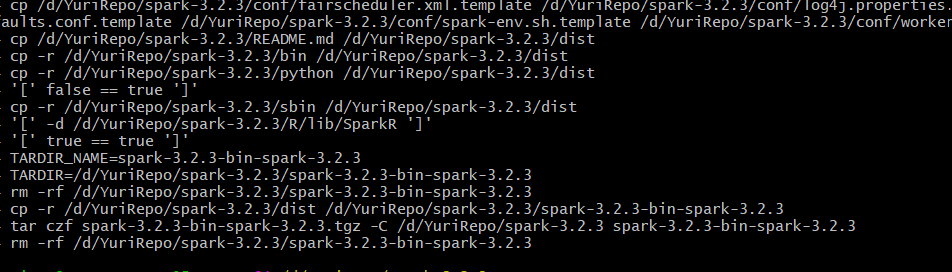
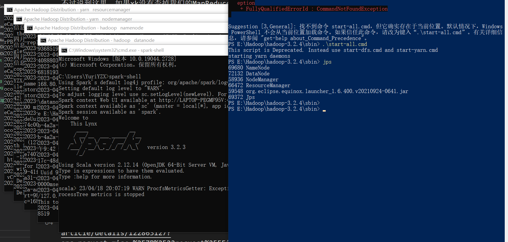
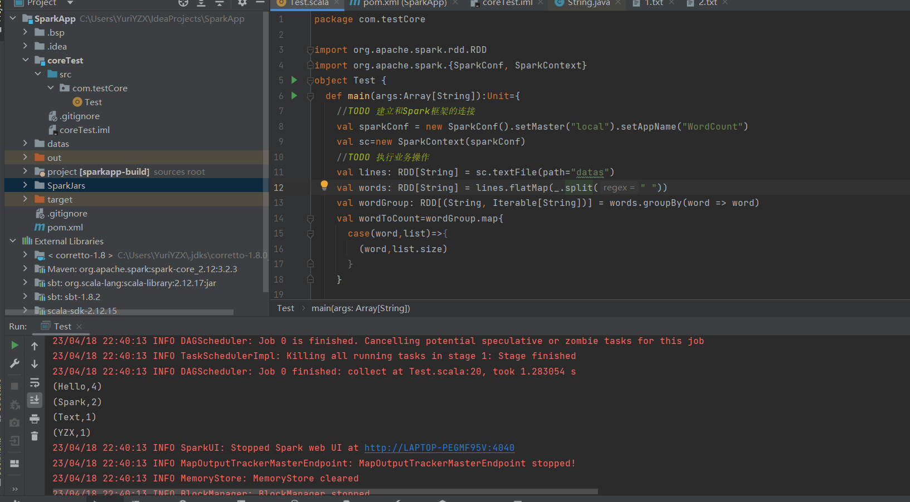

# Spark编译
源码下载:
https://spark.apache.org/downloads.html
注意:
1. Choose a Spark release:3.2.3(Nov 28,2022)
这里是3.2版本，之所以不选择3.3是因为3.3兼容性不好，各种支持，版本配置有许多问题，比如不适合Intelij
2. Choose a package type:Source Code
既然要魔改，自然是要用源码来编程
3. Download Spark:spark-3.2.3.tgz
下载在windows本地就行，编译是在windows上，运行考虑在linux上进行.
4. 安装InteliJ,有学生版免费，直接下ultimate,不用扣扣索索用社区版
5. 需要配置java 1.8.0,直接在IDEA里面自助下载环境就行,scala支持在插件里面下载,sbt那些不要管,maven命令会自己给你下好，scala要用最新的.

官方编译文档:
https://spark.apache.org/docs/latest/building-spark.html#building-a-runnable-distribution


[^1]Spark参考教程
请先按这个参考教程配置POM,否则编译必错无疑，其中最为可恶的就是Failed to execute goal net.alchim31.maven:scala-maven-plugin


[^2]net.alchim31.maven报错
不要按这个参考教程来，你乱插dependency没用，而且语法也不对，这里主要是要在pom.xml里找net.alchim31.maven这个字段，只有三个条目，找到有version的地方，改成3.2.2(或者保留4.3.0也可以，注意只改有version的地方)即可.

编译命令:
在Spark源码根目录下打开GitBash

> ./build/mvn -Phadoop-3.2 -Pyarn -Dhadoop.version=3.2.2 -Phive -Phive-thriftserver -DskipTests clean package

此处需要20min，这个命令会自动将各种依赖包安装好，所以会占网络资源，需要在maven的settings里面配置阿里云镜像，参照[^3].


>./dev/make-distribution.sh \
--name spark-3.2.3 \
--tgz -Phive \
-Phive-thriftserver \
-Pyarn -Phadoop-3.2 \
-Dhadoop.version=3.2.2 \
-Dscala.version=2.12.14

此处需要15min


成功会在目录下产生spark-3.2.3-bin-spark-3.2.3.tgz，解压文件的目录下面就是编译成功的结果.

# hadoop环境配置
这里主要参照[^4]，你只要按这个里面的傻瓜操作就行。
注意java版本都是1.8-361+
这里配好后Yarn也一并完成了，Hadoop占用1.2个GB的硬盘资源，而且实际开发环境中的数据也会增长，占用在同一盘符里，所以注意不要放置到C盘里（空间大当我没说）。
我们的hadoop统一使用 **3.2.2\+** 以上版本，注意不要下载成2.7之类的
https://hadoop.apache.org/release/3.2.4.html
在链接页面最下方download ***.tar.gz即可，不要下载成src源码，因为我们并不是用rust调优Hadoop,不过说到这里，如果xk没有否掉我们的MapReduce改进的话，也许我们真的就来hadoop的src里面造作了。
解压后，因为是在windows下面安装的，所以要加上一个dll和一个exe文件
https://github.com/cdarlint/winutils/tree/master/hadoop-3.2.2/bin
在这里面只要下载winutils.exe和hadoop.dll，放置到hadoop的bin目录下面就可以了
之后就是按照[^4]的操作配置HADOOP_HOME,四个xml文件，最后节点格式化
`hdfs namenode -format`
然后配置scala，Spark环境变量什么的就ok了
当然，之前配置过的也不用再次配置，在IDEA里面开发估计不太需要配置Scala了，但是配置Spark后就可以在任意地方打开cmd运行Spark了，而且启用Hadoop后就开启了hdfs服务，Spark的命令行就不会爆一长串INFO和EXCEPTION了。

**Spark启动后相当于一种服务，我们编写Spark应用程序后，运行这个程序就是在调用Spark服务**
最后可以产生一台电脑上跑许多个cmd的盛况


# 开发简单的Spark程序

配了这么多东西，总得来个demo试一试
之前我们仅仅改过一个Logo,现在我们开发一个可以跑的WordCount程序
在B站尚硅谷视频中，P4~P7就是开发的流程，但是他使用的Spark是哪里来的呢？
他在POM文件里配置依赖的时候，说过IDEA会自动检查依赖是否存在，如果不存在会
**自动下载**但是这样显然使用的不是我们自己编写的Spark，所以不要按他的去改POM文件，相反，我们应该去编译好的Spark根目录下寻找到jars目录，将整个目录复制到工作路径下，这里我给这个目录命名为`SparkJars`,jar是一种压缩文件格式，但是对于Scala/Java来说十分容易解析。右键目录，Add as Library,Add to Module选项填上你的Spark项目的模块，之后你在编写的scala文件里面就可以正常导入org.apache.spark...了
> tip1: 有未导入的类时，鼠标移动到位置，快捷键Alt+Enter就可以自动导入，当然你如果IDEA解析不到的话就不行了，这个时候应该检查jar包是否正确导入。

> tip2: IDEA可以提供类型补全，或者说你可以调用Spark的函数后，继续键入
`.var`然后回车就可以自动补全前面的一长串类型，然后命名变量后回车即可。但是如果你不是在他提示补全的红色框内命名变量的话，回车就会把整行回退到原来的未补全状态，就很烦。
## 在这里附上代码
``` scala
package com.testCore

import org.apache.spark.rdd.RDD
import org.apache.spark.{SparkConf, SparkContext}
object Test {
  def main(args:Array[String]):Unit={
    //TODO 建立和Spark框架的连接
    val sparkConf = new SparkConf().setMaster("local").setAppName("WordCount")
    val sc=new SparkContext(sparkConf)
    //TODO 执行业务操作
    val lines: RDD[String] = sc.textFile(path="datas")
    val words: RDD[String] = lines.flatMap(_.split(" "))
    val wordGroup: RDD[(String, Iterable[String])] = words.groupBy(word => word)
    val wordToCount=wordGroup.map{
      case(word,list)=>{
        (word,list.size)
      }
    }

    val array: Array[(String, Int)] = wordToCount.collect()
    array.foreach(println)

    
    //TODO 关闭连接
    sc.stop()
  }
}

```
在根目录下datas文件夹下有两个txt文件，内容分别为
1.txt:
Hello Spark
Hello Text
2.txt:
Hello YZX
Hello Spark
## 重要注意事项
JDK1.8!!!
Scala2.12!!!
Hadoop 3.22+!!!
Scala的配置注意你自己项目右键的add framework support和 File->ProjectStructure->Global Libraries的两个地方就可以

一定要是2.12,否则scala使用Spark运行时会报错。

[^1]: https://blog.csdn.net/liweihope/article/details/122863127

[^2]:https://www.cnblogs.com/war3blog/p/7864804.html

[^3]:https://blog.csdn.net/ITzhangminpeng/article/details/79936598

[^4]:https://blog.csdn.net/qq_48519116/article/details/123825598