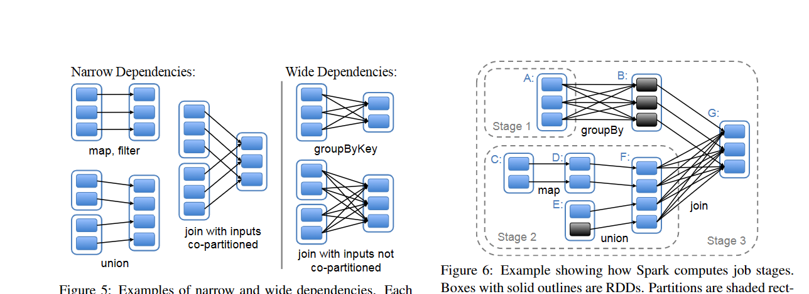

---
presentation:
  width: 1600
  height: 1200
---

<!-- slide -->

# 基于Rust语言对Apache Spark性能瓶颈的优化

## This-Lynx

> 闫泽轩 李牧龙 罗浩铭 汤皓宇 徐航宇

<!-- slide -->
# 目录
## 1 项目介绍
## 2 立项依据
## 3 具体改进
## 4 测试结果
## 5 项目总结

<!-- slide -->
## 1 项目介绍

<!-- slide vertical=true -->

## 基于Rust版Spark开源项目vega

<!-- slide vertical=true -->

<!-- slide -->
## 2 背景和立项依据

<!-- slide vertical=true -->

## Rust语言

- ### 安全性
- ### 高性能
- ### 并发性

<!-- slide vertical=true -->

## 分布式计算框架

- ### Apache Hadoop
- ### Apache Spark
- ### Ray
- ### . . .

<!-- slide vertical=true -->

## Spark和RDD

<!-- slide -->
## 3 具体改进

<!-- slide -->
## Shuffle优化

<!-- slide vertical=true -->
## Shuffle介绍
将输入的M个分区内的数据“按一定规则”重新分配到R个分区上。
- 各个节点上相同key的内容写入主节点磁盘文件中
- 相同key的数据将被拉取到同一个分区进行聚合操作

**最大的性能瓶颈!**

<!-- slide vertical=true -->
## SortShuffleManager
- 对每一对Map和Reduce端的分区配对都产生一条分区记录，原版Spark生成一个文件存入，Vega将Shuffle记录保存在以DashMap(分布式HashMap)实现的缓存里
- 由于生成的文件数过多，会对文件系统造成压力，且大量小文件的随机读写会带来一定的磁盘开销，故其性能不佳

<!-- slide vertical=true -->
## SortShuffleManager
- 数据会根据目标的分区Id（即带Shuffle过程的目标RDD中各个分区的Id值）进行排序，然后写入一个单独的Map端输出文件中，而非很多个小文件
- 输出文件中按reduce端的分区号来索引文件中的不同shuffle部分
- 大幅减小了随机访存的开销与文件系统的压力，不过增加了排序的开销

<!-- slide vertical=true -->
## 我们的优化
在我们对Vega中shuffle逻辑的优化中，由于使用了DashMap缓存来保存Shuffle记录，我们无需进行排序，直接按reduce端分区号作为键值写入缓存即可。这既避免了排序的开销，又获得了SortShuffle合并shuffle记录以减少shuffle记录条数的效果。这样，shuffle输出只需以reduce端分区号为键值读出即可。

<!-- slide vertical=true -->
## Shuffle优化测试结果

使用两千万条shuffle记录的载量进行单元测试，测试结果如下：
（Map端有M个分区，Reduce端有R个分区，$M\cdot R=20000000$）
| 时间/s |   1   |   2   |   3   | 平均  |
| :----: | :---: | :---: | :---: | :---: |
| 优化前 | 9.73  | 10.96 | 10.32 | 10.34 |
| 优化后 | 6.82  | 5.46  | 4.87  | 5.72  |

**运行速度提升了81%**

<!-- slide -->
## 实现容错

<!-- slide -->
## 加入HDFS文件系统

<!-- slide -->
## 添加实时监控拓展模块

<!-- slide vertical=true -->

## 监控工具

- Prometheus
- Grafana
- node_exporter

*基于Docker直接部署*

<!-- slide vertical=true -->

## 效果展示

<!-- slide vertical=true -->

## 效果展示

<!-- slide -->
## 自动化测试

<!-- slide -->
## 4 测试结果

<!-- slide -->
## 5 项目总结

<!-- slide vertical=true -->
## 组员分工与进度管理

- 闫泽轩（组长）：
- 李牧龙：
- 罗浩铭：对Vega的Shuffle模块进行优化，编写项目测试样例
- 汤皓宇：对vega进行Docker部署，添加性能监控拓展模块
- 徐航宇：

<!-- slide vertical=true -->
## 项目意义与前瞻性

- ### Vega继承了Spark的诸多优点
- ### Vega吸收了Rust语言的诸多优良特性
- ### 我们对Vega项目进行了诸多优化，进一步提升了其性能

<!-- slide -->
## 项目的优化方向

<!-- slide vertical=true -->
### 减少序列化反序列化开销

<!-- slide vertical=true -->
### 构建更加用户友好的API
- Rust的类型机制较为复杂
- 原有的RDD算子类型不够丰富

