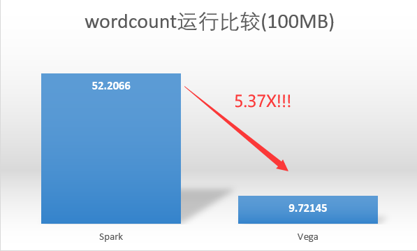

---
presentation:
  width: 1600
  height: 1200
---

<!-- slide -->

# 基于Rust语言对Apache Spark性能瓶颈的优化

## This-Lynx

> 闫泽轩 李牧龙 罗浩铭 汤皓宇 徐航宇

<!-- slide -->
# 目录
## 1 项目介绍
## 2 立项依据
## 3 具体改进
## 4 测试结果
## 5 项目总结

<!-- slide -->
## 1 项目介绍

<!-- 我们组在数月的每周两次固定讨论，线下开会的频率下圆满完成了学期初制订的各项任务目标，并且在此基础上**超额**完成了拓展功能。 -->

<!-- slide vertical=true -->

## 基于Rust版Spark开源项目vega

<!-- slide vertical=true -->

<!-- slide -->
## 2 背景和立项依据

<!-- slide vertical=true -->

## Rust语言

- ### 安全性
- ### 高性能
- ### 并发性

<!-- slide vertical=true -->

## 分布式计算框架

- ### Apache Hadoop
- ### Apache Spark
- ### Ray
- ### . . .

<!-- slide vertical=true -->

## Spark和RDD

<!-- slide -->
## 3 具体改进
<!-- slide vertical=true -->
##  改进依据

<!-- slide -->
## Shuffle优化

<!-- slide vertical=true -->
## Shuffle介绍
将输入的M个分区内的数据“按一定规则”重新分配到R个分区上。
- 各个节点上相同key的内容写入主节点磁盘文件中
- 相同key的数据将被拉取到同一个分区进行聚合操作

**最大的性能瓶颈!**

<!-- slide vertical=true -->
## Hash Shuffle Manager
- 对每一对Map和Reduce端的分区配对都产生一条分区记录，原版Spark生成一个文件存入，Vega将Shuffle记录保存在以DashMap(分布式HashMap)实现的缓存里
- 由于生成的文件数过多，会对文件系统造成压力，且大量小文件的随机读写会带来一定的磁盘开销，故其性能不佳

<!-- slide vertical=true -->
## Sort Shuffle Manager
- 数据会根据目标的分区Id（即带Shuffle过程的目标RDD中各个分区的Id值）进行排序，然后写入一个单独的Map端输出文件中，而非很多个小文件
- 输出文件中按reduce端的分区号来索引文件中的不同shuffle部分
- 大幅减小了随机访存的开销与文件系统的压力，不过增加了排序的开销
 

<!-- slide vertical=true -->
## 我们的优化
在我们对Vega中shuffle逻辑的优化中，由于使用了DashMap缓存来保存Shuffle记录，我们无需进行排序，直接按reduce端分区号作为键值写入缓存即可。这既避免了排序的开销，又获得了SortShuffle合并shuffle记录以减少shuffle记录条数的效果。这样，shuffle输出只需以reduce端分区号为键值读出即可。

<!-- slide vertical=true -->
## Shuffle优化测试结果

使用两千万条shuffle记录的载量进行单元测试，测试结果如下：
（Map端有M个分区，Reduce端有R个分区，$M\cdot R=20000000$）
| 时间/s |   1   |   2   |   3   | 平均  |
| :----: | :---: | :---: | :---: | :---: |
| 优化前 | 9.73  | 10.96 | 10.32 | 10.34 |
| 优化后 | 6.82  | 5.46  | 4.87  | 5.72  |

**运行速度提升了81%**

<!-- slide -->
## 实现容错

<!-- slide vertical=true -->
## 容错机制
利用循环队列，在某从机下线时递归地进行任务的重新分发，
保证程序的正常运行，并打印出相关Error信息以供用户检查。

<!-- slide vertical=true -->
## 效果展示
待填充

<!-- slide -->
## 加入HDFS文件系统

<!-- slide vertical=true -->
## 实现目标
- 从HDFS读文件
- **利用读取的数据生成Rdd**
- 将数据写入HDFS

<!-- slide vertical=true -->
## Hdrs

- 用Rust包装HDFS的C接口
- 实现了Read、Write等Trait，功能丰富

<!-- slide vertical=true -->
## 读取数据/生成Rdd
- 不能仅由主机读取
- **HdfsReadRdd**
- compute阶段读取
- 可以解码数据

<!-- slide vertical=true -->
## 写入数据
- 仅由主机写入

<!-- slide -->
## 添加实时监控拓展模块

<!-- slide vertical=true -->

## 监控工具

- Prometheus
- Grafana
- node_exporter

*基于Docker直接部署*

<!-- slide vertical=true -->

## 效果展示

<!-- slide vertical=true -->

## 效果展示

<!-- slide -->
## 自动化测试
<!-- 自动化实现提交到仓库后自动检查提交结果的正确性并运行test，如果运行失败会发邮件提省协作者提交结果测试失败 -->

<!-- slide vertical=true -->

<!-- slide vertical=true -->

<!-- slide -->
## 4 测试结果

<!-- slide vertical=true -->

<!-- slide -->
## 5 项目总结

<!-- slide vertical=true -->
## 组员分工与进度管理

- 闫泽轩（组长）：负责会议日程议程安排，对项目正确性进行测试，编写测试样例和部署测试。
- 李牧龙：为Vega增加了HDFS的读写接口和用于调试的本地读文件接口，进行Vega和Spark的分布式运行对比测试，编写wordcount样例
- 罗浩铭：对Vega的Shuffle模块进行优化，编写项目测试样例
- 汤皓宇：对vega进行Docker部署，添加性能监控拓展模块
- 徐航宇：负责Vega运行环境与配置文件的创建，撰写及维护用户手册，并为Vega实现容错机制

<!-- slide vertical=true -->
## 项目意义与前瞻性

- ### Vega继承了Spark的诸多优点
- ### Vega吸收了Rust语言的诸多优良特性
- ### 我们对Vega项目进行了诸多优化，进一步提升了其性能

<!-- slide -->
## 项目的优化方向
<!-- slide vertical=true -->
### 减少序列化反序列化开销

<!-- slide vertical=true -->
### 构建更加用户友好的API
- Rust的类型机制较为复杂
- 原有的RDD算子类型不够丰富

