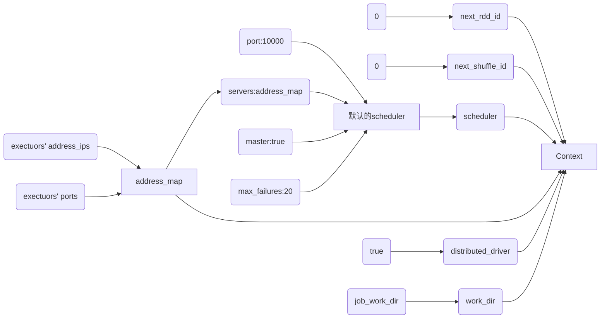
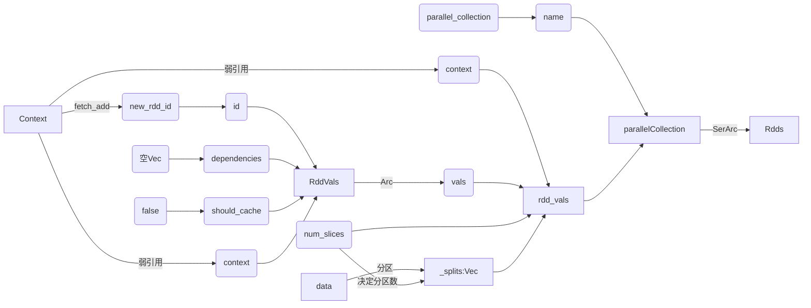
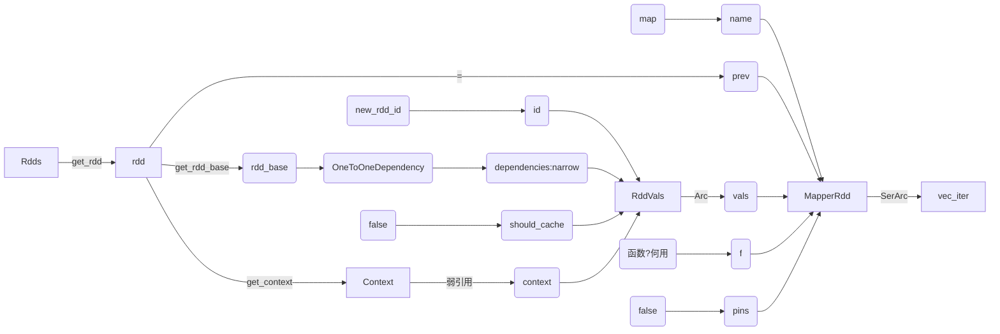

# 结题报告

## 目录

## 项目介绍
我们的项目基于不完善的Rust版Spark开源项目vega，对其性能瓶颈进行优化，以实现一个性能明显优于原版Spark的Spark内核。
我们优化了Shuffle阶段的算法，接入了HDFS分布式文件系统，加入了多机下的队列容错机制，加入了基于Grafana/Prometheus实时监控运维模块，加入了项目自动测试。这使得Vega在运行速度上较Spark与原版Vega相比有了更大的提升，同时在可靠性、可用性与可维护性上也明显提升。

## 组员分工与进度管理

## 背景和立项依据

### 项目背景
#### Vega
Vega项目完全使用Rust从零写起，构建完成了一个较为简单的Spark内核。不过，这一项目已经有两三年没有维护，项目里还有不少算法没有实现，特别是Spark后来的诸多优化更新，这些都可以是我们的改进空间。

**Context建立(master)**:

**makerdd**:

**map**:

**collection**:

### 立项依据

#### ShuffleManager

Shuffle是将输入的M个分区内的数据“按一定规则”重新分配到R个分区上的过程。在Spark程序中，Shuffle是性能的最大瓶颈，因为Shuffle的过程往往伴随着大量的磁盘I/O与网络I/O等开销，因此Spark框架中Shuffle阶段的设计优劣是决定性能好坏的关键因素之一。实现一个优良的ShuffleManager，减少不必要的Shuffle开销至关重要。

在MapReduce框架中，Shuffle阶段是连接Map和Reduce之间的桥梁，Map阶段通过Shuffle过程将数据输出到Reduce阶段中。Spark本质上与MapReduce框架十分相似，因此也有自己的Shuffle过程实现。

Shuffle过程中，各个结点上的相同key都会先写入本地磁盘文件中，然后其他结点需要通过网络传输拉取各个结点上的磁盘文件中的含有相同key的记录。在将这些含有相同key的数据都拉取到同一个结点进行聚合操作时，还有可能会因为一个结点上处理的key过多，导致内存不够存放，进而溢写到磁盘文件中。因此在Shuffle过程中，可能会发生大量的磁盘文件读写操作，以及数据的网络传输操作，而这无疑也会降低程序的执行速度。

##### ShuffleManager架构

在Spark中，Driver和每个Executor的SparkEnv实例化过程中，都会创建一个ShuffleManager，用于管理Shuffle过程中产生的块数据，提供集群块数据的读写，包括数据的本地读写和读取远程RDD结点的块数据。在RDD间存在宽依赖时，需要进行Shuffle操作，此时便需要将Spark作业（Job）划分成多个Stage，并在划分Stage的关键点———构建ShuffleDependency时———利用ShuffleManager进行Shuffle注册，获取后续数据读写所需的ShuffleHandle。

ShuffleManager中的shuffleBlockResolver是Shuffle的块解析器，该解析器为数据块的读写提供支撑层，便于抽象具体的实现细节。基于此，有宽依赖关系的RDD执行compute时就可以读取上一Stage为其输出的Shuffle数据，并将计算结果传入下一stage。[^spark_optimize]

Vega中，划分Stage的点部分同样需要构建ShuffleDependency，它会将Shuffle过程中产生的数据写入一个Cache内，而Shuffle阶段后的reduce阶段将通过ShuffleFetcher从Cache读出shuffle数据，读请求将通过ShuffleService类以TCP服务器形式响应。

##### 可改进的点

ShuffleManager在生成依赖关系及RDD获取依赖关系过程中所需的计算使用频繁，可以在rust中得到优化。同时，Shuffle算法也极为关键，必须使用当前的SOTA算法，如在Vega中，只实现了最基础的HashShuffleManager，而没有实现性能更高的SortShuffleManager，这也是可以优化的点

#### Rust优势

在对Spark的实现问题上，Rust与Scala（Spark所使用的语言）相比有诸多优势：

**安全性**

scala 所有的对象都是在堆中的，有 Head 的，生命周期由 GC 管控的。虽然有不用关心分配、释放的自由。却也导致了 STW 和更大的内存占用。

Rust 通过静态内存安全管理和所有权系统，可以避免许多 Spark 运行时错误，例如内存泄漏、垂悬指针异常等。而与Scala相比，Rust的内存管理发生在编译期，其所有权和声明周期的计算与检查都在编译期执行，这使得它无需消耗较大性能的GC机制，就能保证内存安全。

此外，Rust将运行时错误划分为两类，通过模式匹配的控制方式，在面对可恢复的错误时执行对应的错误处理代码，而面对不可恢复的错误时发生panic停止程序，既进一步保证了安全，又提高了用户的体验。

在Spark的内存密集阶段，可以使用Rust改写，以减少内存占用、提高程序性能。

**高性能**

Rust 秉承零成本抽象原则，通过无运行时开销的特性，将许多其他语言的运行时开销（如GC）放置到了编译期，并将顶层的代码编译为较为高效的机器码，使得程序员在进行抽象时，不必担心性能的下降。

使用 Rust 进行 Spark 的性能瓶颈优化可以提高数据处理速度和效率，减少资源浪费和计算成本。

**并发性**

Spark 是一个分布式计算框架，具有良好的并发性能。而 Rust 则通过所有权和类型系统，将许多并发错误转化为了编译时错误，从而避免在部署到生产环境后修复代码或出现竞争、死锁或其他难以复现和修复的 bug ，实现了高效而安全的并发设计。

安全高效的并行与函数式编程息息相关。Scala正是由于其函数式编程的特性被Spark选中，而同样作为函数式的语言，Rust对并行的支持更好。使用 Rust 对 Spark 的高并发场景进行优化，可以进一步提高 Spark 的并发性能和安全性，从而提高整个应用程序的性能。

Rust为了获取安全性和高性能，对程序员施加了较多的规则，在编译期进行了较为严格的检查（内存安全正），使得编程难度显著提高。但是如果熟悉了它的编程风格，就可以轻松写出安全而高效的代码。此外，用Rust编写的代码，只要能够通过编译，基本就可以正常运行，且在调试代码时，可以分模块测试而不用担心它们的互相影响————这提高了调试代码的效率，而且适于多人协作开发（在函数式编程方式下尤是如此）。

## 项目具体优化细节
### 队列容错实现

### HDFS文件系统

### Shuffle部分
在Vega原有的HashShuffle算法中，会对每一对Map和Reduce端的分区配对都产生一条分区记录，假设Map端有M个分区，Reduce端有R个分区，那么最后产生的分区记录一共会有M*R条。原版的Spark中，每一条Shuffle记录都会被写进磁盘里。由于生成的文件数过多，会对文件系统造成压力，且大量小文件的随机读写会带来一定的磁盘开销，故其性能不佳。而Vega中已将Shuffle记录保存在以DashMap(分布式HashMap)实现的缓存里，这大幅降低了本地I/O开销，但远程开销仍然较大，且DashMap占用空间与性能也会受到索引条数过多的影响。

Spark自1.1.0版本起默认采用的是更先进的SortShuffle。数据会根据目标的分区Id（即带Shuffle过程的目标RDD中各个分区的Id值）进行排序，然后写入一个单独的Map端输出文件中，而非很多个小文件。输出文件中按reduce端的分区号来索引文件中的不同shuffle部分。这种shuffle方式大幅减小了随机访存的开销与文件系统的压力，不过增加了排序的开销。（Spark起初不采用SortShuffle的原因正是为了避免产生不必要的排序开销）

在我们对Vega中shuffle逻辑的优化中，由于使用了DashMap缓存来保存Shuffle记录，我们无需进行排序，直接按reduce端分区号作为键值写入缓存即可。这既避免了排序的开销，又获得了SortShuffle合并shuffle记录以减少shuffle记录条数的效果。这样，shuffle输出只需以reduce端分区号为键值读出即可。

对shuffle部分，以两千万条shuffle记录的载量（Map端有M个分区，Reduce端有R个分区，`M*R=20000000`）进行单元测试，测试结果如下：
优化前：9.73,10.96,10.32 平均：10.34s
优化后：6.82,5.46,4.87 平均：5.72s

测得运行速度提升了81%，由此说明我们对这一模块的优化是成功的。

### 实时监控拓展模块

### 自动化测试

## 测试结果

## 项目总结
### 项目意义与前瞻性
随着大数据处理需求的不断增长，对数据处理框架的性能和可靠性要求也越来越高。

Vega继承了Spark的诸多优点。同样使用RDD，使得Vega拥有了简明、灵活、可扩展性好的编程模式，拥有了对非结构化数据或复杂的任务的良好支持，拥有了数据分片的高度弹性及在硬盘与内存间的高效调度，拥有了基于Lineage（血统）的高效容错机制。由此，它对计算任务的分布式执行有了良好的支持，可以在大数据处理中发挥重要作用。

同时，Vega又吸收了Rust语言的诸多优良特性。Rust具有接近原生代码的性能，无需借助JVM执行，没有垃圾回收开销，使得Vega在性能上较Spark有了更大的提升；Rust又具有强大的内存安全、并发安全的特性，使得Vega在稳定性和可靠性上有了更大的提升；编程过程中，Rust超强的编译器可以避免绝大多数安全问题，现代的语法在零成本抽象的基础上为精简代码提供便利；同时。Rust还具有跨平台的特性，可以在不同的操作系统和硬件上运行，且无需在从节点上配置Vega项目即可运行，为数据处理提供更大的灵活性与可扩展性。用Rust重写Vega，是大势所趋。

我们又在原有Vega项目的基础上进行了优化，优化了Shuffle阶段的算法，接入了HDFS分布式文件系统，加入了多机下的队列容错机制，加入了基于Grafana/Prometheus实时监控运维模块，加入了项目自动测试。这使得Vega在运行速度上有了更大的提升，同时在可靠性、可用性与可维护性上也明显提升。
我们相信，在效率、可靠性、可用性与可维护性上都有着更好表现的Vega，将为大数据处理提供了更高效、更安全的解决方案！

### 项目的优化方向
#### 减少序列化反序列化开销
无论是Spark还是Vega在传递任务时都需要将任务序列化以便于传输，传至目标主机后再反序列化用以执行。而由于序列化反序列化开销很大，Spark与Vega中任务的启动都要花费较长时间。我们可以尝试精简任务的描述方式，同时采用更高性能的序列化反序列化器，以此提高任务传输效率。

#### 构建更加用户友好的API
由于Rust的类型机制较为复杂，使用Vega构建分布式计算应用时较为困难。比如，每次向RDD传递计算任务时传入时，获得结果的类型都会是包裹着计算任务的RDD类型，而在对RDD连续进行多次操作之后，得到的结果类型将会异常复杂，这不利于用户上手。

同时，原有的RDD算子类型不够丰富，支持的计算函数都较为底层，可以开发更多的算子以支持各种各样的计算任务，同时可以利用将底层任务合并为高层任务时的优化空间。

## 参考文献

[^spark_optimize]:王家林. Spark内核机制解析及性能调优. 2017.
[^jni]:Rust jni crate https://crates.io/crates/jni
[^capnp]: Cap’n Proto is an insanely fast data interchange format and capability-based RPC system. https://capnproto.org/

