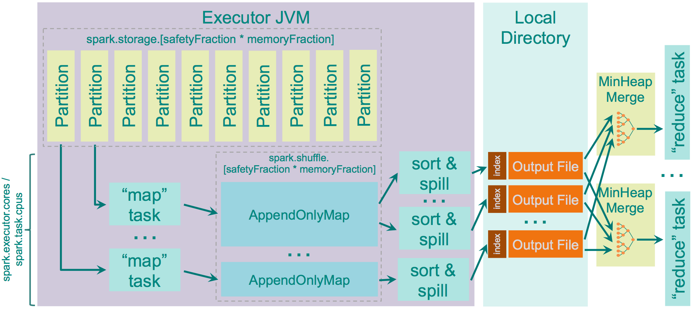

# 结题报告 <!-- omit in toc -->

- [项目介绍](#项目介绍)
- [组员分工](#组员分工)
- [进度管理](#进度管理)
- [项目背景](#项目背景)
  - [分布式计算框架简介](#分布式计算框架简介)
  - [Spark简介](#spark简介)
  - [Vega](#vega)
- [立项依据](#立项依据)
  - [ShuffleManager](#shufflemanager)
    - [ShuffleManager架构](#shufflemanager架构)
    - [可改进的点](#可改进的点)
  - [Rust优势](#rust优势)
    - [安全性](#安全性)
    - [高性能](#高性能)
    - [并发性](#并发性)
  - [文件系统](#文件系统)
    - [HDFS架构](#hdfs架构)
    - [与客户端交互](#与客户端交互)
    - [容错性](#容错性)
- [项目具体优化细节](#项目具体优化细节)
  - [Shuffle部分](#shuffle部分)
  - [HDFS文件系统](#hdfs文件系统)
  - [容错实现](#容错实现)
  - [实时监控拓展模块](#实时监控拓展模块)
  - [自动化测试](#自动化测试)
    - [本地测试效果](#本地测试效果)
    - [Github workflow流程](#github-workflow流程)
    - [自动测试效果](#自动测试效果)
- [测试结果](#测试结果)
- [项目总结](#项目总结)
  - [项目意义与前瞻性](#项目意义与前瞻性)
  - [未来的优化方向](#未来的优化方向)
    - [减少序列化反序列化开销](#减少序列化反序列化开销)
    - [构建更加用户友好的API](#构建更加用户友好的api)
    - [开发新的RDD算子](#开发新的rdd算子)
    - [实现更加可靠的容错](#实现更加可靠的容错)
    - [实现更合理的任务分区机制](#实现更合理的任务分区机制)
    - [实现跨平台的零成本移植](#实现跨平台的零成本移植)
  - [我们的收获](#我们的收获)
- [参考文献](#参考文献)

## 项目介绍

我们的项目以不完善的Rust版Spark[^spark_org][^spark_computing]开源项目Vega[^vega_github]为基础，对其性能瓶颈进行了优化，实现了一个性能明显优于原版Spark的分布式计算框架。下图为我们的项目结构图：


我们优化了Shuffle阶段的算法，加入了多机下的队列容错机制，接入了HDFS分布式文件系统，加入了基于Grafana/Prometheus的实时监控运维模块，并进行了项目自动化测试。最终的Vega在运行速度上相较Spark与原版Vega相比都有了很大的提升，同时在可靠性、可用性与可维护性上也明显优于原版。

## 组员分工

- 闫泽轩（组长）：负责会议日程议程安排，对项目正确性进行测试，编写测试样例和部署测试
- 李牧龙：为Vega增加了HDFS的读写接口和用于调试的本地读文件接口，进行Vega和Spark的分布式运行对比测试，编写wordcount样例
- 罗浩铭：对Vega的Shuffle模块进行优化，编写项目测试样例
- 汤皓宇：对Vega进行Docker部署，添加性能监控拓展模块，配置Docker下的Prometheus/Grafana/node_exporter来展示Vega运行时各机器的CPU使用率和Vega的运行情况，负责每次会议的记录整理
- 徐航宇：负责Vega运行环境与配置文件的创建，撰写及维护用户手册，并为Vega实现容错机制

## 进度管理
| 时间进度       | 计划进度            | 实际进度                                                 |
| -------------- | ------------------- | -------------------------------------------------------- |
| 第八周         | 系统学习rust        | 以lab2, lab3为抓手在实验中学习Rust                       |
| 第九周         | 编译，测试Vega模块  | 修复了原版Vega编译失败，部署失效的Bug                    |
| 第十周         | 定位Vega模块        | 分配任务量，借鉴Spark对Vega代码进行阅读和理解            |
| 第十一到十三周 | 编写优化对象模块    | 测试Vega分布式部署，开会写注释                           |
| 第十四到十五周 | 添加拓展模块        | 完成lab4, 推进HDFS加入文件系统及容错机制的编写           |
| 第十六周       | 跑benchmark部署测试 | 编写测试样例，准备进入考试周                             |
| 第十七周       | 无                  | 考试周放空                                               |
| 第十八周       | 无                  | 连续五天开会高强度工作，完成所有既定任务并撰写报告和展示 |

从4月初到7月初，我们保持每周两次讨论的频率，小步快跑着通力合作完成了这个项目。虽然中途也遇到了不少困难，其中有些甚至在网上难以找到或是根本就没有可参考的内容，但功夫不负有心人，我们最后也都成功一一解决了这些问题。

如下为我们[代码仓库](https://github.com/XhyDds/vega/)[^code_repo]的提交记录，我们在原作者的基础上新添加了上百次commit.


## 项目背景

### 分布式计算框架简介


主流的分布式计算框架主要分为四类，即MapReduce-like[^mapreduce]系统、Streaming[^spark_stream]系统、图计算系统和基于状态的系统。

- **MapReduce-like系统**

以MapReduce(Hadoop)和Spark为代表。其特点是将计算抽象成high-level operator，如map, reduce, filter这样的算子，然后将算子组合成DAG，然后由后端的调度引擎进行并行化调度。

- **Streaming系统**

以flink, storm, Sprk streaming等为代表，专为流式数据提供服务的系统，强调实时性。

- **图计算系统**

以Pregel框架等为代表，特点是将计算过程抽象为图，然后在不同节点分布式执行，适用于PageRank等任务。

- **基于状态的系统**

以distbelief, Parameter Server架构等为代表，专为大型机器学习模型服务，将机器学习的模型存储上升为主要组件。

近年来，不同分布式框架的融合已成为趋势，比如Spark作为MapReduce-like系统，同时也支持Pregel框架为基础的图计算，以及Spark Streaming为基础的流处理问题。

### Spark简介

Spark是一个快速、通用、可扩展的分布式计算系统。它最初是由加州大学伯克利分校AMPLab开发的，其奠基论文为*Spark: Cluster Computing with Working Sets*.[^spark]Spark提供了一种基于内存的计算模型，可以比Hadoop MapReduce更快地处理大规模数据，支持Java、Scala、Python和R等多种编程语言，支持UI可视化管理。

Spark的核心概念是弹性分布式数据集(Resilient Distributed Datasets，简称RDD)。RDD是一种可以被划分成多个分区、分布在多个节点上的数据结构，支持高效的并行计算和容错。Spark中的许多计算都是通过对RDD进行转换和操作来实现的。

Spark的计算过程可以分为两个阶段：转换阶段和动作阶段。在转换阶段，Spark会对RDD进行一系列转换操作，例如map、filter、reduceByKey等。这些操作不会立即执行，而是构建一个执行计划。在动作阶段，Spark会根据执行计划将转换操作转化为实际的计算任务，例如collect、count、save等。这些任务会被分配到不同的节点上执行，最终将结果汇总返回给驱动程序。

Spark的运行模式可以分为本地模式和集群模式。在本地模式下，Spark可以直接在单台机器上运行，用于开发和测试。在集群模式下，Spark可以运行在多台机器上，实现分布式计算。

Spark还提供了许多高级功能，例如机器学习、图计算、流处理等。Spark的生态系统也非常丰富，包括MLlib(机器学习库)、Spark Streaming(流处理库)和GraphX(图分析库)等，可以满足不同应用场景的需求。他们还确保这些API具有高度的互操作性，使得人们首次可以在同一引擎中编写多种端到端的大数据应用程序。

### Vega

Vega项目完全使用Rust从零写起，构建完成了一个较为简单的Spark内核。不过，这一项目已经有两三年没有维护，刚接手时项目还需要修复部分BUG才可运行。此外，项目里还有不少算法及模块没有实现，特别是Spark后来的诸多优化更新。

这一项目在Github上已获得2.2K颗Star，是一个较为有名的Rust项目，其原仓库页面如下：


作者也写了一篇博客介绍了自己的Vega项目：


以下为Vega的运行机制：

- **Context建立(master)**


以上为Context的运行过程。Context结构中，scheduler为调度器，address_map存储着从机的ip地址，distributed_driver为对是否为主机的标识。

- **makerdd**


makerdd用于创建rdd，其对rdd_vals进行了包装，rdd_vals包含了context，vals，及经过分区的data，其中vals包含了id，dependencies，should_cache，context等重要信息。

- **map**


map函数用于对rdd中的每个元素进行操作，返回一个MapperRdd的ScrArc封装，Rdd中包含f，即对每个元素的操作，以及pins，即是否已经将该任务与某从机ip绑定，以及经过了基础设置的RddVals。

- **collection**


collection用于将Rdd发送给从机执行，回收结果并安装分区组合成程序的最终结果，首先对Rdd分区，对将其与collect函数一并提交给JobTracker，然后执行run_job函数，发送并等待所有任务执行完毕，最后将结果合并，collect为最终结果。

## 立项依据

### ShuffleManager

Shuffle是将输入的M个分区内的数据“按一定规则”重新分配到R个分区上的过程。在Spark程序中，Shuffle是性能的最大瓶颈，因为Shuffle的过程往往伴随着大量的磁盘I/O与网络I/O等开销，因此Spark框架中Shuffle阶段的设计优劣是决定性能好坏的关键因素之一。实现一个优良的ShuffleManager，减少不必要的Shuffle开销至关重要。

在MapReduce框架中，Shuffle阶段是连接Map和Reduce之间的桥梁，Map阶段通过Shuffle过程将数据输出到Reduce阶段中。Spark本质上与MapReduce框架十分相似，因此也有自己的Shuffle过程实现。

Shuffle过程中，各个结点上的相同key都会先写入本地磁盘文件中，然后其他结点需要通过网络传输拉取各个结点上的磁盘文件中的含有相同key的记录。在将这些含有相同key的数据都拉取到同一个结点进行聚合操作时，还有可能会因为一个结点上处理的key过多，导致内存不够存放，进而溢写到磁盘文件中。因此在Shuffle过程中，可能会发生大量的磁盘文件读写操作，以及数据的网络传输操作，而这无疑也会降低程序的执行速度。

#### ShuffleManager架构

在Spark中，Driver和每个Executor的SparkEnv实例化过程中，都会创建一个ShuffleManager，用于管理Shuffle过程中产生的块数据，提供集群块数据的读写，包括数据的本地读写和读取远程RDD结点的块数据。在RDD间存在宽依赖时，需要进行Shuffle操作，此时便需要将Spark作业（Job）划分成多个Stage，并在划分Stage的关键点———构建ShuffleDependency时———利用ShuffleManager进行Shuffle注册，获取后续数据读写所需的ShuffleHandle。

ShuffleManager中的shuffleBlockResolver是Shuffle的块解析器，该解析器为数据块的读写提供支撑层，便于抽象具体的实现细节。基于此，有宽依赖关系的RDD执行compute时就可以读取上一Stage为其输出的Shuffle数据，并将计算结果传入下一stage。[^spark_optimize]

Vega中，划分Stage的点部分同样需要构建ShuffleDependency，它会将Shuffle过程中产生的数据写入一个Cache内，而Shuffle阶段后的reduce阶段将通过ShuffleFetcher从Cache读出shuffle数据，读请求将通过ShuffleService类以TCP服务器形式响应。

#### 可改进的点

ShuffleManager在生成依赖关系及RDD获取依赖关系过程中所需的计算使用频繁，可以在rust中得到优化。同时，Shuffle算法也极为关键，必须使用当前的SOTA算法，如在Vega中，只实现了最基础的HashShuffleManager，而没有实现性能更高的SortShuffleManager，这也是可以优化的点。

### Rust优势

在对Spark的实现问题上，Rust与Scala（Spark所使用的语言）相比有诸多优势：

#### 安全性

scala所有的对象都是在堆中的，有Head的，生命周期由GC管控的。虽然有不用关心分配、释放的自由。却也导致了STW和更大的内存占用。

Rust通过静态内存安全管理和所有权系统，可以避免许多Spark运行时错误，例如内存泄漏、垂悬指针异常等。而与Scala相比，Rust的内存管理发生在编译期，其所有权和声明周期的计算与检查都在编译期执行，这使得它无需消耗较大性能的GC机制，就能保证内存安全。

此外，Rust将运行时错误划分为两类，通过模式匹配的控制方式，在面对可恢复的错误时执行对应的错误处理代码，而面对不可恢复的错误时发生panic停止程序，既进一步保证了安全，又提高了用户的体验。

在Spark的内存密集阶段，可以使用Rust改写，以减少内存占用、提高程序性能。

#### 高性能

Rust [^course.rs]秉承零成本抽象原则，通过无运行时开销的特性，将许多其他语言的运行时开销(如GC)放置到了编译期，并将顶层的代码编译为较为高效的机器码，使得程序员在进行抽象时，不必担心性能的下降。

使用Rust进行Spark的性能瓶颈优化可以提高数据处理速度和效率，减少资源浪费和计算成本。

#### 并发性

Spark是一个分布式计算框架，具有良好的并发性能。而Rust则通过所有权和类型系统，将许多并发错误转化为了编译时错误，从而避免在部署到生产环境后修复代码或出现竞争、死锁或其他难以复现和修复的 bug，实现了高效而安全的并发设计。

安全高效的并行与函数式编程息息相关。Scala正是由于其函数式编程的特性被Spark选中，而同样作为函数式的语言，Rust对并行的支持更好。使用Rust对Spark的高并发场景进行优化，可以进一步提高Spark的并发性能和安全性，从而提高整个应用程序的性能。

Rust为了获取安全性和高性能，对程序员施加了较多的规则，在编译期进行了较为严格的检查（内存安全正），使得编程难度显著提高。但是如果熟悉了它的编程风格，就可以轻松写出安全而高效的代码。此外，用Rust编写的代码，只要能够通过编译，基本就可以正常运行，且在调试代码时，可以分模块测试而不用担心它们的互相影响————这提高了调试代码的效率，而且适于多人协作开发（在函数式编程方式下尤是如此）。

### 文件系统

作为一个分布式计算框架，Vega没有接入任何的文件系统，这显然不合理。我们考虑接入HDFS，首先Rust开源社区中有提供HDFS支持的包hdrs，且将其接入vega，可以增强对文件的支持。同时Spark原生支持HDFS，接入HDFS更容易融入Spark生态。以下我们对HDFS作进一步介绍。

HDFS[^hdfs](Hadoop Distributed File System)是一个基于GFS[^gfs]的分布式文件系统，同时也是Hadoop的一部分。它具有GFS的许多特性，例如可靠性高，将文件分块存储，适合大文件存储，但延迟较高且无法高效存储小文件。

#### HDFS架构


其中NameNode即GFS中的Master节点，负责整个分布式文件系统的元数据(MetaData)管理和响应客户端请求。

DataNode即为GFS中的chunkserver，负责存储数据块，通过心跳信息向NameNode报告自身状态。

#### 与客户端交互

HDFS的通信协议全部建立在TCP/IP协议上，包括客户端、DataNode和NameNode之间的协议以及客户端和DataNode之间的协议。这些协议通过RPC模型进行抽象封装。

读取方面，客户端先和NameNode交互，获取所需文件的位置，随后直接和对应的DataNode交互读取数据。NameNode会确保读取程序尽可能读取最近的副本。

写入方面，HDFS只支持追加写入操作，不支持随机写入(修改)操作。同一文件同一时刻只能由一个写入者写入。

删除文件时，文件不会马上被释放，而是被移入/trash目录中，随时可以恢复。移入/trash目录超过规定时间后文件才被彻底删除并释放空间。

#### 容错性

HDFS的容错处理和GFS基本一致，可大致分为以下4点：
1. 每一个数据块有多个副本(默认3个)，副本的存放策略为：第一个副本会随机选择，但是不会选择存储过满的节点，第二个副本放在和第一个副本不同且随机选择的机架，第三个和第二个放在同一机架上的不同节点，剩余副本完全随机节点。
2. 每一个数据块都使用checksum校验，客户端可以使用checksum检查获取的文件是否正确，若错误则从其他节点获取。
3. DataNode宕机时，可能会导致部分文件副本数量低于要求。NameNode会检查副本数量，对缺失副本的数据块增加副本数量。
4. 主从NameNode，主NameNode宕机时副NameNode成为主NameNode。

## 项目具体优化细节

### Shuffle部分
在Vega原有的HashShuffle算法中，会对每一对Map和Reduce端的分区配对都产生一条分区记录，假设Map端有M个分区，Reduce端有R个分区，那么最后产生的分区记录一共会有M*R条。原版的Spark中，每一条Shuffle记录都会被写进磁盘里。由于生成的文件数过多，会对文件系统造成压力，且大量小文件的随机读写会带来一定的磁盘开销，故其性能不佳。而Vega中已将Shuffle记录保存在以DashMap(分布式HashMap)实现的缓存里，这大幅降低了本地I/O开销，但远程开销仍然较大，且DashMap占用空间与性能也会受到索引条数过多的影响。[^Shuffle_Architecture]


Spark自1.1.0版本起默认采用的是更先进的SortShuffle。数据会根据目标的分区Id（即带Shuffle过程的目标RDD中各个分区的Id值）进行排序，然后写入一个单独的Map端输出文件中，而非很多个小文件。输出文件中按reduce端的分区号来索引文件中的不同shuffle部分。这种shuffle方式大幅减小了随机访存的开销与文件系统的压力，不过增加了排序的开销。（Spark起初不采用SortShuffle的原因正是为了避免产生不必要的排序开销）



在我们对Vega中shuffle逻辑的优化中，由于使用了DashMap缓存来保存Shuffle记录，我们无需进行排序，直接按reduce端分区号作为键值写入缓存即可。这既避免了排序的开销，又获得了SortShuffle合并shuffle记录以减少shuffle记录条数的效果。这样，shuffle输出只需以reduce端分区号为键值读出即可。

使用两千万条shuffle记录的载量进行单元测试，测试结果如下：
（Map端有M个分区，Reduce端有R个分区，$M\cdot R=20000000$）

| 时间/s |   1   |   2   |   3   | 平均  |
| :----: | :---: | :---: | :---: | :---: |
| 优化前 | 9.73  | 10.96 | 10.32 | 10.34 |
| 优化后 | 6.82  | 5.46  | 4.87  | 5.72  |

测得运行速度提升了81%，由此说明我们对这一模块的优化是成功的。


### HDFS文件系统
原本的Vega没有接入任何分布式文件系统的接口，甚至本地文件读写效果也相当差（分布式状态运行时会重复执行任务）。为了改善Vega的文件读取可用性，我们为其增加了与HDFS之间的接口。

接入HDFS主要需要解决几个问题：读取和写入数据，将数据制成Rdd。

将数据读出和写入可以利用一个第三方包：hdrs实现。hdrs用Rust包装了HDFS的C接口，实现了Read、Write等Trait，很好地解决了读取写入数据的问题。

但在分布式系统上，为提高读取效率和减少运算过程中的传输，应该让各个worker同时从HDFS读取。为此，我们编写了HdfsReadRdd。该Rdd会自动将要读取的所有文件分区，在`compute()`函数执行时让多个worker同时读取，并分别处理这些文件。

相比之下，写入的处理非常简单。由于写入时一个文件一次只能一台机器写入，因此直接提供写入到HDFS上文件的函数，调用时由master执行即可。

为统一IO功能，我们提供了可供调用的HdfsIO类，其中的`read_to_vec`和`read_to_rdd`方法可以将HDFS上的文件读取为字节流或Rdd，`write_to_hdfs`方法可以对HDFS进行写入。另外，为了方便处理读取得到的字节流，我们还提供了对文件进行读取和解码的`read_to_vec_and_decode`函数，调用时只要在`read_to_rdd`的基础上多传入一个用于解码的decoder函数，即可得到一个从HdfsReadRdd包装得到的Rdd，该Rdd进行`compute()`之后即可读取文件并且得到解码后的文件内容。

另外，为方便运行和修复原作者的错误，我们按照类似与HDFS进行交互的方式，提供了LocalFsIO和LocalFsReadRdd，可用于调试时读取本地文件。


### 容错实现
Vega没有实现容错机制，这导致了当某个节点出现故障时，整个程序都无法正常运行并卡死。这显然是不合理的，我们参考了一些论文与资料[^FT1] [^FT3]，尝试为其实现一个较完整的容错机制。


起初，我们尝试仿效原作者 rajasekarv 的 receive_results 函数，编写了 task_failed 函数，并在 submit_task 函数中调用：当尝试5次连接超时后，主机会认为从机下线，并调用 task_failed 函数，进行容错处理，将该任务重新放入任务队列中，等待 shuffle 的重新调度。但是，由于原作者相关函数与结构并没有实现完全，导致产生了一系列难以修复的问题。


这主要是因为，当任务执行失败时，需要为 on_event_failure 函数提供错误原因 TastEndReason ，其中需要包含 server_uri,shuffle_id,map_id,reduce_id，而后三者在 submit_task 所在环境下不易获取。上图中显示的错误即后续的处理函数未能根据提供的 shuffle_id 获取正确的shuffle。

后来我们选择跳出固有逻辑，选用新的方式完成容错。我们利用循环队列来存储从机ip，在某从机下线时，从队首取出一个从机，并将原任务重新分发给该从机，然后将该从机放回队尾，并打印出相关Error信息以供用户检查（信息包括下线的从机编号，ip，未能成功处理的任务id，以及重新提交任务后接受任务的从机编号，ip等）。


具体地，我们在调用 submit_task 函数时，使用 tokio::spawn 调用异步函数 submit_task_iter ，并将从机队列作为参数传入（直接修改 submit_task 为异步函数会导致生命周期出错，难以修改且影响稳定性）。接着，在 submit_task_iter 函数中，当连续五次连接超时后，将会从队列中取出备选的从机的ip，并递归调用 submit_task_iter，即尝试将任务重新发给另一台从机执行。

功能上，通过这种方式，我们保证了在任何情况下，程序均能正常运行：
- 如果某从机下线，能够正确将任务重新分发给其他从机（只有1/n的概率发到同一从机）；
- 如果该从机再次上线，任务的分发也能够继续正常进行；
- 如果所有从机都下线（如主机网络不佳），程序将等待，直到某一台从机上线，才能继续执行。

性能上，这一处理方式不仅能够保证程序的正常运行，还能一定程度上降低容错带来的性能损耗：
- 避免了使用大量资源在收集结果阶段对任务是否成功进行监测和处理，且处理更及时。因为提前了处理错误的时机，且只在发生错误时进行处理，正常运行过程中不产生开销;
- 通过直接在 submit_task_iter 用 tokio::spawn 创建的异步线程中递归调用，减少了对任务，ip队列等的克隆开销。如果放在异步线程外面，由于需要使用 async move 闭包，必须要提前备份task与ip队列，否则会产生对已经失去所有权的变量的引用，而这会带来大量的克隆开销。
- 由于此过程是异步进行的，并不会影响其他任务的正常执行，即，对某任务的容错并不会影响其他任务。

### 实时监控拓展模块

原本的Vega里是没有性能监控模块的，但它实际上是一个很复杂的分布式系统。因此如果某个地方出了问题是很难排查的。因此，在某些关键点加上监控，通过监控获取数据，可以方便调试与对于系统进行检测。

Grafana和Prometheus的搭配是一种应用非常广泛的监控模式。其中Prometheus是一个开源时序数据库，用来存储各种数据，包括各种CPU时间信息，硬盘使用数据等等。而Grafana是一个开源可视化工具，提供了将Prometheus里数据转为仪表盘的功能。

如下即为Prometheus查看监控目标的画面。


为了获得更多的监控数据，往往会加入node_exporter来给Prometheus中加入更多的值。

但还需要对vega中的运行情况进行监控，这就需要使用对应的Rust库，将需要的数据值注册之后，根据不同的运行情况和结果进行更新。

最终是使用了docker-compose.yml来配置，只需如下一行命令即可实现部署。

```bash
$ docker compose up -d
```

部署效果如下：


### 自动化测试
自动化实现提交到仓库后自动检查提交结果的正确性并进行自动测试。

如果运行失败会发邮件提醒协作者提交结果测试失败。

自动化测试使用Github Action提供的相关功能实现，在每次git push时触发，能够大大提高开发人员调试效率和保证提交内容完整可用。
#### 本地测试效果
```sh
cargo build
cargo test
```

#### Github workflow流程


#### 自动测试效果


黄色圆框表示刚刚提交的结果正在进行测试，测试按照一定的流程进行，这个流程可以由开发者指定，并且Github提供了丰富的插件和环境便于我们使用，这个功能可以在仓库的Actions中添加Workflow[^work_flow]使用。
- 自动化：GitHub Workflow可以自动化您的构建、测试和部署流程，从而减少手动操作和减少错误。

- 可重复性：GitHub Workflow可以确保您的构建、测试和部署流程在每次运行时都是相同的，从而提高可重复性。

- 可视化：GitHub Workflow提供了一个可视化的界面，可以让您轻松地查看您的构建、测试和部署流程。

- 可扩展性：GitHub Workflow可以轻松地扩展到其他工具和服务，例如Docker、AWS、Azure等。

- 开放性：GitHub Workflow是开源的，因此您可以自由地修改和定制它以满足您的需求。

## 测试结果

> 100MB 单机模式wordcount[^spark_examples]


> 200MB 分布式wordcount
> 


> 100,000,000次,运行时间单位ms


## 项目总结
### 项目意义与前瞻性

随着大数据处理、分布式计算的需求不断增长，对分布式计算框架的性能和可靠性要求也越来越高。

Vega继承了Spark的诸多优点。同样使用RDD，使得Vega拥有了简明、灵活、可扩展性好的编程模式，拥有了对非结构化数据或复杂的任务的良好支持，拥有了数据分片的高度弹性及在硬盘与内存间的高效调度，拥有了基于Lineage（血统）的高效容错机制。由此，它对计算任务的分布式执行有了良好的支持，可以在大数据处理中发挥重要作用。

同时，Vega又吸收了Rust语言的诸多优良特性。Rust具有接近原生代码的性能，无需借助JVM执行，没有垃圾回收开销，使得Vega在性能上较Spark有了更大的提升；Rust又具有强大的内存安全、并发安全的特性，使得Vega在稳定性和可靠性上有了更大的提升；编程过程中，Rust超强的编译器可以避免绝大多数安全问题，现代的语法在零成本抽象的基础上为精简代码提供便利；同时。Rust还具有跨平台的特性，可以在不同的操作系统和硬件上运行，且无需在从节点上配置Vega项目即可运行，为数据处理提供更大的灵活性与可扩展性。用Rust重写Vega，是大势所趋。

我们又在原有Vega项目的基础上进行了优化，优化了Shuffle阶段的算法，接入了HDFS分布式文件系统，加入了多机下的队列容错机制，加入了基于Grafana/Prometheus实时监控运维模块，加入了项目自动测试。这使得Vega在运行速度上有了更大的提升，同时在可靠性、可用性与可维护性上也明显提升。

我们相信，在效率、可靠性、可用性与可维护性上都有着更好表现的Vega，将为大数据处理提供了更高效、更安全的解决方案！


### 未来的优化方向
#### 减少序列化反序列化开销
无论是Spark还是Vega在传递任务时都需要将任务序列化[^serde_traitobject][^capnp]以便于传输，传至目标主机后再反序列化用以执行。而由于序列化反序列化开销很大，Spark与Vega中任务的启动都要花费较长时间。我们可以尝试精简任务的描述方式，同时采用更高性能的序列化反序列化器，以此提高任务传输效率。


#### 构建更加用户友好的API
由于Rust的类型机制较为复杂，使用Vega构建分布式计算应用时较为困难。比如，每次向RDD传递计算任务时传入时，获得结果的类型都会是包裹着计算任务的RDD类型，而在对RDD连续进行多次操作之后，得到的结果类型将会异常复杂，这不利于用户上手。[^vega_book]

下图即为一例：


#### 开发新的RDD算子
Spark作为Apache基金会下的顶级项目，参与开源的开发人员众多，更新速度很快，每两个月就有一次中等程度的版本更新，而vega已经停止维护两年已久，因此不能即使更新RDD，这导致原有的RDD算子类型不够丰富，支持的计算函数都较为底层，[^big_float]可以开发更多的算子以支持各种各样的计算任务，同时可以利用将底层任务合并为高层任务时的优化空间。

#### 实现更加可靠的容错
Spark中的容错机制是基于Spark的Lineage（血统）机制实现的。在Spark中，每个RDD都有一个指向其父RDD的指针，这样就可以通过RDD的血统关系来实现容错。当某个RDD的分区数据丢失时，可以通过其父RDD的血统关系重新计算得到。这种机制可以保证Spark的容错性，但是当某个RDD的父RDD丢失时，就无法通过血统关系重新计算得到，这就需要重新从头开始计算，这样就会导致计算效率的降低。

虽然我们实现的容错机制已经能够较完美地解决问题，但仍有一定提高的空间。具体地，可以考虑权衡各方面因素，尝试更加合理的容错机制。参考的文献有，[^FT3] [^FT2] 等，比如在[^FT2]中提到了一个利用 time 而不是 timeout 来实现容错的方法。

#### 实现更合理的任务分区机制
在当前版本的Vega中，IO部分的任务分区是按照文件数量划分的，即，尽量保证各个节点分到的文件数目相近。但是这样的划分方式可能并不合理，更合适的方案应该是使得各个分区的文件大小相近。

对此，我们设想了一种较合适的方案：使用优先队列或堆，每个节点代表一个分区，按照分区中的文件总大小组织结构。在分配任务时，将任务分给堆顶的分区（加入其任务链表），并对堆结构进行更新。这样，我们可以保证各个分区分配到的文件总大小相近。

但是，受限于时间，这一点我们并没有具体实现，未来可以考虑将之完成。

#### 实现跨平台的零成本移植
vega在分布式运行时不需要在从机上下载环境，但是限于配置文件和平台依赖的库函数使用，这种移植还未进行实现和测试。但是利用Rust的条件编译`#[cfg(target os="windows")]`可以编写两套平台下的函数，以及在Context,env模块中编写解耦的配置加载逻辑理论上就可以实现跨平台的移植。Spark运行分布式时需要在从机上安装应用，而vega不需要。这样可以在未来的工作中实现跨平台的零成本移植.

### 我们的收获
在这一学期的Vega项目中，我们小组戮力同心、团结一致，每位组员都奋勇争先、鞠躬尽瘁，以高度的团队精神、奉献精神高质量地完成了OSH大作业。

Vega是我们小组大多数人目前接触到的最大的项目。接手这样一个大项目，要求我们要配置项目与环境以便成功编译运行，要在前人庞杂的代码、复杂的调用关系中理出逻辑关系，要接触到各种各样的第三方API。而更进一步，我们还要解决前人留下的BUG，要在巨大的项目中精确定位能改进的模块，在重构部分代码时要保证与项目其它部分的依赖关系不变。高强度的、贴近工业界真实开发场景的项目实践让我们每个人的系统编程、软件工程技能得到了充分锻炼。

同时深入学习运用Rust，让我们深刻了解了函数式、内存安全、强大编译器等Rust独有的特性，让我们零距离体会到现代编程语言的魅力，由于Rust体现着未来语言的趋势，这也将帮助我们适应未来的编程语言。

同时，随着大数据处理、分布式计算的需求不断增长，分布式计算框架正发挥着日益重要的作用。这个项目让我们深入了解了Spark这一分布式计算框架的内核机制及调优，无论未来我们是要开发或是使用分布式计算框架，这样一段经历对我们都是非常有益的。

总而言之，vega项目使我们小组每一个人都收获颇丰，感谢OSH大作业能够给我们这样一个契机来经手这一项目，感谢老师和助教的悉心指导！


## 参考文献

[^spark]:Zaharia, Matei, et al. “Spark: Cluster Computing With Working Sets.” IEEE International Conference on Cloud Computing Technology and Science, June 2010, p. 10. www2.eecs.berkeley.edu/Pubs/TechRpts/2010/EECS-2010-53.pdf.
[^spark_optimize]:JiaLin Wang. Spark Kernel Mechanism Analysis and Performance Optimization. 2017.
[^jni]:Rust jni crate https://crates.io/crates/jni
[^capnp]: Cap’n Proto is an insanely fast data interchange format and capability-based RPC system. https://capnproto.org/
[^hdfs]:HDFS Architecture. https://hadoop.apache.org/docs/r3.3.5/hadoop-project-dist/hadoop-hdfs/HdfsDesign.html
[^gfs]:Ghemawat, Sanjay, Howard Gobioff, and Shun-Tak Leung. "The Google File System." Operating Systems Review (2003): 29-43. Web. https://ustc-primo.hosted.exlibrisgroup.com.cn/permalink/f/tp5o03/TN_cdi_proquest_miscellaneous_31620514
[^prom]:Roman Kudryashov. Monitoring Rust web application with Prometheus and Grafana. https://romankudryashov.com/blog/2021/11/monitoring-rust-web-application/

[^big_float]:High Precision Crate implemented for calculating pi. https://crates.io/crates/num-bigfloat

[^FT1]:Jalote P. Fault tolerance in distributed systems[M]. Prentice-Hall, Inc., 1994. https://dl.acm.org/doi/abs/10.5555/179250

[^FT2]:Lamport L. Using time instead of timeout for fault-tolerant distributed systems[J]. ACM Transactions on Programming Languages and Systems (TOPLAS), 1984, 6(2): 254-280. https://dl.acm.org/doi/pdf/10.1145/2993.2994

[^FT3]:Cristian F. Understanding fault-tolerant distributed systems[J]. Communications of the ACM, 1991, 34(2): 56-78. https://dl.acm.org/doi/pdf/10.1145/102792.102801

[^vega_book]:vega user guide book https://rajasekarv.github.io/vega/chapter_1.html

[^spark_computing]:*Spark: Cluster Computing with Working Sets*
Matei Zaharia, Mosharaf Chowdhury, Michael J. Franklin, Scott Shenker, Ion Stoica
University of California, Berkeley https://people.csail.mit.edu/matei/papers/2010/hotcloud_spark.pdf


[^spark_org]:Unified engine for large-scale data analytics https://spark.apache.org/

[^vega_github]:A new arguably faster implementation of Apache Spark from scratch in Rust https://github.com/rajasekarv/vega

[^work_flow]:A workflow is a configurable automated process that will run one or more jobs.  https://docs.github.com/en/actions/using-workflows

[^course.rs]:Rust tutorial for Chinese developer https://course.rs/about-book.html

[^mapreduce]: Dean, J., & Ghemawat, S. (2004). MapReduce: Simplified Data Processing on Large Clusters. In Proceedings of the 6th Conference on Symposium on Operating Systems Design & Implementation - Volume 6 (pp. 10-10). USENIX Association.

[^code_repo]:ThisLynx code repo location https://github.com/XhyDds/vega/

[^serde_traitobject]:open source crate for Serialization and Deserialization https://crates.io/crates/serde_traitobject

[^spark_stream]:Spark Streaming Official Web URL https://spark.apache.org/streaming/

[^spark_examples]:Spark Examples for Python,which was referenced by us https://github.com/apache/spark/tree/master/examples/src/main/python

[^Shuffle_Architecture]:x0FFF. “Spark Architecture: Shuffle.” Distributed Systems Architecture, 22 Apr. 2016, 0x0fff.com/spark-architecture-shuffle.