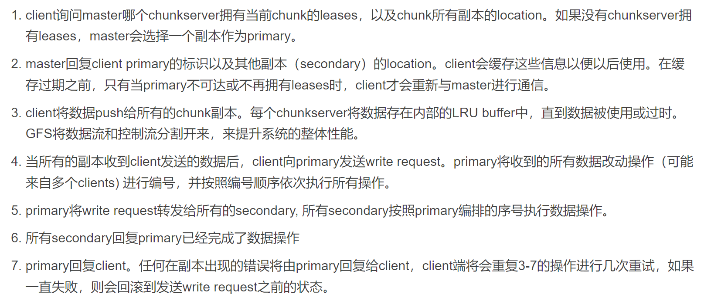
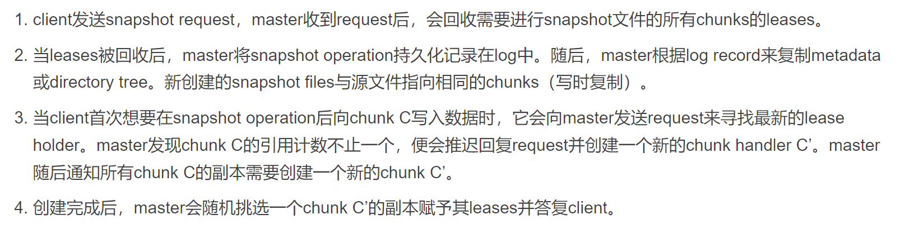
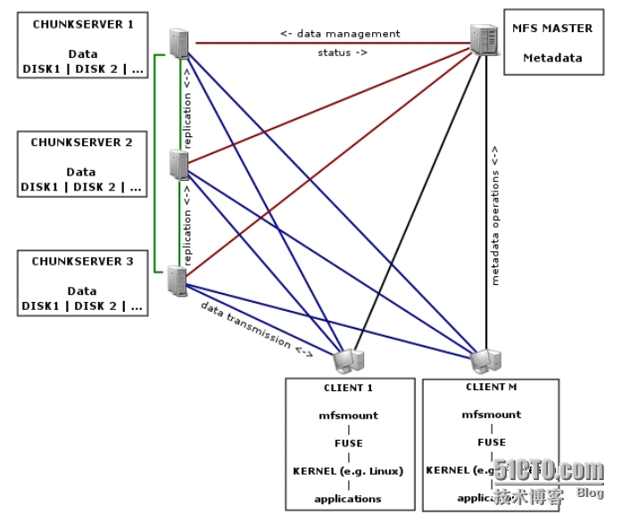

## XRP: In-Kernel Storage Functions with eBPF

#### 提要：
随着存储设备的性能提升（如HDD->NVME SSD），在与存储设备交互时，Linux内核的开销占比越来越大（接近一半）。作者提出XRP，用以减少这部分开销，从而提升存储性能。

#### 创新点：
XRP允许用户定义的函数在NVME驱动层执行，并且在实现中采取了一些限制措施（如对访问的位置进行检测防止越界），从而得以安全地“绕开”Linux内核。

#### 结果（只总结了一部分）：
##### 1. 延迟
XRP在延迟方面优于read()和io_uring，但差于SPDK。不过XRP不需要轮询，因此相较SPDK对CPU的占用少。
当线程数较多时，XRP的尾端延迟显著优于SPDK。
##### 2.带宽
当index深度增加时，XRP的带宽较read()和io_uring更高。当线程数增加时，XRP的带宽增加也优于read()和io_uring，且线程数足够多时，带宽要优于SPDK。

#### 详细阅读
XRP利用（或者说借鉴？）了Linux的eBPF,这是一项可以将用户定义的函数注入Linux内核执行的技术。

XRP事实上可以部署在内核中的任何一层，但NVME驱动最接近硬件层，可以带来最大的性能提升。

对于中途需要大量访问磁盘内容，而用户程序并不关心中间的查找结果，只需要得到查找得到的数据的情况（这种情况很多，比如在二叉树中查找等），如果直接在用户程序层进行查找过程，那么每一次查找得到的某一个节点数据都需经内核传回用户程序，随后若查找还未结束，则用户程序还需通过内核取下一项数据。这样在硬件-内核-用户之间不断传递的过程开销很大且不必要。若利用XPR技术将这样的程序放到驱动中执行，则可越过大部分的内核层，且不需要大量的上下文切换。

实现XRP的挑战主要在于：
1. 地址转换和安全性。由于driver无法获取文件系统元数据，因此无法获得文件的实际地址。如果直接传递文件的物理地址，又会导致安全性问题（访问的位置不受限制）
   作者采用的解决方式是将Linux的extent status tree缓存一份，通过一个查找函数在其中查找物理地址，这一查找函数同时还会检查文件访问是否越界；通过在合适的位置调用更新函数来更新这一缓存，同时还通过版本号等防止extent status tree不是最新。
2. 同时访问问题（省流：摆烂了）。一份文件同时被读和写的情况对于XRP而言比较棘手，因为XRP无法得知写请求（因为在驱动里面），这可能导致XRP读取得到错误的数据。这一问题可以通过使用锁来解决，但XRP实现在NVMe interrupt handler中，使用锁的开销高昂。因此，XRP只适用于很少修改的数据结构，且大量数据结构确实很少修改。

#### 可行性：
硬件上，现如今的个人PC大多采用NVMe的SSD；软件上，作者开放了源代码（用的C语言，祖宗之法不可变），因此理论上可行（实际上开源项目巨大，我也不知道能不能行）。

## 分布式存储系统调研

### GFS（Google File System）:
GFS是一个经典的分布式文件系统，是谷歌为海量搜索设计的专用文件系统，于2003年提出。不开源。
#### 特点：
   1. GFS为处理大量的大文件（100MB以上，常见为若干GB）设计，支持小文件但不作优化。
   2. 适用于大批量的流式读取，对随机读取不作优化。
   3. 支持大量顺序追加写入，这种写入操作的典型操作规模与读取类似。写入后文件极少修改。支持随机写入但不保证效率。
   4. 支持多客户端高效地同时追加写入。
   5. 相比低延迟，更重视持续的高带宽。
#### 架构：
   1. 一个GFS集群由一个master和若干个chunkservers组成，并且可以由多个客户端访问。这些机器都是使用Linux操作系统的通用计算机。
   2. 文件在GFS中被分成固定大小的分块，每一个块用一个独一无二的64位chunk handle识别（这一识别码在分块创建时确定）。分块以Linux文件的形式存储在chunkservers上，读写时用chunk handle和字节范围指定。每一个分块都存在多个（默认3个）chunkservers上。
   3. master在内存中存储文件系统元数据，包括命名空间，文件到块的映射和块的分布。块的分布不是永久存放在master上的（即没有存放在如硬盘这种不易失存储器上），而是在master启动时轮询每一chunkserver获得，并且通过心跳信息（Heart Beat message，即定时发送的信息）维护。这一设计使得  master无需与chunkserver保持同步，否则chunkserver加入或退出时总是要修改记录（这种情况经常发生）。
   master永久存储元数据的关键改动（日志）。日志会被远程备份。日志超过一定规模便会生成存档点（checkpoints），master重启时会从最近的存档点以及之后的少量日志恢复自身状态。
   4. 一致性：
   GFS对文件的不同状态定义如下：如果所有clients看到的数据都相同，则该文件区域是consistent。如果所有client看到的数据不仅相同，还能完整的看到改动的记录，则该文件区域是defined。并发的改动操作会让文件区域保持consistent，但是undefined，因为可能无法看到所有的数据变化（可能存在并发修改同一条记录，之前的修改记录被覆盖的情况）。一次失败的数据改动会造成文件系统unconsistent，不同的clients可能获取到的是不同的数据。GFS应用可以区分文件区域是undefined还是defined。在一系列成功的修改操作后，GFS可以通过这些机制保证文件的defined特性：(a) chunk上的数据改动顺序与其副本一致；(b)用版本号区分chunk副本是否已过时。
   使用GFS的应用程序可以利用一些简单技术实现宽松的一致性，包括：尽量采用追加写入而不是覆盖，Checkpoint，自验证的写入操作，自标识的记录。checkpoint可以包含校验和。同时应用程序也应加强自身的幂等性。
#### 系统交互：
   1. master会定期选择一个chunk的主副本（primary ），其余副本为二级副本（secondary），chunk变更时的顺序由主副本规定。一个副本成为主副本的租约时间为60秒，这样即使master或primary宕机，只需等待60秒，随后指定新的primary即可。确定主副本的过程（lease）如下：
   
   2. GFS的控制流与数据流分离，数据流按线性的流水线方式传输。每个chunkserver将数据发送给离自己最近的还未收到数据的chunkserver。这样可以使每台chunkserver用最大的带宽发送数据，而不必在各个接收者之间分配带宽，同时可以降低延迟。距离可以用IP地址计算出。
   3. GFS提供原子（atomically）的追加写入（record append）操作，这一操作中client只提供数据，由GFS选择一个offset写入并返回给client。如果写入时数据可以被当前块容纳，则GFS直接写入；否则GFS让主副本和次副本将当前块填满，并回复client这一操作需要在下一个块中重试。如果某次追加写入失败，则client重新执行写入，因此GFS不保证数据在字节级别上的一致性，它只保证每一个数据至少被追加写入了一次。
   4. GFS提供snapshot操作来对文件和目录进行快速复制，且几乎不影响正在执行的修改操作。snapshot的流程如下：
   
#### Master操作：
   1. 由于master operation都比较耗时，如snapshot，创建chunk等，因此为了减小master operations之间的影响，GFS master采用了以命名空间为单位的分段加锁机制。GFS对namespace tree中的每一个节点，无论是文件名还是目录名，都设置了一个read-write lock。 每个master operation在执行前都会获得一系列的read-write lock。如果master operation想要访问/d1/d2/.../dn/leaf，它会获得/d1, /d1/d2, ..., /d1/d2.../dn 的read-locks并获得 /d1/d2/.../dn/leaf 的read-lock或write-lock。这样加锁可以防止文件在对应目录执行snapshot时被创建，且支持并行的文件创建（writer只在创建的文件处获得write-lock）。
   为了保证最大的可靠性和可用性，以及尽可能大的带宽，GFS将一个chunk的多个副本放置在处于不同机架的chunkservers上。代价是写操作需要跨越机架（即很可能需要跨越不同的交换机）。
   2. GFS在创建、重新复制和平衡副本时，会考虑3个因素：放在disk空间利用率低于平均值的chunkserver上；限制每个chunkserver的replicas数量，尽量负载均衡；部署在不同的机架中。同时，GFS会在chunk可用的replicas数量由于chunkserver故障等原因低于用户定义的数量时执行重新复制，重复制的优先级如下：replicas数量越少，优先级越高；alive file对应的chunk的优先级高于recently deleted files对应的chunk的优先级；阻塞了client处理程序的chunk优先级更高。并且，master会周期性的检查系统状态来执行rebalances操作。master会定期查看replicas在chunkservert上的分布，将replicas移动到其他chunkserver上，以均衡disk space和load balance。 通过这种方式，对于新加入的chunkserver，master会逐渐的填满它，而不是立即给它大量的chunk。
   3. 垃圾回收机制上，GFS并不会立即释放被删除的文件。当一个文件被删除时，GFS将它改名为包含删除时间的时间戳的文件，当这样的文件存在超过3天后空间才将被释放（3天这个时间可以调）。该文件被（彻底）删除后，这个文件所有的chunk都将无法被取得。master周期性地扫描chunk namespace，会删除所有的孤儿chunk和相应的metadata。在与chunkserver进行通信的heartbear message中，master会告诉哪些metadata已经不存在了，chunkserver会删除存储的相应的chunk。另外，master节点会维护chunk版本号。每当master赋予新的chunkserver租约（选择新的primary）时，它将更新版本号。如果有chunkservers在更新版本号时不可用，则它的版本号不会被更新。在它重新启动向master汇报自己的版本号后，master将会发现它有过时的副本，并在定期的垃圾清理中清理过时副本。如果master发现有chunkservers的版本号比自己大，则它会认为自己在发放租约并更新版本号时崩溃了，此时它会更新自己的版本号。
#### 容错与错误诊断
   1. master和chunkservers具有快速启动功能。GFS并不区分正常和非正常的关闭，在实际使用中也是通过直接kill掉进程来关闭服务器的，因此无论在哪种情况下停止运行，服务器都能在几秒内快速恢复。
   另外，前面已经提到了chunk会被复制到不同的机架的服务器上，并且用户可以为不同命名空间设置不同的复制等级，因此充足的副本可以保证部分chunkservers宕机时不影响可用性。同时Google也在探寻采用奇偶校验和纠删码等解决方案。
   同时，master的状态也有多个副本，如果Master进程所在的机器或者磁盘失效了，处于GFS系统外部的监控进程会在其它的存有完整操作日志的机器上启动一个新的Master进程。客户端使用规范的名字访问Master（比如gfs-test）节点，这个名字类似DNS别名，因此也就可以在Master进程转到别的机器上执行时，通过更改别名的实际指向访问新的Master节点。master还有多个影子服务器（不是镜像服务器），影子服务器的数据可能比master稍慢，对于一些情况（如应用程序对数据是否最新不敏感，或读取的文件不常改变）可以提高读取效率。
   2. GFS使用了checksum来检查副本是否损坏。每一个chunk都被分成64KB的块，每一块对应一个32位的checksum。每次读取操作之前，chunkservers会使用checksum来检验数据的正确性，如果检验结果不正确，则chunkserver返回错误，并向master报告。master会为其从其他副本恢复数据，随后删除错误数据。另外，chunkserver空闲时会扫描不常用的文件是否损坏，防止不常用文件缺少足够的有效副本。
   3. GFS有包含关键事件（比如chunkservers的启动和关闭）以及所有RPC请求和回复的诊断日志。可用于诊断问题，进行性能分析等。

### HDFS：
#### 特点：
   基于GFS开发，因此具有GFS的许多特性，例如可靠性高，将文件分块存储，适合大文件存储，但延迟较高且无法高效存储小文件等。
#### 架构：

   1. NameNode：类似（或者说就是）GFS中的Master，负责整个分布式文件系统的元数据（MetaData）管理和响应客户端请求。
   2. DataNode：GFS中的chunkserver，负责存储数据块，通过心跳信息向NameNode报告自身状态。
#### 容错与可靠性：
   1. 每一个数据块有多个副本（默认3个），副本的存放策略为：第一个副本会随机选择，但是不会选择存储过满的节点，第二个副本放在和第一个副本不同且随机选择的机架，第三个和第二个放在同一机架上的不同节点，剩余副本完全随机节点。
   2. checksum校验，DataNode宕机时对缺失副本的数据块增加副本数量（与GFS相同）
   3. 主从NameNode，主NameNode宕机时副NameNode成为主NameNode。

### MooseFS
#### 特点：
   GFS的一种C实现，具有GFS的许多特性。支持POSIX，支持随机写入。
#### 架构：

   架构与GFS几乎一致。
   1. Managing Server（Master）：负责管理元数据，控制chunkservers中的数据拷贝等。
   2. Metadata backup servers：备份metadata日志的服务器，使得当Master宕机时，可以快速让新服务器接管Master的工作。
   3. Data Servers（chunkservers）：存放数据的服务器。
#### 容错与可靠性：
   与GFS基本相同，但为了支持随机写入，chunk可以修改，可能会导致出错。
#### 备注：
   MooseFS不同于GFS和HDFS，后两者都是专用文件系统（GFS是给谷歌自己的搜索引擎用的，HDFS是Hadoop的一部分），MooseFS是一个商用的通用分布式文件系统，最初是闭源（且收费）的，后来才推出了开源的社区版，但功能有限制。因此官方给出了比较详细的关于如何部署该文件系统的文档，网络上也有教多这方面的教程，但关于技术方面的细节介绍比较少（鉴于我们重点不在存储系统，可能MooseFS比较适合我们）。

