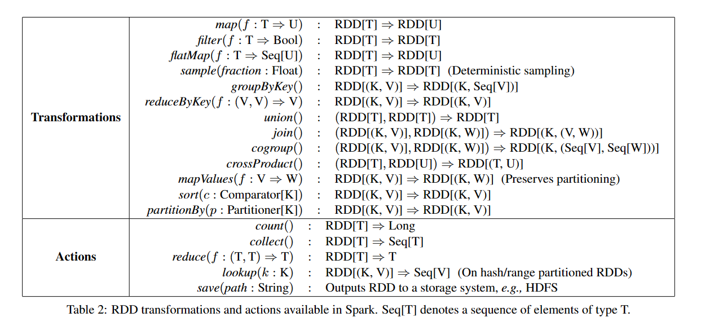
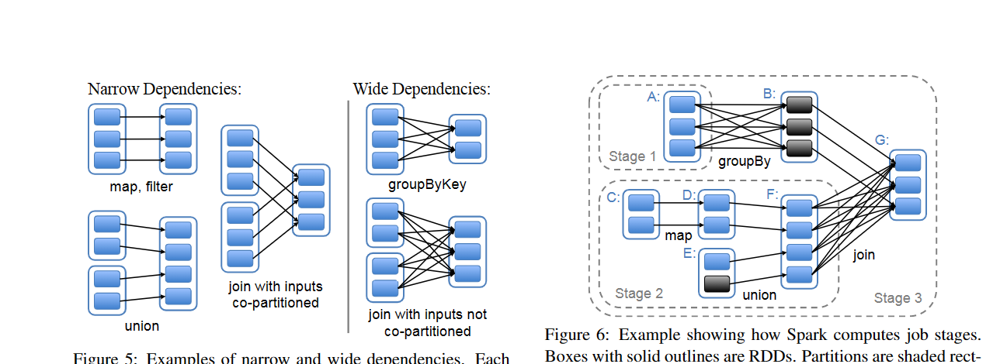

# 论文笔记
> Resilient Distributed Datasets: A Fault-Tolerant Abstraction for In-Memory Cluster Computing(by UCB)
## 摘要:
RDDs来源于两种当前的数据流系统不能有效处理的应用：迭代式算法，以及交互式数据挖掘工具。在这两种方式中将数据保存在内存中都可以将速度提升一个数量级。

为了提高容错性，RDDs提供了高度限制的形式，他们是只读的数据集并且只能被其他的RDDs操作构建。
## 介绍:
MR中使用有向无环图来确定工作流程，但是这样还不够。比如在复用工作数据在多并行的操作中。
## RDDs
### RDD抽象
一个 RDD 是一个只读, 被分区的数据集.我们可以通过两种对稳定的存储系统和其他的 RDDs 进行操作而创建一个新的 RDDs.为了区别开 RDDs 的其他操作, 我们称这些操作为 transformations, 比如 map, filter 以及 join 等都是 transformations 操作.

### 编程接口
RDDs被表达为对象，transformation被触发使用这些对象上的方法。
当定义了一个或多个RDDs后，用户可以在actions中使用它们，这些操作要么为应用程序返回数据，要么将数据导出到存储系统中。常见的action操作:count,collect,save.
请注意这些action都是懒操作，以允许运行时在构建RDD时进行转换。
用户可以控制RDDs的另外两个方面，caching和partitioning.
快照会将RDD暂存到内存中方便之后复用，如果内存不够用也会落盘。
自定义分区会将多个RDD以相同方式映射，可以方便之后的合并。
### 示例:控制台日志挖掘
考虑从TB级别日志数据中寻找错误信息。
```
lines = spark.textFile("hdfs://...")
errors = lines.filter(_.startsWith("ERROR"))
errors.cache()
```
这时集群上还没有执行任何工作。但是如果我们使用action
errors.count()
Spark就会将分区中的errors信息cache进内存中。但是请注意lines并不会产生快照，这也是我们所希望的。
Spark调度器会将transformation流水线到有cache的节点上去计算。如果某一份errors丢失，Spark只需要用filter在对应的lines的分区上重建即可。

## Spark编程接口
Spark使用Scala实现由于其简洁和效率（静态类型）。
为了使用Spark，开发者编写driver程序连接到集群上去运行worker,driver定义了一个或多个RDDs并且激活他们上的action.workers是长期生存的进程，能够将RDD分区映射到RAM中，就像JAVA对象一样。



注意map是一个一对一映射，flatMap是一对多（就像MR中的map一样）。用户还可以要求一个RDD进行cached，进一步的用户可以得到一个RDD的划分顺序，由Partitioner类表达，并且将其他的RDD也根据此进行划分。
想groupBuKey,reduceByKey,以及sort自动的导致hash或者区间划分的RDD.

### 实例应用
Spark可以表达不同的现有的集群模型：MapReduce,Pregel,HaLoop.
1. 迭代机器学习
   考虑一个梯度下降的算法，从任意的w开始，每一次迭代，他就计算w在数据中的函数的和然后移动w到能提高他的方向上。

``` s
   val points = spark.textFile(...)
    .map(parsePoint).cache()
    var w = // random initial vector
    for (i <- 1 to ITERATIONS) {
        val gradient = points.map{ p =>
        p.x * (1/(1+exp(-p.y*(w dot p.x)))-1)*p.y
        }.reduce((a,b) => a+b)
    w -= gradient
    }
```

2. 使用RDDs的MR
```S
data.flatMap(myMap)
.reduceByKey(myCombiner)
.map((k, v) => myReduce(k, v))
```
   用Spark改写MapReduce是十分简单的。

3. 使用RDDs的Pregel,Haloop,略


## RDD表示和任务调度
每一个RDD有一套划分，这些划分是数据集的部分，一套对父RDD的依赖，以及一个从父RDD计算的函数，以及包括划分方案和数据存放的元数据。
RDD应该区分宽依赖和窄依赖，宽依赖是多对一，窄依赖可以近似理解为一对一。窄依赖容易恢复，宽依赖难恢复。
涉及的转换函数的通用接口大部分少于20行代码

### RDD的实现范例
HDFS files:
输入全部来自于HDFS文件，对于这些RDD，partitions对于每一块文件返回一个划分，这些划分的偏移量存放在每一个划分对象中；返回preferredLocation提供了块文件所在的节点，以及iterator用来读块文件。
1. map:在任何RDD上调用map会返回MappedRDD对象，这个对象的partition和preferredLocation等同于他的父亲，但是在iterator方法上应用了传递给parent records的map
2. union:在两个RDD上调用union会返回一个RDD，划分是父RDD的合并，子划分是窄依赖的。注意不会去重
3. sample:取样类似于mapping,除了除了RDD存储了随机种子对于parent records的每一个划分样本。
4. join:加入两个RDDs可能导致不同的依赖情况，取决于他们是否有相同的partitionor

### Spark任务调度

调度器的接口是一个叫runJob的函数，他使用一个RDD参数去工作，一套感兴趣的partitions，以及一个在这些划分上运行的函数。这个接口对于表达Spark中的所有action是足够的(count,collect,save...)
调度器检查目标RDD的lineage关系图来构建stages的DAG去执行。每一个stage包含了尽可能多的使用窄依赖的流水线transformation.stages的边界是要求宽依赖的shuffle操作或者任意缓存的partitions可能短路父RDD的计算.我们从每一个它的parents完成的阶段开始计算确实的partitions工作。
调度器将工作放在数据本地以最小化通信成本。如果一个任务需要处理缓存的划分，我们就把它发送到有哪个划分的节点。否则，如果一个task处理的划分是RDD提供首选位置的，我们就把任务发送过去。
对于宽依赖，我们立即实现中间记录在那些有着parent partition的记录上，以简化容错恢复，很像MapReduce实现map输出一样.
如果一个任务失败了，我们就在其他节点上运行，只要父节点仍然是可用的。如果一些stages变的不可用，我们就重新提交任务去计算失去的这些stages的划分。
最终，lookup action，使得用户从hash或者range partition中获取元素通过它的key,提出了一个有趣的设计问题.
### Checkpointing
在长依赖关系中，采用checkpoingting可能更好。
Spark当前实现了chkp的API但是将选择权留给了用户。
主义chkp可以在后台工作，并不会产生一致性问题的开销（eg,cow schemes,分布式快照，或者程序暂停）

## 实现
用Scala在大约10000行实现，系统可以使用任意的Hadoop资源来当作输入（eg hdfs）,使得很容易集成进入Hadoop环境中。
论文中讨论了三个有趣的实现:Scala解释器，用于交互式使用Spark,缓存管理，以及调试工具。
