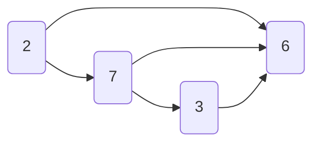

## 图计算系统
### Pregel框架
由Google提出，用于大规模分布式图计算，可用BFS、SSSP（单源最短路径）、PageRank等问题。
pregel的计算常由一系列迭代组成，称为sperstep(超步)。
基于消息传递机制，采用了BSP计算模型：即每个计算节点在固定的迭代周期内进行计算，然后等待其他计算节点完成计算后再进行下一轮迭代。
一般分为以下三个步骤：
1. Vertex computation：各节点执行本地计算。
2. Message communication：各节点将计算结果发送给相邻节点。
3. Global synchronization：超步结束后，系统对所有节点进行同步，确保所有节点都执行完毕后，进入下一个超步。(直到结果收敛)

For Example:(PageRank)
1. 初始化：将所有顶点的PageRank值初始化为1/n，其中n是图中顶点的总数。
2. Vertex computation阶段：每个顶点计算它的PageRank值。每个顶点会收到来自它相邻顶点的消息，消息包含了相邻顶点的PageRank值和它们的出度。顶点会根据消息计算新的PageRank值，并将新的PageRank值发送给它的相邻顶点。每个顶点只能更新自己的PageRank值一次，如果PageRank值没有更新，则不发送消息。
3. Message communication阶段：顶点之间通过消息传递交换计算结果。每个顶点会将自己的PageRank值按比例分配给它的相邻顶点，消息中包含了相邻顶点的id和PageRank值。
4. Global synchronization阶段：每个超步结束时，系统会对所有顶点进行同步，确保所有顶点执行完毕后进入下一个超步。直到所有顶点的PageRank值的差值小于一个阈值，算法结束。

下面是基于spark的一个实现：
这是针对如下图的：

代码：
```
import org.apache.spark.SparkContext
import org.apache.spark.graphx.{Edge, EdgeDirection, EdgeTriplet, Graph, VertexId}
import org.apache.spark.rdd.RDD
import org.apache.spark.sql.SparkSession

object Pregel {

  def main(args: Array[String]): Unit = {
    val spark: SparkSession = SparkSession.builder()
      .master("local[4]")
      .appName(this.getClass.getName)
      .getOrCreate()
    val sc: SparkContext = spark.sparkContext
    import spark.implicits._

    // 1. 构建顶点的RDD
    val verts: RDD[(Long, (Int, Int))] = sc.parallelize(Array(
      (1L, (7, -1)),
      (2L, (3, -1)),
      (3L, (2, -1)),
      (4L, (6, -1))
    ))

    // 2. 构建边的RDD
    val edges: RDD[Edge[Boolean]] = sc.parallelize(Array(
      Edge(1L, 2L, true),
      Edge(1L, 4L, true),
      Edge(2L, 4L, true),
      Edge(3L, 1L, true),
      Edge(3L, 4L, true)
    ))

    // 3. 构建图
    val graph: Graph[(Int, Int), Boolean] = Graph(verts, edges)
    graph.triplets.foreach(println)
    // ((1,(7,-1)),(4,(6,-1)),true)
    // ((3,(2,-1)),(1,(7,-1)),true)
    // ((1,(7,-1)),(2,(3,-1)),true)
    // ((2,(3,-1)),(4,(6,-1)),true)
    // ((3,(2,-1)),(4,(6,-1)),true)

    // initialMsg 在superstep 0之前发送至顶点的初始消息
    // maxIterations 将要执行的最大迭代次数
    // activeDirection 发送消息方向（默认是出边方向：EdgeDirection.Out）
    // vprog 用户定义函数，用于顶点接收消息
    // sendMsg 用户定义的函数，用于确定下一个迭代发送的消息及发往何处
    // mergeMsg 用户定义的函数，在vprog前，合并到达顶点的多个消息
    val initialMsg: Int = 9999
    val maxIterations: Int = Int.MaxValue
    
    // vertexId: 当前顶点的Id
    // value: 当前顶点的attr
    // message: 当前顶点要接收的消息
    def vprog(vertexId: VertexId, value: (Int, Int), message: Int) = {
      if (message == initialMsg) value else (message min value._1, value._1)
    }

    def sendMsg(triple: EdgeTriplet[(Int, Int), Boolean]) = {
      val sourceVertex: (Int, Int) = triple.srcAttr
      if (sourceVertex._1 == sourceVertex._2) Iterator.empty
      else Iterator((triple.dstId, sourceVertex._1))
    }

    def mergeMsg(msg1: Int, msg2: Int): Int = msg1 min msg2

    graph.pregel(initialMsg, maxIterations, EdgeDirection.Out)(vprog, sendMsg, mergeMsg)
      .vertices.foreach(println)
    // (1,(2,7))
    // (2,(2,3))
    // (3,(2,-1))
    // (4,(2,2))
  }
}
```


Rmk:
Apache Giraph、Spark、Neo4j等系统均已实现Pregel框架的支持。

### Giraph框架
同样基于BSP模型。

与Pregel的区别：
1. Pregel框架中，每个计算节点处理多个顶点的计算，这种方式可以减少通信开销，但是也可能导致负载不均衡的问题。而Giraph框架中，每个计算节点只处理一个顶点的计算，这种方式可以保证负载均衡，但是会增加通信开销。
2. 具体实现方式略有不同。

## 流处理计算系统
**Goal:**
针对无界的、小量的（每次处理）、持续实时快速产生的数据。批处理系统强调的是计算能力，流处理系统更要求吞吐量（单位时间内处理请求数量）、实时性（至少秒级）
### Spark Streaming
RDD是 Spark Core 的核心抽象，DStream 是 Spark Streaming 提供的高级别抽象，因为 DStream 是由许多 RDDs 构成。