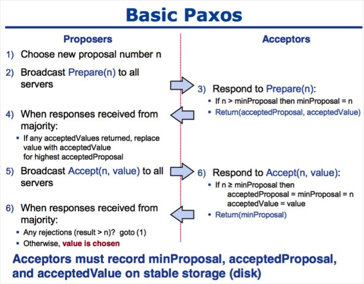

## MemLiner: Lining up Tracing and Application for a Far-Memory-Friendly Runtime
- 关键词：远程存储,GC（垃圾回收）,JDK,
- 作者在论文中为了解决当前GC存在的两大问题（资源竞争，低效预取）提出了新的运行时技术(MemLiner)可以结合当前已有的GC技术，将回收效率提高1.5~2倍。
- 需要注意该技术被希望运用在远程的分布式存储系统上以减少远程管理存储的开销，同时实验主要在服务器上运行，硬件要求较高（CPU E5-2640，128GB mem, 1024GB SSD,connected by RDMA over 40Gbps InfiniBand network）,综合考虑该论文属于JVM GC调优的范畴，可实操性不明确。

## RPC(Remote Procedure Call) 调研
- RPC（Remote Procedure Call）叫作远程过程调用，它是利用网络从远程计算机上请求服务，可以理解为把程序的一部分放在其他远程计算机上执行。通过网络通信将调用请求发送至远程计算机后，利用远程计算机的系统资源执行这部分程序，最终返回远程计算机上的执行结果。
  
RPC 工作原理总结：

Provider：服务提供方，CS 模型中的 Server。
Consumer： 调用远程服务服务消费方，CS 模型中的 Client。
Registry：服务注册与发现的服务管理中心。
Monitor：统计服务的调用次数和调用时间的监控中心。
Container：服务运行容器，如 jetty。

RPC 执行过程总结：

服务容器负责启动，加载，运行服务提供者。
服务提供者在启动时，向注册中心注册自己提供的服务，暴露自己的 IP 和端口信息。
服务消费者在启动时，向注册中心订阅自己所需的服务。
注册中心返回服务提供者列表给消费者，如果有变更，注册中心将基于长连接推送给数据消费者。
服务消费者，从提供这地址列表中，基于软负载均衡算法，选一台提供者进行调用，如果调用失败，再选另外一台服务调用。
服务消费者和提供者，在内存中累计调用次数和调用时间，定时发送一次统计数据到监控中心。

要实现一个RPC不算难，难的是实现一个高性能高可靠的RPC框架。

比如，既然是分布式了，那么一个服务可能有多个实例，你在调用时，要如何获取这些实例的地址呢？

这时候就需要一个服务注册中心，比如在Dubbo里头，就可以使用Zookeeper作为注册中心，在调用时，从Zookeeper获取服务的实例列表，再从中选择一个进行调用。

那么选哪个调用好呢？这时候就需要负载均衡了，于是你又得考虑如何实现复杂均衡，比如Dubbo就提供了好几种负载均衡策略。

这还没完，总不能每次调用时都去注册中心查询实例列表吧，这样效率多低呀，于是又有了缓存，有了缓存，就要考虑缓存的更新问题，blablabla......

你以为就这样结束了，没呢，还有这些：

客户端总不能每次调用完都干等着服务端返回数据吧，于是就要支持异步调用；
服务端的接口修改了，老的接口还有人在用，怎么办？总不能让他们都改了吧？这就需要版本控制了；
服务端总不能每次接到请求都马上启动一个线程去处理吧？于是就需要线程池；
服务端关闭时，还没处理完的请求怎么办？是直接结束呢，还是等全部请求处理完再关闭呢？
......
如此种种，都是一个优秀的RPC框架需要考虑的问题。

## 分布式一致性算法应用场景 
https://zhuanlan.zhihu.com/p/31727291

- 分布式一致性(Consensus)
  - 领导者选举：进程对leader达成一致
  - 互斥：对于访问临界资源（不许同时读写）的进程达成一致
  - 原子广播：进程对消息传递顺序达成一致

- 典型应用场景：
  - 主从同步
  - 主从异步
  - Paxos,Raft(提供一致性和可用性的平衡)
  
- CAP理论（一致性，可用性，容错性的不可能三角）
- 多副本状态机：
  - 多副本状态机是指多台机器具有完全相同的状态，并且运行完全相同的确定性状态机。
  - 多副本状态机的每个副本上都保存有完全相同的操作日志，保证所有状态机副本按照相同的顺序执行相同的操作，这样由于状态机是确定性的，则会得到相同的状态。
  - 保证复制到各个服务器上的日志的一致性正是分布式一致性算法的工作。一致性算法保证所有状态机副本上的操作日志具有完全相同的顺序，如果状态机的任何一个副本在本地状态机上执行了一个操作，则绝对不会有别的副本在操作序列相同位置执行一个不同的操作。

## Paxos算法详解
https://zhuanlan.zhihu.com/p/31780743
Paxos将系统中的角色分为提议者 (Proposer)，决策者 (Acceptor)，和最终决策学习者 (Learner):
- Proposer: 提出提案 (Proposal)。Proposal信息包括提案编号 (Proposal ID) 和提议的值 (Value)。
- Acceptor：参与决策，回应Proposers的提案。收到Proposal后可以接受提案，若Proposal获得多数
Acceptors的接受，则称该Proposal被批准。
- Learner：不参与决策，从Proposers/Acceptors学习最新达成一致的提案（Value）。

Paxos算法通过一个决议分为两个阶段（Learn阶段之前决议已经形成）：
- 第一阶段：Prepare阶段。Proposer向Acceptors发出Prepare请求，Acceptors针对收到的Prepare请求进行Promise承诺。
- 第二阶段：Accept阶段。Proposer收到多数Acceptors承诺的Promise后，向Acceptors发出Propose请求，Acceptors针对收到的Propose请求进行Accept处理。
- 第三阶段：Learn阶段。Proposer在收到多数Acceptors的Accept之后，标志着本次Accept成功，决议形成，将形成的决议发送给所有Learners。

## Raft算法详解
https://zhuanlan.zhihu.com/p/32052223

