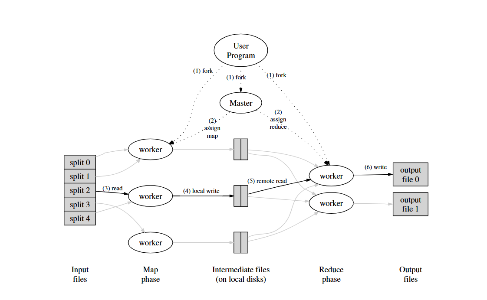

## MemLiner: Lining up Tracing and Application for a Far-Memory-Friendly Runtime
- 关键词：远程存储,GC（垃圾回收）,JDK,
- 作者在论文中为了解决当前GC存在的两大问题（资源竞争，低效预取）提出了新的运行时技术(MemLiner)可以结合当前已有的GC技术，将回收效率提高1.5~2倍。
- 需要注意该技术被希望运用在远程的分布式存储系统上以减少远程管理存储的开销，同时实验主要在服务器上运行，硬件要求较高（CPU E5-2640，128GB mem, 1024GB SSD,connected by RDMA over 40Gbps InfiniBand network）,综合考虑该论文属于JVM GC调优的范畴，可实操性不明确。

## RPC(Remote Procedure Call) 调研
- RPC（Remote Procedure Call）叫作远程过程调用，它是利用网络从远程计算机上请求服务，可以理解为把程序的一部分放在其他远程计算机上执行。通过网络通信将调用请求发送至远程计算机后，利用远程计算机的系统资源执行这部分程序，最终返回远程计算机上的执行结果。
  
RPC 工作原理总结：

Provider：服务提供方，CS 模型中的 Server。
Consumer： 调用远程服务服务消费方，CS 模型中的 Client。
Registry：服务注册与发现的服务管理中心。
Monitor：统计服务的调用次数和调用时间的监控中心。
Container：服务运行容器，如 jetty。

RPC 执行过程总结：

服务容器负责启动，加载，运行服务提供者。
服务提供者在启动时，向注册中心注册自己提供的服务，暴露自己的 IP 和端口信息。
服务消费者在启动时，向注册中心订阅自己所需的服务。
注册中心返回服务提供者列表给消费者，如果有变更，注册中心将基于长连接推送给数据消费者。
服务消费者，从提供这地址列表中，基于软负载均衡算法，选一台提供者进行调用，如果调用失败，再选另外一台服务调用。
服务消费者和提供者，在内存中累计调用次数和调用时间，定时发送一次统计数据到监控中心。

要实现一个RPC不算难，难的是实现一个高性能高可靠的RPC框架。

比如，既然是分布式了，那么一个服务可能有多个实例，你在调用时，要如何获取这些实例的地址呢？

这时候就需要一个服务注册中心，比如在Dubbo里头，就可以使用Zookeeper作为注册中心，在调用时，从Zookeeper获取服务的实例列表，再从中选择一个进行调用。

那么选哪个调用好呢？这时候就需要负载均衡了，于是你又得考虑如何实现复杂均衡，比如Dubbo就提供了好几种负载均衡策略。

这还没完，总不能每次调用时都去注册中心查询实例列表吧，这样效率多低呀，于是又有了缓存，有了缓存，就要考虑缓存的更新问题，blablabla......

你以为就这样结束了，没呢，还有这些：

客户端总不能每次调用完都干等着服务端返回数据吧，于是就要支持异步调用；
服务端的接口修改了，老的接口还有人在用，怎么办？总不能让他们都改了吧？这就需要版本控制了；
服务端总不能每次接到请求都马上启动一个线程去处理吧？于是就需要线程池；
服务端关闭时，还没处理完的请求怎么办？是直接结束呢，还是等全部请求处理完再关闭呢？
......
如此种种，都是一个优秀的RPC框架需要考虑的问题。

## 分布式一致性算法应用场景 
https://zhuanlan.zhihu.com/p/31727291

- 分布式一致性(Consensus)
  - 领导者选举：进程对leader达成一致
  - 互斥：对于访问临界资源（不许同时读写）的进程达成一致
  - 原子广播：进程对消息传递顺序达成一致

- 典型应用场景：
  - 主从同步
  - 主从异步
  - Paxos,Raft(提供一致性和可用性的平衡)
  
## CAP理论（一致性，可用性，容错性的不可能三角）
CAP原则又称CAP定理，指的是在一个分布式系统中，一致性（Consistency）、可用性（Availability）、分区容错（Partition-tolerance）。在一个分布式系统中三个要素不可同时具有，只能选择其中两个。
一致性（Consistency）
在分布式系统中，所有节点在同一时刻的数据都是一致的。

可用性（Availability）
在集群中一部分节点故障后，集群整体是否还能响应客户端的读写请求。即每个请求不管成功与否都能得到响应。

分区容错（Partition-tolerance）
保证系统中任意信息的丢失都不会影响系统的运行。

一个分布式系统里面，节点组成的网络本来应该是连通的。然而可能因为一些故障，使得有些节点之间不连通了，整个网络就分成了几块区域。数据就散布在了这些不连通的区域中。这就叫分区。


- 多副本状态机：
  - 多副本状态机是指多台机器具有完全相同的状态，并且运行完全相同的确定性状态机。
  - 多副本状态机的每个副本上都保存有完全相同的操作日志，保证所有状态机副本按照相同的顺序执行相同的操作，这样由于状态机是确定性的，则会得到相同的状态。
  - 保证复制到各个服务器上的日志的一致性正是分布式一致性算法的工作。一致性算法保证所有状态机副本上的操作日志具有完全相同的顺序，如果状态机的任何一个副本在本地状态机上执行了一个操作，则绝对不会有别的副本在操作序列相同位置执行一个不同的操作。

## Paxos算法详解
https://zhuanlan.zhihu.com/p/31780743
Paxos将系统中的角色分为提议者 (Proposer)，决策者 (Acceptor)，和最终决策学习者 (Learner):
- Proposer: 提出提案 (Proposal)。Proposal信息包括提案编号 (Proposal ID) 和提议的值 (Value)。
- Acceptor：参与决策，回应Proposers的提案。收到Proposal后可以接受提案，若Proposal获得多数
Acceptors的接受，则称该Proposal被批准。
- Learner：不参与决策，从Proposers/Acceptors学习最新达成一致的提案（Value）。

Paxos算法通过一个决议分为两个阶段（Learn阶段之前决议已经形成）：
- 第一阶段：Prepare阶段。Proposer向Acceptors发出Prepare请求，Acceptors针对收到的Prepare请求进行Promise承诺。
- 第二阶段：Accept阶段。Proposer收到多数Acceptors承诺的Promise后，向Acceptors发出Propose请求，Acceptors针对收到的Propose请求进行Accept处理。
- 第三阶段：Learn阶段。Proposer在收到多数Acceptors的Accept之后，标志着本次Accept成功，决议形成，将形成的决议发送给所有Learners。


## Raft算法详解
https://zhuanlan.zhihu.com/p/32052223

1. Raft算法概述
Raft将系统中的角色分为领导者（Leader）、跟从者（Follower）和候选人（Candidate）：
- Leader：接受客户端请求，并向Follower同步请求日志，当日志同步到大多数节点上后告诉Follower提交日志
- Follower：接受并持久化Leader同步的日志，在Leader告之日志可以提交之后，提交日志。
- Candidate：Leader选举过程中的临时角色。
2. Leader选举
3. 日志同步
   Leader选出后，就开始接收客户端的请求。Leader把请求作为日志条目（Log entries）加入到它的日志中，然后并行的向其他服务器发起 AppendEntries RPC （RPC细节参见八、Raft算法总结）复制日志条目。当这条日志被复制到大多数服务器上，Leader将这条日志应用到它的状态机并向客户端返回执行结果。

## Ceph
- 高性能 : 
1. 摒弃了传统的集中式存储元数据寻址的方案，采用CRUSH算法，数据分布均衡，并行度高。
2. 考虑了容灾的隔离，能够实现各类负载的副本放置规则，例如跨机房、机架感知等。
3. 能够支持上千个存储节点的规模，支持TB到PB级的数据。

- 高可用 : 
1. 副本数可以灵活控制
2. 支持故障域分隔，数据强一直性
3. 多故障场景自动进行修复自愈
4. 没有单点故障，自动管理，高可扩展性

- 去中心化 : 
1. 扩展灵活
2. 随着节点增加而线性增长

- 特性丰富 : 
1. 支持三种存储接口 : 块存储、文件存储、对象存储
2. 支持自定义接口，支持多种语言驱动。

## MapReduce

- 介绍:
  - MapReduce是一种编程模型和一种产生及处理大数据的实现方式。他的关键在于两个函数（由用户编写）：Map和Reduce
- Types:
  - map  (k1,v1)        ----> list(k2,v2)
  - reduce(k2,list(v2)) --->list(v2)
- Example(伪代码):
  
```C++
  map(String key, String value):
    // key: document name
    // value: document contents
    for each word w in value:
    EmitIntermediate(w, "1");


  reduce(String key, Iterator values):
    // key: a word
    // values: a list of counts
    int result = 0;
    for each v in values:
    result += ParseInt(v);
    Emit(AsString(result));
```
- 执行过程:

1. MapReduce库先将输入文件分成M份（一般每份64MB，也可用可选参数控制），然后他在集群上启动多份程序
2. 有一份特殊的程序拷贝--master，剩下的都是worker并且被master分配任务.共有M个map任务和R份Reduce任务去分配。master选择空闲的worker去分配map task或者reduce task
3. 获得map任务的worker从对应的输入文件中读取内容。他从中解析出键值对并且将每一对传给Map函数。这些中间键值对被缓存在存储器中
4. 周期性的，这些缓冲的中间键值文件的**位置**被传输给master,master负责把这些信息发给reduce worker
5. 当reduce worker接受到来自master的中间键值文件的位置后，它就使用RPC从map worker的本地磁盘中读取缓存数据，并且根据key进行排序。这样所有出现的相同的key就能被合并到一个组。这个排序是必要的因为通常不同的键会被映射到同一个reduce task中。如果中间键值数据过于庞大的话，则应该使用外部排序
6. reduce worker不断的在排序好的中间键值数据上进行迭代，对于遇到的特定的中间键值对，就将键和值集合传入reduce函数中，函数的输出结果就将加载到最终的输出文件中去（对于这个reduce部分）
7. 当所有的map和reduce人物都被完成后，master就唤醒用户程序，这时MapReduce的调用完成，继续返回到用户的代码中

- 容错性
**Worker Failure**
master会周期性的测试每一个worker，以此来判定是否执行失败，如果map失败就重新安排worker执行。这是因为由于ma过程的结果存储在本地，如果失败就无法取得结果。但是已经完成的Reduce工作不需要回滚，因为其结果存储在全局文件系统中。
并且如果map失败，比如A失败后任务被B重新执行，那么还未读取A的reduce task就会切换到来自于B的数据输出。
**Master Failure**
由于Master只有一个节点，因此失败的可能性很低，如果失败就重新运行整个MapReduce

- 相关改进
  BackupTask,在大部分任务完成后，调用空闲资源一起完成剩余任务，这是为了避免Straggler拖延进度，任何一个worker完成就标记为整个任务完成。未采用此种机制的过程将会提升44%的时间。

  优化分配函数，默认函数是hash(key) mod R，可以改进分配任务的方式使得**负载均衡**

  采用组合函数，将同一类键值对在Map时就组合起来（相当于部分提前了Reduce的工作）

  优化数据传输格式，自定义数据格式，方便解析

  任务失败时发送信号给Master，累积一定次数后就判定某个记录是坏的，跳过之

  进行日志记录和进度显示，方便维护

## Ray
> 背景知识：演员模型（actor,也被译作行动器）
  演员模型推崇的哲学是“一切皆是演员”，这与面向对象编程的“一切皆是对象”类似。

  演员是一个运算实体，响应接收到的消息，相互间是并发的：

  发送有限数量的消息给其他演员；
  创建有限数量的新演员；
  指定接收到下一个消息时要用到的行为。
  以上动作不含有顺序执行的假设，因此可以并行进行。

  发送者与已发送通信的解耦，是演员模型的根本优势，演员模型启用了异步通信并将控制结构当作消息传递的模式

### Ray框架的需求和设计
- 支持细粒度的计算
- 支持对于时间和资源的非均匀使用
- 支持动态执行

为了满足这些任务的需求，Ray实现了一套统一的接口，这套接口既能表达基于任务的并行计算(task-parallel)，又能表达基于行动器的并行计算(actor-based)。前者使得Ray能高效地、动态地对仿真、高维状态输入处理（如图像、视频）和错误恢复等任务进行负载均衡，后者行动器的设计使得Ray能有效地支持有状态的计算，例如模型训练、与客户端共享可变状态（如参数服务器）。

### Ray编程模型
futures = f.remote(args)	
远程地执行函数f。f.remote()以普通对象或future对象作为输入，返回一个或多个future对象，非阻塞执行。

objects = ray.get(futures)	
返回与一个或多个future对象相关联的真实值，阻塞执行

ready_futures = ray.wait(futures, k, timeout)	
当futures中有k个future完成时，或执行时间超过timeout时，返回futures中已经执行完的future

actor = Class.remote(args)
futures = actor.method.remote(args)	
将一个类实例化为一个远程的行动器，并返回它的一个句柄。然后调用这个行动器的method方法，并返回一个或多个future. 两个过程均为非阻塞的。

### 任务的编程范式如下：

1. 注册任务：在需要注册为任务的函数上加上@ray.remote装饰器
2. 提交任务：在调用具有@ray.remote装饰器的函数时，需要带上.remote()而不是直接调用
3. 非阻塞提交：无论任务的运行需要多少时间，在提交任务后都会立即返回一个ObjectRef对象
4. 按需阻塞获取结果：在你需要函数的返回值时，可以通过ray.get来获取

优点：
- 细粒度负载均衡：利用任务级粒度的负载感知调度来进行细粒度的负载均衡
- 输入数据本地化：每个任务可以在存有它所需要的数据的节点上调度
- 较低的恢复开销：无需记录检查点或恢复到中间状态

### 行动器的编程范式

1. 注册行动器：在需要注册为行动器的类上加上@ray.remote装饰器
2. 实例化行动器：相比于普通Python类的实例化，需要在类名后加上.remote
3. 提交方法调用：调用行动器的方法时，同样需要带上.remote()而不是直接调用
4. 非阻塞提交：无论方法的运行需要多少时间，在提交任务后都会立即返回一个ObjectRef对象（同一行动器实例下，方法会按照提交顺序串行地运行）
5. 按需阻塞获取结果：在需要方法运行的返回值时，可以通过ray.get来获取

优点：
使用行动器的架构可以使整个系统中只维护一份参数信息，并且对于同一份参数的更新操作都是串行的。另外，提交参数更新的请求是非阻塞的，参数更新是GPU密集型的任务，因此在提交完后还可以并行地去做CPU密集型的任务，这也是Ray框架异构性的体现。

### Ray计算模型
Ray采用动态任务图计算模型，在这一模型中，当输入数据就绪时，系统将自动触发相应的远程函数和行动器方法的执行。本节将介绍计算图是如何在用户程序中构建的。

首先，不考虑行动器的参与，计算图的节点可以分为两类：数据对象和远程函数调用（任务）。同样地，边也可以分为两类：数据边和控制边。数据边用来记录数据和任务之间的依赖关系,控制边用来记录任务之间嵌套调用的依赖关系.

行动器方法的调用也表示为节点，它们与远程函数基本相同，只是为了记录同一行动器上的后续方法调用之间的状态依赖关系，需要增加第三种类型的边：状态边。状态边将同一行动器下的方法调用组织成链式结构，这一链式结构记录了方法的调用顺序。

### Ray的架构
Ray的架构由应用层和系统层组成，其中应用层实现了Ray的API，作为前端供用户使用，而系统层则作为后端来保障Ray的高可扩展性和容错性。整体的架构图如下图所示：


- 驱动器进程 (Driver Process): 执行用户程序的进程。顾名思义，所有操作都需要由主进程来驱动。
- 工作器进程 (Worker Process): 执行由驱动器或其他工作器调用的任务（远程函数）的无状态的进程。工作器由系统层分配任务并自动启动。当声明一个远程函数时，该函数将被自动发送到所有的工作器中。在同一个工作器中，任务是串行地执行的，工作器并不维护其任务与任务之间的局部状态，即在工作器中，一个远程函数执行完后，其局部作用域的所有变量将不再能被其他任务所访问。
- 行动器进程 (Actor Process): 行动器被调用时只执行其所暴露的方法。行动器由工作器或驱动器显式地进行实例化。与工作器相同的是，行动器也会串行地执行任务，不同的是行动器上执行的每个方法都依赖于其前面所执行的方法所导致的状态。

系统层
系统层由三个主要部件组成：全局控制存储器 (Global Control Store)、分布式调度器 (Distributed Scheduler)和分布式对象存储器 (Distributed Object Store)。这些部件在横向上是可扩展的，即可以增减这些部件的数量，同时还具有一定的容错性。

GCS
GCS设计的初衷是让系统中的各个组件都变得尽可能地无状态，因此GCS维护了一些全局状态：

- 对象表 (Object Table)：记录每个对象存在于哪些节点
- 任务表 (Task Table)：记录每个任务运行于哪个节点
- 函数表 (Function Table)：记录用户进程中定义的远程函数
- 事件日志 (Event Logs)：记录任务运行日志

### 分布式调度器
Ray中的任务调度器被分为两层，由一个全局调度器和每个节点各自的局部调度器组成。为了避免全局调度器负载过重，在节点创建的任务首先被提交到局部调度器，如果该节点没有过载且节点资源能够满足任务的需求（如GPU的需求），则任务将在本地被调度，否则任务才会被传递到全局调度器，考虑将任务调度到远端。由于Ray首先考虑在本地调度，本地不满足要求才考虑在远端调用，因此这样的调度方式也被称为自底向上的调度。

### 分布式对象存储器
Ray实现了一个内存式的分布式存储系统来存储每个任务的输入和输出。Ray通过内存共享机制在每个节点上实现了一个对象存储器 (Object Store)，从而使在同一个节点运行的任务之间不需要拷贝就可以共享数据。当一个任务的输入不在本地时，则会在执行之前将它的输入复制到本地的对象存储器中。同样地，任务总会将输出写入到本地的对象存储器中。这样的复制机制可以减少任务的执行时间，因为**任务永远只会从本地对象存储器中读取数据（否则任务不会被调度）**，并且消除了热数据可能带来的潜在的瓶颈。