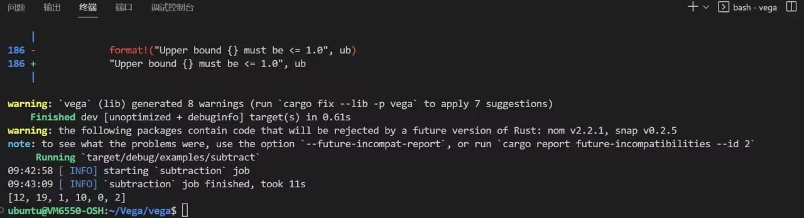
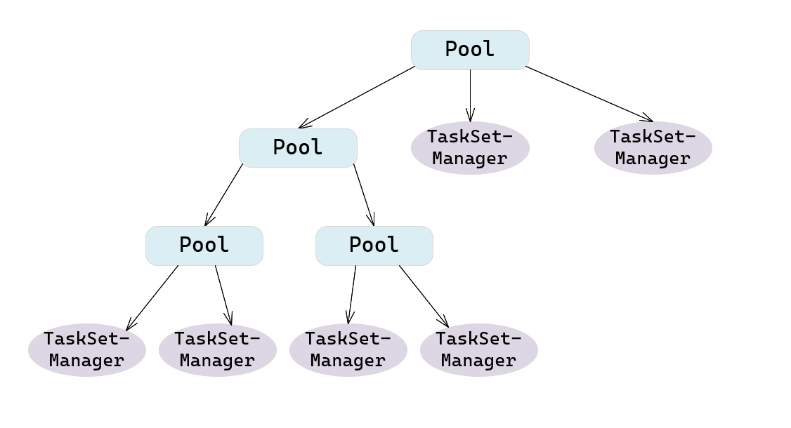

---
presentation:
  width: 1600
  height: 1200
---

<!-- slide -->

# 基于Rust语言对Apache Spark性能瓶颈的优化

This-Lynx

闫泽轩 李牧龙 罗浩铭 汤皓宇 徐航宇

<!-- slide -->
## 目录
- ### 01 项目概览
- ### 02 项目背景
- ### 03 项目设计 & 可行性

<!-- slide -->
## 01 项目概览
What’s our project

<!-- slide  vertical=true -->
## 项目概览
本项目为使用Rust编程语言对Apache Spark性能瓶颈的优化，项目基于不完善且已停止维护多年的Rust版Spark开源项目vega，在其基础上对项目中对应于Spark性能瓶颈部分的优化，并对该项目不完善的地方也进行优化。

<!-- slide -->
## 02 项目背景
Why we’re doing so 

<!-- slide  vertical=true -->
## 从MapReduce开始

<!-- slide  vertical=true -->
### 举个体现分布式计算原理的例子:数绿豆(wordcount)
假设有一大堆五颜六色的彩虹豆，给你派若干个人来数一数各种颜色的豆子，怎么办?

1. 将彩虹豆堆划分开，每个人来数一堆
2. 每个人数到一种颜色的豆子，就在一个小本本上记上一行(color,1)
3. 小本本上的东西最后汇总起来，这时候就不需要去盯着豆子数了，最后在总表上记好
   | col  | num  |
   | ---- | ---- |
   | col1 | num1 |
   | col2 | num2 |
   | ...  | ...  |
   | colx | numy |

<!-- slide  vertical=true -->
## Hadoop(MapReduce)的后继者——Spark(RDD)
显然，这个简单的模型威力已足够强大，但是仍然面临一些问题。

- 只有map,reduce两种算子，最多加上combine,功能很少
- 万一有一个人摆烂，撂摊子不干了，只能从头开始(容错不够优雅)
- 如果多个任务之间有依赖，容错的成本大大提高
<!-- slide  vertical=true -->
## RDD
由UCBlab提出的可伸缩的分布式数据集（Resilient Distributed Dataset）解决了上述问题

- 一个 RDD 是一个只读, 被分区的数据集.我们可以通过稳定的存储系统和其他的 RDDs 进行操作而创建一个新的 RDDs.为了区别开 RDDs 的其他操作, 我们称这些操作为 transformations, 比如 map, filter 以及 join 等都是 transformations 操作.
- 不同的算子对应了不同的依赖关系，RDD论文将这些关系分为两种:宽依赖与窄依赖，宽依赖
<!-- slide  vertical=true -->

<!-- slide  vertical=true -->
## 从Scala到Rust,从Maven到Cargo

<!-- slide -->
## 03 项目设计 & 可行性
How we’ll get there

<!-- slide vertical=true -->

综合考虑，我们选定**基于不完善的Rust版Spark开源项目vega的实现**，虽然两者都有一定缺陷，但是利用JNI技术的实例资料十分匮乏，尤其是rust与Scala都作为新兴语言，相关接口支持不够充分，而且跨语言调用面临对象转化的问题，无法保证开发进度。而vega作为开源项目，已经收获1.9k Star,但是因为缺乏维护而不支持许多新版特性显得十分可惜。这既是缺陷，也是优化的对象。使用vega完全面向rust,避免了跨语言调用的困难。因此，我们最终选定就vega的实现。

<!-- slide  vertical=true -->

## 理论依据

<!-- slide -->
## build
<!-- slide vertical=true -->
### Spark build

<!-- slide vertical=true -->

### Vega build

<!-- slide vertical=true -->
### Vega build

<!-- slide -->

## 调度

<!-- slide vertical=true -->

## 调度任务类

- `Job`
- `Stage`
  - `ResultStage`
  - `ShuffleMapStage`
- `Task`
  - `ShuffleMapTask`
  - `ResultTask`
- `TaskSet`
- `Schedulable`
  - `Pool`
  - `TaskSetManager`

<!-- slide vertical=true -->

举例如下图

调度池中的一些方法均是递归式的操作，如果是`Pool`类，则继续递归，如果是`TaskSetManager`则调用对应的操作方法

<!-- slide vertical=true -->

## 调度算法
 

- FIFO方法
- Fair方法：资源使用率低优先

<!-- slide vertical=true -->

## DAG调度

<!-- slide vertical=true -->

<!-- slide vertical=true -->

## 可以改进的内容

- 添加调度算法
- 利用协程的方式进行调度

<!-- slide vertical=true -->

<!-- slide -->

## ShuffleManager

在Spark框架中，Shuffle阶段（类似于MapReduce中的Shuffle）涉及十分密集的磁盘的读写和网络I／O，是极为重要的性能瓶颈。

<!-- slide  vertical=true-->
## ShuffleManager
ShuffleManager被用于管理块数据：
- 提供集群块数据的读写，包括数据的本地读写和读取远程RDD结点的块数据
- 通过控制shuffle前后的数据块的读写关系，来实现shuffle过程

<!-- slide  vertical=true-->
## ShuffleManager可改进的点
由于ShuffleManager的优化至关重要，必须使用当前的SOTA算法。
在Vega中，只实现了最基础的HashShuffleManager，而没有实现性能更高的SortShuffleManager，这是极为明显的可以优化的点。

<!-- slide -->

### Spark Streaming

Spark Streaming：
Spark Streaming是Spark的一个扩展模块，通过微批处理的方式使Spark支持流处理。
这个扩展模块本身并不承担计算任务，只负责接收数据和定时打包并提交任务，因此改进空间不大。但Vega目前还不具备流处理功能，因此实现Spark Streaming可以作为我们后期完成了必要内容后的可选项。

Spark Streaming的实现思想：
采用微批次的方势，按照用户指定的时间间隔定时打包生成作业，提交给Spark核心进行计算。

内部组件：
/This-Lynx/docs/feasibility_report/src/SparkStreamingItems.png
Streaming Context是Spark Streaming的起始点，流式计算的启动和停止都通过它来完成。

流式数据封装在DStream类中，DStream内部由一系列连续的RDD构成，每个RDD代表特定时间间隔内的一批数据。DStream实例和它们之间的依赖关系存储在DStream Graph中。

JobScheduler负责调度在Spark上执行的作业。其内部的JobGenerator内有一个定时器，会定时调用generateJobs方法生成作业序列。ReceiverTracker则负责管理和控制Receiver的状态。
<!-- slide -->
## Rust与Scala通过JNI交互

<!-- slide vertical=true -->
- Scala是在JVM上运行的语言，常用JNI接口与C语言等实现交互。
- 另一方面，Rust可通过二进制接口的方式与其他语言进行交互。

**jni[^jni] crate**对JNI提供了安全的Rust接口。

<!-- slide vertical=true -->
挑战：
- 二者对对象及其特性的底层实现不同，难以直接相互调用。
- 需要遵守的规范繁杂，限制较多，不易编写代码。
- 网络上Rust与Scala直接交互的尝试较少，没有合适的资料可供参考。
- 交互的路径较长，容易带来不必要的性能损失。

<!-- slide -->

## Rust相较于Scala的优势

<!-- slide vertical=true -->

1. **安全性**：Rust在编译期进行了较为严格的检查，有较强的安全保证。

2. **高性能**: Rust 秉承零成本抽象原则，将许多运行时开销（如GC）放置到了编译期。

3. **并发性**: Rust 在并发编程下较难出现竞争、死锁或其他难以复现和修复的 bug 更加高效安全。

<!-- slide -->

## 概要设计报告

### 可行方案

为了实现对Spark瓶颈的优化，我们经过调研，找到了两条可行的路线，分别为直接在Apache Spark源码基础上进行重写，以及基于一个不完善的开源项目进行修改。

#### 源码基础上对Spark性能瓶颈的Rust重写

在源代码上进行修改，考虑使用Rust重写其中的性能瓶颈模块，特别是内存密集型、CPU密集型的部分，同时保留源码的非关键部分，尤其是Spark中原生的丰富API，以此达到以小范围的修改达到较为显著的性能提升的效果。

在Spark的Scala源码与Rust代码间的交互是这一方案中需要特别关注的点，主要是由于scala基于JVM，与非JVM语言的Rust之间，有较大的交互困难。我们考虑使用Scala的JNI(Java Native Interface)与Rust进行交互，我们这里使用jni crate来实现两种语言间的交互。

优势：Spark文档比较详细，编译相对较为方便，且没有无法使用的风险。

缺陷：Spark代码庞杂，显然无法全部重写，只能考虑回调，但从Rust回调scala又极少有人进行尝试，需要自行探索。

#### 基于不完善的Rust版Spark开源项目vega的实现

由于Rust语言的诸多优点，用Rust重写Spark是一个非常有诱惑力的方案。此前，就已经有一个较为粗浅的基于Rust的Spark项目：vega（[Github仓库](https://github.com/rajasekarv/vega)）。这一项目完全使用Rust从零写起，构建完成了一个较为简单的Spark内核。不过，这一项目已经有两三年没有维护，项目里还有不少算法没有实现，特别是Spark后来的诸多优化更新，这些都可以是我们的改进空间。

优势：vega总代码量较少，修改起来较方便。且为原生Rust项目，不需要回调。

缺陷：vega文档不够详细，且已经不再处于被维护状态，假如遇到问题，可能很难解决。

<!-- slide -->

## 进度管理

| 时间进度          | 进度概览             |
| ----------------- | -------------------- |
| 第八周            | 系统学习rust         |
| 第九周            | 编译，测试vega模块   |
| 第十周            | 定位vega模块         |
| 第十一周~第十四周 | 编写优化对象模块     |
| 第十五周          | 添加拓展模块         |
| 第十六周          | 跑benchmark,部署测试 |
