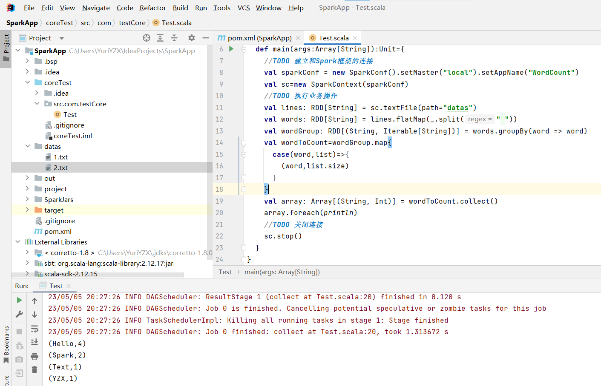

---
presentation:
  width: 1600
  height: 1200
---

<!-- slide -->

# 基于Rust语言对Apache Spark性能瓶颈的优化

## This-Lynx

闫泽轩 李牧龙 罗浩铭 汤皓宇 徐航宇

<!-- slide -->
## 目录
- ### 01 项目概览
- ### 02 项目背景
- ### 03 项目设计 & 可行性

<!-- slide -->
## 01 项目概览
What's our project

<!-- slide  vertical=true -->
## 项目概览
使用Rust编程语言对Apache Spark性能瓶颈的优化
基于Rust版Spark开源项目vega

<!-- slide -->
## 02 项目背景
Why we're doing so 

<!-- slide  vertical=true -->
## 从MapReduce开始

<!-- slide  vertical=true -->

## 举个例子：数豆子(wordcount)

一大堆五颜六色的彩虹豆，若干个人来数一数各种颜色的豆子

1. 将彩虹豆堆划分开，每个人来数一堆<!-- .element: class="fragment" data-fragment-index="1" -->
   
2. 每个人数到一种颜色的豆子，就在一个小本本上记上一行 <!-- .element: class="fragment" data-fragment-index="2" --> 
   | color | 1   |
   | ----- | --- |
   |       |     |

3. 小本本上的东西最后汇总起来，这时候就不需要去盯着豆子数了，最后在总表上记好<!-- .element: class="fragment" data-fragment-index="3" -->
   | color  |  num  |
   | :----: | :---: |
   | color1 | num1  |
   | color2 | num2  |
   |  ...   |  ...  |
   | colorx | numx  |

<!-- slide  vertical=true -->

## MapReduce(Apache Hadoop)

之前的模型就是MapReduce，其已足够强大，但是仍然面临一些问题。

- 功能少：只有`map`, `reduce`两种算子<!-- .element: class="fragment" data-fragment-index="1" -->
- 容错不优雅：只能从头开始<!-- .element: class="fragment" data-fragment-index="2" -->
- 存在依赖的任务容错成本高<!-- .element: class="fragment" data-fragment-index="3" -->

<!-- slide  vertical=true -->

## RDD(Apache Spark)——MapReduce的继任者

(Resilient Distributed Dataset)

<!-- slide vertical=true -->

## RDD特点

- 只读且被分区的数据集
- `transformation`操作：通过存储系统和其他的 RDDs 进行操作而创建一个新的 RDD，如 `map`, `filter`以及`join`等
- 不同的算子对应不同的依赖关系，宽依赖与窄依赖

<!-- slide -->

## 概要设计

<!-- slide vertical=true -->

## 两条可行的路线

- 源码基础上对Spark性能瓶颈的Rust重写
- 基于不完善的Rust版Spark开源项目vega的实现

<!-- slide  -->

## 源码基础上对Spark性能瓶颈的Rust重写

<!-- slide vertical=true -->

## 从Scala到Rust，从Maven到Cargo

  
  

<!-- slide vertical=true -->

## rust与scala对比

- 安全性：Rust编译期进行较为严格的检查
- 高性能：Rust秉承零成本抽象原则，将许多运行时开销（如GC）放置到了编译期，提高了数据处理速度和效率
- 并发性：Rust中同样有函数式编程的理念，这与并发契合

<!-- slide vertical=true -->

## Rust与Scala通过JNI交互

- Scala是在JVM上运行的语言，常用JNI接口与C语言等实现交互。
- 另一方面，Rust可通过二进制接口的方式与其他语言进行交互。

**jni crate**对JNI提供了安全的Rust接口。

<!-- slide vertical=true -->
## 挑战

- 底层实现不同，难以直接相互调用。
- 需要遵守的规范繁杂，限制较多，不易编写代码。
- 网络上交互的尝试较少，缺少合适的参考资料。
- 交互的路径较长，容易带来不必要的性能损失。

<!-- slide -->

## 基于不完善的Rust版Spark开源项目vega

- [vega](https://github.com/rajasekarv/vega)仓库
- 最近一次更新在2021年
- [介绍博客](https://medium.com/@rajasekar3eg/fastspark-a-new-fast-native-implementation-of-spark-from-scratch-368373a29a5c)

<!-- slide -->

## 综合评价

- 源码基础上对Spark性能瓶颈的Rust重写
  - Spark文档**详细**
  - 可以**保证能运行**
  - 代码庞杂，无法全部重写
  - 只能考虑回调，但极少有人进行尝试，需要自行探索
- 基于不完善的Rust版Spark开源项目vega的实现
  - vega文档不够详细
  - 已经不再处于被维护状态
  - vega总代码量较少，**修改起来较方便**
  - 为原生Rust项目，**不需要回调**

<!-- slide vertical=true -->

## 最终确定基于不完善的Rust版Spark开源项目vega的实现路线

<!-- slide -->

## 03 项目设计 & 可行性
How we'll get there

<!-- slide -->

## 理论依据

<!-- slide -->

## 调度

<!-- slide vertical=true -->

## 调度任务类

- `Job`
- `Stage`
  - `ShuffleMapStage`
  - `ResultStage`
- `Task`
  - `ShuffleMapTask`
  - `ResultTask`
- `TaskSet`
- `Schedulable`
  - `Pool`
  - `TaskSetManager`

<!-- slide vertical=true -->

## DAG调度

<!-- slide vertical=true -->

<!-- slide vertical=true -->

<!-- slide vertical=true -->

## 调度算法
 

- FIFO方法
- Fair方法：资源使用率低优先

<!-- slide vertical=true -->

## 可以改进的内容

- 添加调度算法
- 利用协程的方式进行调度

<!-- slide vertical=true -->

<!-- slide -->

## ShuffleManager

在Spark框架中，Shuffle阶段（类似于MapReduce中的Shuffle）涉及十分密集的磁盘的读写和网络I／O，是极为重要的性能瓶颈。

<!-- slide  vertical=true-->

## ShuffleManager

被用于管理块数据
- 提供集群块数据的读写
  - 数据的本地读写
  - 读取远程RDD结点的块数据
- 通过控制shuffle前后的数据块的读写关系，实现shuffle过程

<!-- slide  vertical=true-->

## ShuffleManager可改进的点

其优化至关重要，必须使用当前的SOTA算法。

- `HashShuffleManager`（vega已经实现）
    为每个Reduce端的Task生成一个文件，从而生成数量惊人的文件，降低I/O吞吐率，并导致Shuffle阶段时内存中积攒大量文件句柄。
    
- `SortShuffleManager` （vega还未实现）
    根据分区ID进行排序，然后输出到单个数据文件中，同时生成对应的索引文件。

<!-- slide -->

## HDFS

- vega没有接入任何文件系统，作为一个分布式计算系统显然不合理
- Rust开源社区中有提供HDFS支持的包（hdrs）
- 可以将其接入vega，增强对文件的支持和一致性
- Spark原生支持HDFS，接入HDFS更容易融入Spark生态

<!-- slide -->

## Spark Streaming

- Spark Streaming是Spark的一个扩展模块，使Spark支持流处理。
- 微批次
- 只负责提交任务，不负责计算，改进空间不大
- 作为完成必要内容后的可选项

<!-- slide  vertical=true -->

## Spark Streaming内部组件

Streaming Context：Spark Streaming的起始点和上下文

DStream和DStream Graph：封装流式数据和依赖关系

JobScheduler和ReceiverTracker：调度，生成作业，控制Receicer状态

<!-- slide -->

## 技术依据

<!-- slide -->

## 编译工具

<!-- slide vertical=true -->

## Maven

- Java项目的构建自动化工具
- 构建软件及其依赖关系

<!-- slide vertical=true -->

## Cargo

- 提供了一系列的工具，为 Rust 项目的管理提供尽可能完整的手段
- 与 Rust 语言及其编译器 rustc 紧密结合
- 能够对该项目的各种依赖项进行方便、统一和灵活的管理

<!-- slide -->

## 部署测试

<!-- slide vertical=true -->

### Spark build

<!-- slide vertical=true -->

### vega build

<!-- slide vertical=true -->

### vega build

<!-- slide -->

## 进度管理

| 时间进度          | 进度概览            |
| ----------------- | ------------------- |
| 第八周            | 系统学习rust        |
| 第九周            | 编译，测试vega模块  |
| 第十周            | 定位vega模块        |
| 第十一周~第十四周 | 编写优化对象模块    |
| 第十五周          | 添加拓展模块        |
| 第十六周          | 跑benchmark部署测试 |
