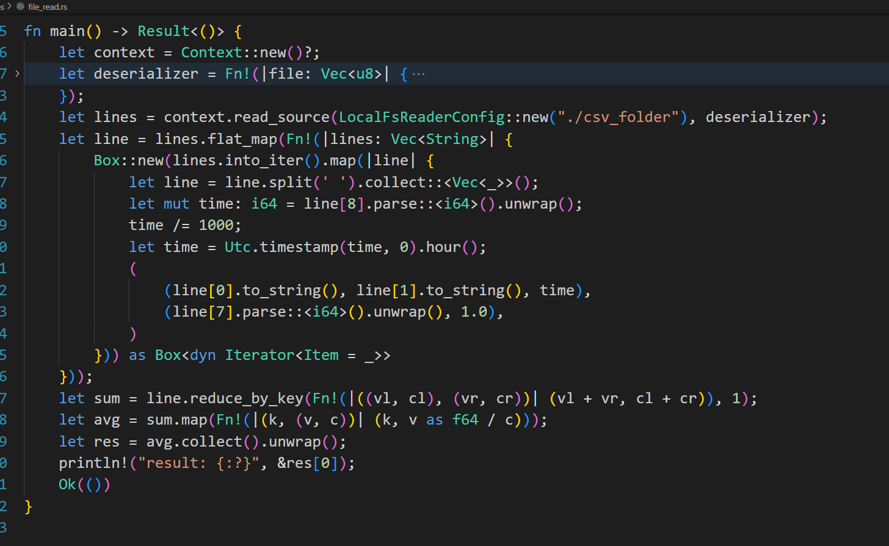
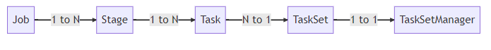

---
presentation:
  width: 1600
  height: 1200
---

<!-- slide -->

# 基于Rust语言对Apache Spark性能瓶颈的优化

## This-Lynx

闫泽轩 李牧龙 罗浩铭 汤皓宇 徐航宇

<!-- slide -->
## 目录
- ### 01 项目概览
- ### 02 项目背景
- ### 03 项目设计 & 可行性

<!-- slide -->
## 01 项目概览
What's our project

<!-- slide  vertical=true -->
## 项目概览
本项目为使用Rust编程语言对Apache Spark性能瓶颈的优化，项目基于不完善且已停止维护多年的Rust版Spark开源项目vega，在其基础上对项目中对应于Spark性能瓶颈部分的优化，并对该项目不完善的地方也进行优化。

<!-- slide -->
## 02 项目背景
Why we're doing so 

<!-- slide  vertical=true -->
## 从MapReduce开始

<!-- slide  vertical=true -->

### 举个体现分布式计算原理的例子:数绿豆(wordcount)
假设有一大堆五颜六色的彩虹豆，给你派若干个人来数一数各种颜色的豆子，怎么办?

1. 将彩虹豆堆划分开，每个人来数一堆
2. 每个人数到一种颜色的豆子，就在一个小本本上记上一行(color,1)
3. 小本本上的东西最后汇总起来，这时候就不需要去盯着豆子数了，最后在总表上记好
   | col  | num  |
   | ---- | ---- |
   | col1 | num1 |
   | col2 | num2 |
   | ...  | ...  |
   | colx | numy |

<!-- slide  vertical=true -->
## Hadoop(MapReduce)的后继者——Spark(RDD)
显然，这个简单的模型威力已足够强大，但是仍然面临一些问题。

- 只有map,reduce两种算子，最多加上combine,功能很少
- 万一有一个人摆烂，撂摊子不干了，只能从头开始(容错不够优雅)
- 如果多个任务之间有依赖，容错的成本大大提高
<!-- slide  vertical=true -->
## RDD
由UCBlab提出的可伸缩的分布式数据集（Resilient Distributed Dataset）解决了上述问题

- 一个 RDD 是一个只读, 被分区的数据集.我们可以通过稳定的存储系统和其他的 RDDs 进行操作而创建一个新的 RDDs.为了区别开 RDDs 的其他操作, 我们称这些操作为 transformations, 比如 map, filter 以及 join 等都是 transformations 操作.
- 不同的算子对应了不同的依赖关系，RDD论文将这些关系分为两种:宽依赖与窄依赖，宽依赖
<!-- slide  vertical=true -->

<!-- slide  vertical=true -->
## 从Scala到Rust,从Maven到Cargo

<!-- slide vertical=true -->

<!-- slide vertical=true -->
### rust与scala对比

1. **安全性**：
   Rust对程序员施加了较多的规则，在编译期进行了较为严格的检查，有较强的安全保证。此外，Rust将运行时错误划分为可恢复的错误与不可恢复的错误并分别处理，既进一步保证了安全，又提高了用户的体验。
   Scala为了达到接近自然语言的目标，没有对程序员做出过多限制，也因此安全性较Rust更低。

2. **高性能**: 
   Rust 秉承零成本抽象原则，将许多运行时开销（如GC）放置到了编译期，使得程序员在进行抽象时，不必担心性能的下降。使用 Rust 进行 Spark 的性能瓶颈优化可以提高数据处理速度和效率，减少资源浪费和计算成本。
   scala 所有的对象都是在堆中的，有 Head 的，生命周期由 GC 管控的。虽然有不用关心分配、释放的自由。却也导致了 STW 和更大的内存占用。 Rust 没有GC机制，在内存密集的阶段有较大的性能优化。

3. **并发性**: 
   Spark 是一个分布式计算框架，具有良好的并发性能。而Rust函数式编程的理念与高效的并发与并行十分契合。
   此外，Rust通过各类方式避免了在部署到生产环境后才发现错误，或出现竞争、死锁或其他难以复现和修复的 bug ，可以更加高效而安全的并发编程。

<!-- slide vertical=true -->
### Maven到Cargo

**Maven**是用于Java项目的构建自动化工具，而Spark使用Scala编写，Scala与Java共享JVM生态，因此Spark可以使用Maven进行构建和编译.
Maven解决了构建软件的两个方面:如何构建软件及其依赖关系。
- Maven 常用命令
    - mvn clean: 清理
    - mvn package: 打包
    - mvn install: 安装
---

**Cargo**提供了一系列的工具，从项目的建立、构建到测试、运行直至部署，为 Rust 项目的管理提供尽可能完整的手段。同时，与 Rust 语言及其编译器 rustc 紧密结合
使用 cargo 工具的最大优势就在于，能够对该项目的各种依赖项进行方便、统一和灵活的管理。
我们之后会展示Maven和Cargo构建项目的效果。
<!-- slide verical=true -->
## Rust与Scala通过JNI交互

- Scala是在JVM上运行的语言，常用JNI接口与C语言等实现交互。
- 另一方面，Rust可通过二进制接口的方式与其他语言进行交互。

**jni crate**对JNI提供了安全的Rust接口。

<!-- slide vertical=true -->
挑战：
- 二者对对象及其特性的底层实现不同，难以直接相互调用。
- 需要遵守的规范繁杂，限制较多，不易编写代码。
- 网络上Rust与Scala直接交互的尝试较少，没有合适的资料可供参考。
- 交互的路径较长，容易带来不必要的性能损失。

<!-- slide -->
## 03 项目设计 & 可行性
How we'll get there

<!-- slide -->
## 理论依据

<!-- slide -->

## 调度

<!-- slide vertical=true -->

## 调度任务类

- `Job`
- `Stage`
  - `ShuffleMapStage`
  - `ResultStage`
- `Task`
  - `ShuffleMapTask`
  - `ResultTask`
- `TaskSet`
- `Schedulable`
  - `Pool`
  - `TaskSetManager`

<!-- slide vertical=true -->

## DAG调度

<!-- slide vertical=true -->

<!-- slide vertical=true -->

<!-- slide vertical=true -->

## 调度算法
 

- FIFO方法
- Fair方法：资源使用率低优先

<!-- slide vertical=true -->

## 可以改进的内容

- 添加调度算法
- 利用协程的方式进行调度

<!-- slide vertical=true -->

<!-- slide -->

## ShuffleManager

在Spark框架中，Shuffle阶段（类似于MapReduce中的Shuffle）涉及十分密集的磁盘的读写和网络I／O，是极为重要的性能瓶颈。

<!-- slide  vertical=true-->
## ShuffleManager
ShuffleManager被用于管理块数据：
- 提供集群块数据的读写，包括数据的本地读写和读取远程RDD结点的块数据
- 通过控制shuffle前后的数据块的读写关系，来实现shuffle过程

<!-- slide  vertical=true-->
## ShuffleManager可改进的点
由于ShuffleManager的优化至关重要，必须使用当前的SOTA算法。
在Vega中，只实现了最基础的HashShuffleManager，而没有实现性能更高的SortShuffleManager。
**HashShuffleManager**：会为每个Reduce端的Task生成一个文件，从而生成数量惊人的文件，降低I/O吞吐率，并导致Shuffle阶段时内存中积攒大量文件句柄。
**SortShuffleManager**：则是根据分区ID进行排序，然后输出到单个数据文件中，并且同时生成对应的索引文件。

<!-- slide -->
## HDFS
Vega没有接入任何文件系统，作为一个分布式计算系统显然不合理。
Rust开源社区中有提供HDFS的包

## Spark Streaming
Spark Streaming是Spark的一个扩展模块，使Spark支持流处理。
微批次
只负责提交任务，不负责计算，改进空间不大
作为完成必要内容后的可选项

<!-- slide  vertical=true -->
## 内部组件：

Streaming Context：Spar Streaming的起始点和上下文

DStream和DStream Graph：封装流式数据和依赖关系

JobScheduler和ReceiverTracker：调度、生成作业，控制Receicer状态

<!-- slide -->

## 概要设计报告

<!-- slide vertical=true -->

## 两条可行的路线

- 源码基础上对Spark性能瓶颈的Rust重写
  - 优势：Spark文档比较详细，编译相对较为方便，且没有无法使用的风险。
  - 缺陷：Spark代码庞杂，显然无法全部重写，只能考虑回调，但从Rust回调scala又极少有人进行尝试，需要自行探索。
- 基于不完善的Rust版Spark开源项目vega的实现
  - 优势：vega总代码量较少，修改起来较方便。且为原生Rust项目，不需要回调。
  - 缺陷：vega文档不够详细，且已经不再处于被维护状态，假如遇到问题，可能很难解决。

<!-- slide vertical=true -->

## 确定路线

综合考虑，我们选定**基于不完善的Rust版Spark开源项目vega的实现**，虽然两者都有一定缺陷，但是利用JNI技术的实例资料十分匮乏，尤其是rust与Scala都作为新兴语言，相关接口支持不够充分，而且跨语言调用面临对象转化的问题，无法保证开发进度。而[vega](https://github.com/rajasekarv/vega)作为开源项目，已经收获1.9k Star,但是因为缺乏维护而不支持许多新版特性显得十分可惜。这既是缺陷，也是优化的对象。使用vega完全面向rust,避免了跨语言调用的困难。因此，我们最终选定基于vega的实现。

<!-- slide -->
## build
<!-- slide vertical=true -->
### Spark build

<!-- slide vertical=true -->

### Vega build

<!-- slide vertical=true -->
### Vega build

<!-- slide -->

## 进度管理

| 时间进度          | 进度概览             |
| ----------------- | -------------------- |
| 第八周            | 系统学习rust         |
| 第九周            | 编译，测试vega模块   |
| 第十周            | 定位vega模块         |
| 第十一周~第十四周 | 编写优化对象模块     |
| 第十五周          | 添加拓展模块         |
| 第十六周          | 跑benchmark,部署测试 |
