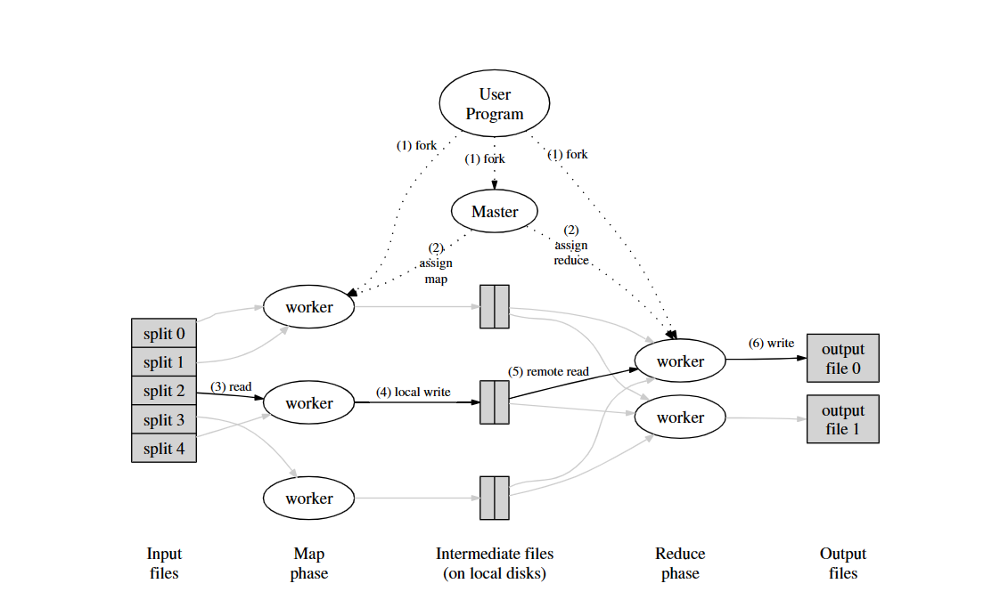
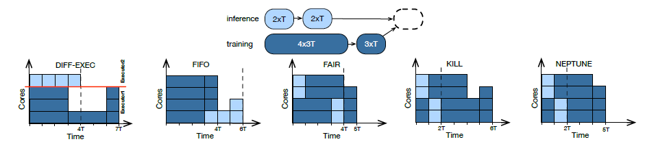

# 调研报告 - 基于Rust语言对Apache Spark性能瓶颈的优化
<!-- **注：相关调研内容要用与主题相关的语言叙述，不要大段copy，介绍背景知识时若与主题相关性低请使用引用，不要硬凑字数** -->

[TOC]

## 小组成员

闫泽轩 李牧龙 罗浩铭 汤皓宇 徐航宇

## 项目背景

<!-- 给出该领域面临的问题，并给出该领域的设计思路，给出领域中已有的轮子  -->
<!-- 领域：我们这里就是指spark性能瓶颈优化（解决的问题是spark性能瓶颈，用的方法是Rust）-->
<!-- 面临问题：spark性能瓶颈    设计思路与已有轮子：调研清楚spark的更新历程-->

### Rust语言介绍
Rust 是一种静态和强类型语言，目标是 C 和 C++占主导地位的系统编程领域。其强类型属性使 Rust 可以安全地重构代码，并在编译时捕获大多数错误。
Rust 的很多设计决策中强调的首要理念是编译期内存安全、零成本抽象和支持高并发。通过对程序员做出更多安全方面的限制，反过来为程序员赋能，以提高开发效率与质量。
此外，它拥有高级函数式语言的大部分特性，例如闭包、高阶函数和惰性迭代器，使得可以安全高效地开发程序。

### 分布式文件系统调研
Spark是一个分布式计算框架，本身不包括文件系统，因此需要选择合适的分布式文件系统供其使用。
鉴于Spark可以在Hadoop集群上运行，且支持Hadoop InputFormat[^15]，HDFS是一个合适的选择。
#### 关于HDFS[^13]：
HDFS（Hadoop Distributed File System）是一个基于GFS的分布式文件系统，同时也是Hadoop的一部分。它具有GFS的许多特性[^14]，例如可靠性高，将文件分块存储，适合大文件存储，但延迟较高且无法高效存储小文件等。
**HDFS架构：**

其中NameNode即GFS中的Master节点，负责整个分布式文件系统的元数据（MetaData）管理和响应客户端请求。
DataNode即为GFS中的chunkserver，负责存储数据块，通过心跳信息向NameNode报告自身状态。
**与客户端交互：**
HDFS的通信协议全部建立在TCP/IP协议上，包括客户端、DataNode和NameNode之间的协议以及客户端和DataNode之间的协议。这些协议通过RPC模型进行抽象封装。
读取方面，客户端先和NameNode交互，获取所需文件的位置，随后直接和对应的DataNode交互读取数据。NameNode会确保读取程序尽可能读取最近的副本。
写入方面，HDFS只支持追加写入操作，不支持随机写入（修改）操作。同一文件同一时刻只能由一个写入者写入。
删除文件时，文件不会马上被释放，而是被移入/trash目录中，随时可以恢复。移入/trash目录超过规定时间后文件才被彻底删除并释放空间。
**容错性：**
HDFS的容错处理和GFS基本一致，可大致分为以下4点：
1. 每一个数据块有多个副本（默认3个），副本的存放策略为：第一个副本会随机选择，但是不会选择存储过满的节点，第二个副本放在和第一个副本不同且随机选择的机架，第三个和第二个放在同一机架上的不同节点，剩余副本完全随机节点。
2. 每一个数据块都使用checksum校验，客户端可以使用checksum检查获取的文件是否正确，若错误则从其他节点获取。
3. DataNode宕机时，可能会导致部分文件副本数量低于要求。NameNode会检查副本数量，对缺失副本的数据块增加副本数量。
4. 主从NameNode，主NameNode宕机时副NameNode成为主NameNode。

### 分布式计算框架发展概述
主流的分布式计算框架主要分为四类，即：MapReduce-like系统、Streaming系统、图计算系统、基于状态的系统。具体的：
**MapReduce-like系统**
以MapReduce(Hadoop)和Spark为代表。
特点是将计算抽象成high-level operator，如map,reduce,filter这样的算子，然后将算子组合成DAG，然后由后端的调度引擎进行并行化调度。
**Streaming系统**
以flink,storm,Sprk streaming等为代表，专为流式数据提供服务的系统，强调实时性。
**图计算系统**
以Pregel框架等为代表，特点是将计算过程抽象为图，然后在不同节点分布式执行，适用于PageRank等任务。
**基于状态的系统**
以distbelief,Parameter Server架构等为代表，专为大型机器学习模型服务，将机器学习的模型存储上升为主要组件。

近年来，不同分布式框架的融合已成为趋势，比如Spark作为MapReduce-like系统，同时也支持Pregel框架为基础的图计算，以及Spark Streaming为基础的流处理问题。

<!-- 偏批处理mapreduce，spark等 -->

### MapReduce

- 介绍:
  - MapReduce是一种编程模型和一种产生及处理大数据的实现方式。他的关键在于两个函数（由用户编写）：Map和Reduce
- Types:
  - map  (k1,v1)        ----> list(k2,v2)
  - reduce(k2,list(v2)) --->list(v2)
- Example(伪代码):
  
```C++
  map(String key, String value):
    // key: document name
    // value: document contents
    for each word w in value:
    EmitIntermediate(w, "1");
  reduce(String key, Iterator values):
    // key: a word
    // values: a list of counts
    int result = 0;
    for each v in values:
    result += ParseInt(v);
    Emit(AsString(result));
```
- 执行过程:

1. MapReduce库先将输入文件分成M份（一般每份64MB，也可用可选参数控制），然后他在集群上启动多份程序
2. 有一份特殊的程序拷贝--master，剩下的都是worker并且被master分配任务.共有M个map任务和R份Reduce任务去分配。master选择空闲的worker去分配map task或者reduce task
3. 获得map任务的worker从对应的输入文件中读取内容。他从中解析出键值对并且将每一对传给Map函数。这些中间键值对被缓存在存储器中
4. 周期性的，分区R份后，这些缓冲的中间键值文件的**位置**被传输给master,master负责把这些信息发给reduce worker
5. 当reduce worker接受到来自master的中间键值文件的位置后，它就使用RPC从map worker的本地磁盘中读取缓存数据，并且根据key进行排序。这样所有出现的相同的key就能被合并到一个组。这个排序是必要的因为通常不同的键会被映射到同一个reduce task中。如果中间键值数据过于庞大的话，则应该使用外部排序
6. reduce worker不断的在排序好的中间键值数据上进行迭代，对于遇到的特定的中间键值对，就将键和值集合传入reduce函数中，函数的输出结果就将加载到最终的输出文件中去（对于这个reduce部分）
7. 当所有的map和reduce人物都被完成后，master就唤醒用户程序，这时MapReduce的调用完成，继续返回到用户的代码中

- 容错性
**Worker Failure**
master会周期性的测试每一个worker，以此来判定是否执行失败，如果map失败就重新安排worker执行。这是因为由于ma过程的结果存储在本地，如果失败就无法取得结果。但是已经完成的Reduce工作不需要回滚，因为其结果存储在全局文件系统中。
并且如果map失败，比如A失败后任务被B重新执行，那么还未读取A的reduce task就会切换到来自于B的数据输出。
**Master Failure**
由于Master只有一个节点，因此失败的可能性很低，如果失败就重新运行整个MapReduce


### Spark及其发展历史[^2]
Apache Spark起源于2009年在加州大学伯克利分校AMPlab的Spark研究项目，Matei Zahari等人于次年发表了其论文，名为“Spark: Cluster Computing with Working Sets”。

当时，Hadoop Map-Reduce是集群的主要并行计算引擎，是第一个在数千个节点规模的集群上进行并行数据处理的开源系统。它展现出了集群计算的巨大潜力：在使用MapReduce的每个组织机构中，都可以使用现有数据构建全新的应用程序，并且在尝试其入门用例之后，许多新的团队开始使用该系统。但是它对一些问题的处理也相当低效。例如，典型的机器学习算法可能需要对数据进行10或20次迭代处理，而在MapReduce中，每次迭代都必须编写为单独的MapReduce作业，并且每次启动时都要在集群上从头开始加载数据。

为了解决这个问题，Spark团队首先设计了一组基于函数式编程的API，可以简洁地表达多步计算应用程序。然后，团队在一个新引擎上实现了这个API，该引擎可以跨多个计算步骤执行高效的内存数据共享。团队还开始与校内校外其他用户一起测试该系统。

Spark的第一个版本仅支持批处理应用程序，但很快又出现了另一类重要应用：交互式数据处理和即席（ad-hoc）查询。通过简单地将Scala解释器插入Spark中，该项目可以提供一个高可用的交互式系统，用于在数百台机器上运行查询。AMPlab还迅速建立了Shark，这是一个可以在Spark上运行SQL查询并支持交互式使用的引擎，其于2011年首次发布。

在这些初始版本之后，发布者很快认识到，对Spark最强大的功能将来自于新的软件库，因此该项目开始遵循今天的“标准库”方法。特别地，AMPlab团队中不同的研究组开始开发MLlib（机器学习库）、Spark Streaming（流处理库）和GraphX（图分析库）。他们还确保这些API具有高度的互操作性，使得人们首次可以在同一引擎中编写多种端到端的大数据应用程序。

2013年，该项目已经得到广泛使用，来自伯克利分校以外的30多个组织共100多位贡献者参与其中。AMPlab将Spark作为长期的、非商业的项目贡献给Apache软件基金会。早期的AMPlab团队还成立了一家公司Databricks，以加强该项目，并加入了其他为Spark做出贡献公司和组织。自那时起，Apache Spark社区在2014年发布了Spark 1.0，在2016年发布了Spark 2.0，并继续定期发布，将新功能带入该项目。

最后，Spark可组合API的核心思想也不断完善。Spark的早期版本（1.0之前）很大程度上只定义了API的功能操作（例如对Java对象集合的map和reduce等并行操作）。从1.0开始，该项目添加了Spark SQL，这是一种用于处理结构化数据（具有固定数据格式，不与Java的内存表示形式绑定的表）的新API。此后，该项目继续添加了大量针对结构化数据的新API，包括DataFrames、机器学习管道和Structured Streaming（这是一个高级的、自动优化的流处理API）。


<!-- 偏流处理flink，storm等 -->

### spark框架的瓶颈

<!-- 讲述为什么选择spark -->
1. shuffle是spark及其他分布式计算框架最核心的问题之一，为了提高shuffle的效率，spark也做了很多迭代更新，如将shuffle机制更新为sorted-bashed shuffle

2. 同时，其计算运行在JVM上也对它的性能有较大影响。[^5]因此，所有处理的数据都是以对象Object的形式存在的。对JVM来说，Object都具有两个特点：

    （1）大小。内存膨胀的问题是大数据处理中一个典型的问题，参考“A Bloat-aware Design for Big Data Application”(ISMM2013)。对象形式会引入许多无关的引用、锁结构、描述符等，导致其内存中的大小相比于对象本身所携带的Value要大得多。例如，一个int值只占4个字节，但是装箱成一个Integer对象，远远不止4个字节了。
    （2）生命周期。JVM有自己的垃圾回收机制，根据对象的生命周期来决定是否需要做垃圾回收。任何对象都有自己的生命周期。由于Spark本身支持cache数据到内存，所以JVM中会有cache的Object。再看shuffle，shuffle 

3. write和shuffle 
read阶段需要用buffer保存所有处理的中间结果（ExternalSorter），然后再写入磁盘，因此Shuffle buffer中也包含了非常多的Object。无论是Cache的Object还是Shuffle Buffer中的Object，它们的生命周期都比较长。当对象数量增加时，有限的内存空间就会因为这些长生命周期的大对象显得非常有压力，最直接的影响就是频繁的触发JVM的垃圾回收机制，Full GC本身就会导致大量开销，频繁的触发Full GC会导致Spark性能急剧下降。这是所有自动内存管理机制都会面临的一个问题，提高了开发效率却面临着大数据处理时的低效内存管理。


4. spark调度算法方面[^11]
  
    对于spark这样的混合型数据处理框架，即既可以处理批数据又可以处理流数据的框架，批数据和流数据是占用同样的运行时间的。但需要注意的是，流数据对于延迟的要求会更高。一种非常直接的想法是优先处理流数据，但同时也要考虑到不使批数据过多地被滞后处理。
  
    默认情况下，spark使用的是FIFO即先进先出算法，这样如果先到的是批数据，自然会阻塞之后到来的数据，造成后续数据等待，延迟增大。而一些常用的调度算法如FAIR公平调度算法，可以降低总的处理时间，但因为其把所有的任务当成一样的，没有考虑到流数据需要的低延迟，可能导致延迟依然相比最优解要高。而如果可以实现随时将当前在进行处理的批数据暂停，切换到需要低延迟的流数据上去，在处理完流数据之后，再切换回来，就做到在保证了流数据的低延迟的同时兼顾了批数据的处理。既使总的处理时间最低，又使延迟最低。当然，这只是最简单的表述，实际过程中，需要考虑到有可能有的批数据被多次延后，可以设定阈值，保证其被多次延后时保证可以持续不被打扰。
  
    在如下图的例子中，同时有推断(流)和训练(批)任务，随时间依次到来，且只有处理完前面的任务，才能处理之后的任务，即任务间存在先后依赖关系。其中，推断的任务是延迟敏感型的，我们的目标是找到一种调度算法，在最短的完成时间内处理完所有的任务，且做到使推断任务结束的时间点尽可能提前。可以看出，FIFO算法可能优先处理先到达的训练任务，而流任务就被滞后了；FAIR算法虽然在很短的时间内就处理掉了所有的任务，但因为批任务需要的时间过大，其流任务的延迟很高。而利用协程的算法，在流任务到来时，就把正在执行的批任务挂起，之后再恢复，达到了最短的完成时间和最短的流延迟。
  
    
  
    而这样的机制是通过协程(coroutine)实现的。协程本质类似一个状态机，定义下之后，每次使用，都进行`yield`一次，得到之后的状态。在Rust语言中，也存在对应的机制，可以直接使用。

5. spark有GC机制
  
    Spark的垃圾回收机制(Garbage Collection, GC)有可能影响到任务线程的执行速度，这会影响任务执行的效率。在这篇论文[^12]中，他们通过Spark的网络UI检测了GC的比例，发现在数据集比较小的时候，GC比例较小，但随着数据集规模的增大，GC比例随之增长，任务执行效率随之降低。其中也提到，当内存成为瓶颈时，会更容易增大GC的比例。而在Rust语言中，没有GC机制，这样就直接减少了这一可能影响性能的因素。

## 立项依据

<!-- 给出思路，给出需求分析，并说明该思路切合需求 -->
### Spark与MapReduce对比

|                | MapReduce          | Spark              |
| -------------- | ------------------ | ------------------ |
| 提出时间       | 2004 by Google     | 2011 by UCB        |
| 数据存储方式   | 磁盘介质           | 内存缓存           |
| 任务级别并行度 | 多进程模型         | 多线程模型         |
| 流数据支持     | 不支持             | 部分支持           |
| 算子           | map&reduce         | MR的超集，更加丰富 |
| 容错机制       | 丢弃，重新执行     | checkpointing      |
| 速度           | 并行计算，速度一般 | 是MR的100倍        |

### Spark和其他主流流处理框架对比


### 流处理框架容错性处理方案：

**Apache Storm：**
Storm使用上游数据备份和消息确认的机制来保障消息在失败之后会重新处理。消息确认原理：每个操作都会把前一次的操作处理消息的确认信息返回。这保障了没有数据丢失，但数据结果会有重复，这就是at-least once传输机制。
**Storm**
采用对每个源数据记录仅仅要求几个字节存储空间来跟踪确认消息。纯数据记录消息确认架构，尽管性能不错，但不能保证exactly once消息传输机制，所有应用开发者需要处理重复数据。Storm存在低吞吐量和流控问题，因为消息确认机制在反压下经常误认为失败。

**Spark Streaming：**
Spark Streaming实现微批处理，容错机制的实现跟Storm不一样的方法。微批处理的想法相当简单。Spark在集群各worker节点上处理micro-batches。每个micro-batches一旦失败，重新计算就行。因为micro-batches本身的不可变性，并且每个micro-batches也会持久化，所以exactly once传输机制很容易实现。

**Samza：**
Samza的实现方法跟前面两种流处理框架完全不一样。Samza利用消息系统Kafka的持久化和偏移量。Samza监控任务的偏移量，当任务处理完消息，相应的偏移量被移除。消息的偏移量会被checkpoint到持久化存储中，并在失败时恢复。

**Apache Flink：**
Flink的容错机制是基于分布式快照实现的，这些快照会保存流处理作业的状态。Flink仍然是原生流处理框架，它与Spark Streaming在概念上就完全不同。Flink也提供exactly once消息传输机制。


### RDD运行流程

RDD在Spark中运行大概分为以下三步：
1. 创建RDD对象
2. DAGScheduler模块介入运算，计算RDD之间的依赖关系，RDD之间的依赖关系就形成了DAG
3. 每一个Job被分为多个Stage。划分Stage的一个主要依据是当前计算因子的输入是否是确定的，如果是则将其分在同一个Stage，避免多个Stage之间的消息传递开销


- 创建 RDD  上面的例子除去最后一个 collect 是个动作，不会创建 RDD 之外，前面四个转换都会创建出新的 RDD 。因此第一步就是创建好所有 RDD( 内部的五项信息 )？
- 创建执行计划 Spark 会尽可能地管道化，并基于是否要重新组织数据来划分 阶段 (stage) ，例如本例中的 groupBy() 转换就会将整个执行计划划分成两阶段执行。最终会产生一个 DAG(directed acyclic graph ，有向无环图 ) 作为逻辑执行计划

- 调度任务  将各阶段划分成不同的 任务 (task) ，每个任务都是数据和计算的合体。在进行下一阶段前，当前阶段的所有任务都要执行完成。因为下一阶段的第一个转换一定是重新组织数据的，所以必须等当前阶段所有结果数据都计算出来了才能继续

### Rust 相较于其他语言的优势[^16]
#### 便于开发
**协作开发：**
Rust 是高效的协作工具，许多在其他语言的协作开发场景中容易出现而不易察觉的 bug ，在 Rust 中将以不被允许通过编译的方式，在编译期消除。在 Rust 的特性与其编译器的协助下，可以轻松地排查 bug ，也可以轻松重构代码且无需担心会引入新的 bug 。

**开发环境：**
Rust 有丰富的生态，包含：内置的依赖管理器和构建工具 Cargo 、格式化工具 Rustfmt 、为 IDE 提供强大的代码补全和内联错误信息功能的Rust Language Server 等。

#### 编译期内存安全：
Rust 可以通过所有权和生命周期的概念，从而在没有垃圾回收机制的条件下，在编译期跟踪变量资源，即保证了内存安全，又不影响程序运行时的效率。

**所有权**
所有程序都必须管理其运行时使用计算机内存的方式。或通过垃圾回收机制，或要求程序员必须亲自分配和释放内存；而 Rust 则通过所有权系统管理内存，编译器在编译时会根据一系列的规则进行检查。如果违反了任何规则，程序都不能编译。这让 Rust 无需垃圾回收（ garbage collector ）即可保障内存安全，且不会减慢程序的运行速度。

*所有权规则*
1. Rust 中的每一个值，在任一时刻都有且只有一个所有者。
2. 当所有者（变量）离开作用域，这个值将被丢弃。
3. 当堆上的数据被赋值时（包括函数的传参与返回），传递所有权。

**堆上变量的移动**
Rust 在对 String 等存储在堆上的变量进行复制时，会只复制其在栈上的变量，并使得赋值的变量不再有效，从而被释放。这被称作移动。这避免了二次释放错误的产生。
这也意味着 Rust 永远也不会自动创建数据的 “深拷贝”，但如果确实需要，可以使用 clone() 函数。栈上的数据的深浅复制则相同，被称作拷贝。

**变量与引用默认的不可变性**
Rust 的变量默认为不可变的，可以对其创建引用，从而获取其值而不使得其因为赋值而无效。（多用于参数传递）
引用的作用域从声明的地方开始一直持续到最后一次使用为止，没有对数据的所有权。
引用也默认是不可变的，但是允许创建可变引用，但同时只能至多存在一个可变引用，且有未失效的不变引用的范围内，不能同时存在可变引用。这是为了避免“数据竞争”，后者会导致未定义行为，难以在运行时追踪，并且难以诊断和修复。
在具有指针的语言中，很容易通过释放内存时保留指向它的指针而错误地生成一个悬垂指针。而 Rust 相应地，也不会产生垂悬引用，即不会在引用失效前将其指向的内存分配给其它持有者。

**生命周期**
Rust 中的每一个引用都有其生命周期，也就是引用保持有效的作用域。
大部分时候，生命周期是隐含并可以通过生命周期省略规则推断的：
*生命周期省略规则*
1. 编译器为每一个引用参数都分配一个生命周期参数。
2. 如果只有一个输入生命周期参数，那么它被赋予所有输出生命周期参数。
3. 如果方法有多个输入生命周期参数并且其中一个参数是 &self 或 &mut self ，说明是个对象的方法，那么所有输出生命周期参数被赋予 self 的生命周期。

在不能通过这三条规则推断出引用的生命周期时，需要通过生命周期注解来标明输入引用与输出引用间的关系。
生命周期保证了不会产生垂悬引用，而其检查也发生在编译期，从而不会对程序的运行时效率产生影响。

 **运行时安全：**
Rust 将错误分为两大类：可恢复的和不可恢复的，大多数语言并不区分这两种错误，并采用类似异常这样方式统一处理他们。而 Rust 用 Result<T, E> 类型处理可恢复的错误，用 panic! 宏，在程序遇到不可恢复的错误时停止执行。这防止了各种未定义行为，保证了程序的运行时安全。（如访问越界的索引时，会产生 panic!）

#### 函数式语言功能：
函数式编程是 Rust 设计的重要灵感来源之一。 Rust 实现了闭包、迭代器这两种特性，用以编写函数式风格的高性能 Rust 代码。
**闭包**
闭包是可以保存在一个变量中或作为参数传递给其他函数的匿名函数，允许捕获被定义时所在的环境，即可通过不可变借用，可变借用和获取所有权三种方式中的任意一种获取参数。
**迭代器**
迭代器负责遍历序列中的每一项和决定序列何时结束的逻辑，抽象掉了循环时所用的高度重复的代码，而将编程的重心放在了代码所特有的概念上，比如迭代器中每个元素必须面对的过滤条件。
此外，迭代器也可以极大提升程序的性能。
**对于性能的优化**
闭包和迭代器是 Rust 零成本抽象原则的典型产物。藉由 Rust 对他们的编译实现，使用它们表达高级抽象的同时，并不影响程序的运行时性能，甚至能得到不亚于底层手写代码的性能，可以极大地提高安全性与运行效率。

#### 零成本抽象：
抽象是指程序员对底层代码或逻辑的逐层封装与抽象的过程，以增加代码的可读性与可管理性。如：循环、函数或类的封装等。
在一般的语言中，抽象同时也意味着性能的下降与额外的开销，而在 c++ 和 Rust 中，其零成本抽象原则使得我们在进行高层抽象时，不必担心会增加运行时成本，事实上，他们会被编译成难以继续优化的机器码，并且能够获得与复杂的手写优化相近的性能。
具体地， Rust 将许多运行时的开销放在编译期，比如： Rust 通过静态内存管理，规避了 gc 带来的性能开销； c++ 的虚函数表所带来的运行时多态，产生了性能损耗，而 Rust 则通过编译时单态化的原则进行了规避。

#### 支持高并发：
并发代表程序的不同部分相互独立的执行。如今随着多核处理器与分布式系统的流行，这一概念显得愈发重要，而其编程又一直困难且容易出错。
Rust 则通过所有权和类型系统，将许多并发错误转化为了编译时错误，从而避免在部署到生产环境后修复代码或出现竞争、死锁或其他难以复现和修复的 bug ，实现了高效而安全的并发。
具体的方法主要有两种：
**消息传递并发**
线程或 actor 通过发送包含数据的消息来相互沟通，而不是通过共享内存。为此， Rust 提供了一个信道的实现，并借此传递所有权。
**共享状态并发**
让多个线程拥有相同的共享数据。这通常意味着多所有权， Rust 通过类型系统和所有权规则，极大的协助了正确地管理智能指针，从而管理这些所有权。

#### 通用性：
Rust 提供了与其他语言的相互调用的接口，这使得可以与 C/C++ ， Python 等语言混合编程。这是通过 extern 关键字实现的。但其他语言不会强制执行 Rust 的规则且 Rust 无法检查它们，所以确保其安全是程序员的责任。（事实上，由 extern 定义的外部接口必须在 unsafe 块中调用）

#### 与 scala 的对比：
spark 选择 scala 的最大原因即其对函数式编程的优秀支持，函数式编程在如今多核 CPU 的硬件条件下，在并发方面的优势越发显现。而 Rust 也融合了函数式编程的特征，也能与 spark 较好地契合。
scala 所有的对象都是在堆中的，有 Head 的，生命周期由 GC 管控的。虽然有不用关心分配、释放的自由。却也导致了 STW 和更大的内存占用。
而 Rust 通过编译器带来的约束，利用其精心设计的内存机制，高速且低消耗地实现了内存安全。

#### 总结：
Rust 通过零成本抽象等方式，拥有了相当的运行时性能和运行时安全，尤其擅长高效安全地处理高并发场景。在对安全或性能要求很高的场景、以及高实时、高并发等一些场景中，可以有相当出色的表现。我们的改写可以集中在这些方面。

## 前瞻性/重要性分析

<!-- 立足于趋势和现实回答本项目的价值 -->

Rust 是一种系统编程语言，强调内存安全、高性能和并发性。在大数据处理中，Spark 是一个广泛使用的开源分布式计算框架，但是由于其复杂的计算模型和数据结构，可能会存在性能瓶颈。因此，使用 Rust 进行 Spark 的性能瓶颈优化具有前瞻性和重要性,Rust有诸多优点，且逐渐流行，用Rust优化spark性能瓶颈符合这一发展趋势,同时spark有重要且广泛的应用，提高其性能将惠及海量用户

内存安全性：Rust 通过内存安全性特性和所有权系统，可以避免许多 Spark 运行时错误，例如内存泄漏、空指针异常等。这些错误会导致应用程序崩溃或出现未定义的行为，影响 Spark 的性能和稳定性。

高性能：Rust 通过其零成本抽象和无运行时开销的特性，可以实现高性能的代码。使用 Rust 进行 Spark 的性能瓶颈优化可以提高数据处理速度和效率，减少资源浪费和计算成本。

并发性：Spark 是一个分布式计算框架，具有良好的并发性能。而 Rust 的并发性能也非常出色，可以轻松处理高并发场景。使用 Rust 进行 Spark 的性能瓶颈优化，可以进一步提高 Spark 的并发性能，从而提高整个应用程序的性能。

总之，使用 Rust 进行 Spark 的性能瓶颈优化可以提高应用程序的性能和稳定性，减少资源浪费和计算成本，具有很高的前瞻性和重要性。

## 相关工作

<!-- 对学术界和工业界的经典工作的前沿进展分类梳理，进一步提供各种轮子的信息 -->

1. SnappyData[^10]是一个支持流处理分析的统一引擎，其在Apache Spark内部融合了一个混合数据库。为了实现低延迟，他绕过了Spark的调度器，实现为统一的分析工作负载提供高吞吐量、低延迟和高并发性。

2.  Zookeeper, ZooKeeper主要服务于分布式系统，可以用ZooKeeper来做：统一配置管理、统一命名服务、分布式锁、集群管理。

3. RPC（Remote Procedure Call）叫作远程过程调用，它是利用网络从远程计算机上请求服务，可以理解为把程序的一部分放在其他远程计算机上执行。通过网络通信将调用请求发送至远程计算机后，利用远程计算机的系统资源执行这部分程序，最终返回远程计算机上的执行结果。

4. POSIX：可移植操作系统接口（Portable Operating System Interface of UNIX，缩写为 POSIX ）。Linux下对文件操作有两种方式：系统调用（system call）和库函数调用（Library functions）。1. 系统调用是通向操作系统本身的接口，是面向底层硬件的。2. 库函数（Library function）是把函数放到库里，供别人使用的一种方式。

5. JVM（Java虚拟机）：是一个抽象的计算模型。
如同一台真实的机器，它有自己的指令集和执行引擎，可以在运行时操控内存区域。
目的是为构建在其上运行的应用程序提供一个运行环境，能够运行 java 字节码。
JVM 可以解读指令代码并与底层进行交互：包括操作系统平台和执行指令并管理资源的硬件体系结构。

## 参考资料

[^1]:Zaharia, Matei, et al. “Spark: Cluster Computing With Working Sets.” IEEE International Conference on Cloud Computing Technology and Science, June 2010, p. 10. www2.eecs.berkeley.edu/Pubs/TechRpts/2010/EECS-2010-53.pdf.
[^2]:Chambers, Bill, and Matei Zaharia. Spark: The Definitive Guide. 2018.

[^5]:张雄. “常见的Spark的性能瓶颈有哪些？.” 知乎, https://www.zhihu.com/question/28023548/answer/138249813.
[^6]:一块小蛋糕. “超全spark性能优化总结.” 知乎专栏, https://zhuanlan.zhihu.com/p/108454557.


[^10]:Barzan Mozafari, Jags Ramnarayan, Sudhir Menon, Yogesh Mahajan, Soubhik Chakraborty, Hemant Bhanawat, and Kishor Bachhav. SnappyData: A Unified Cluster for Streaming, Transactions and Interactice Analytics. CIDR, 2017. https://github.com/TIBCOSoftware/snappydata

[^11]:Panagiotis Garefalakis, Konstantinos Karanasos, and Peter Pietzuch. 2019.
Neptune: Scheduling Suspendable Tasks for Unified Stream/Batch Applications.
In ACM Symposium on Cloud Computing (SoCC ’19), November
20–23, 2019, Santa Cruz, CA, USA. ACM, New York, NY, USA, 13 pages.
https://doi.org/10.1145/3357223.3362724

[^12]:Song, Y., Yu, J., Wang, J. et al. Memory management optimization strategy in Spark framework based on less contention. J Supercomput 79, 1504–1525 (2023). https://doi.org/10.1007/s11227-022-04663-5

[^13]:HDFS Architecture. https://hadoop.apache.org/docs/r3.3.5/hadoop-project-dist/hadoop-hdfs/HdfsDesign.html

[^14]:Ghemawat, Sanjay, Howard Gobioff, and Shun-Tak Leung. "The Google File System." Operating Systems Review (2003): 29-43. Web. https://ustc-primo.hosted.exlibrisgroup.com.cn/permalink/f/tp5o03/TN_cdi_proquest_miscellaneous_31620514

[^15]:Apache Spark™ FAQ. https://spark.apache.org/faq.html

[^16]:Klabnik S, Nichols C. The Rust programming language[M]. No Starch Press, 2023. https://kaisery.github.io/trpl-zh-cn/title-page.html