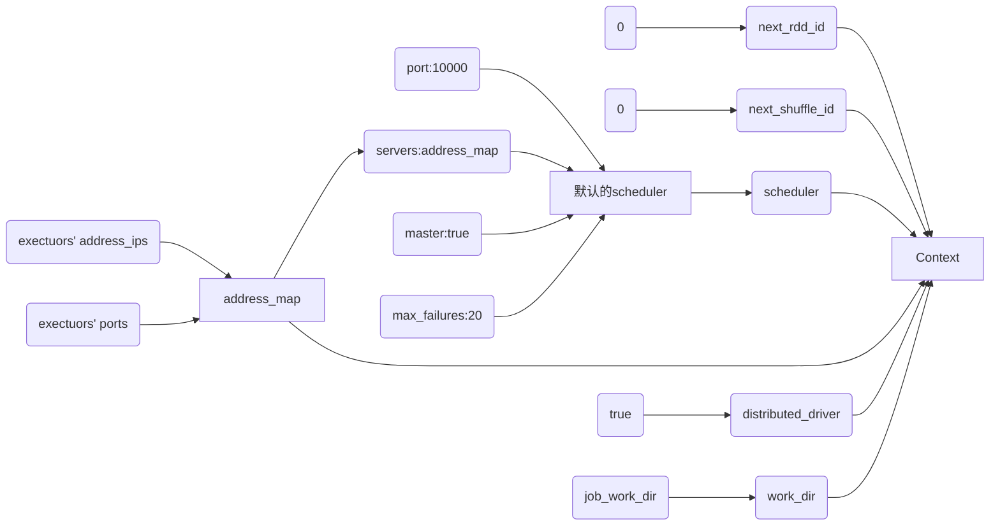
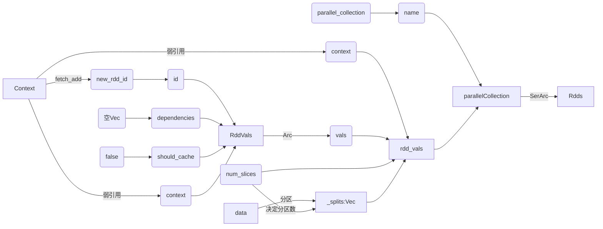
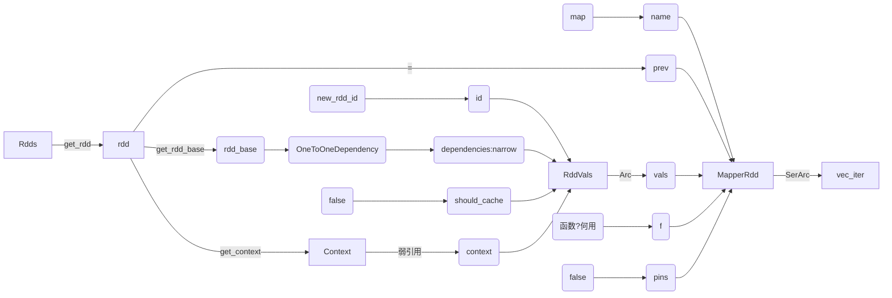
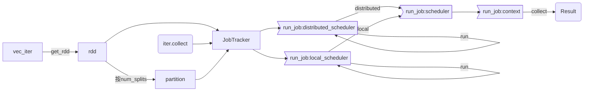

## RUNNING PROCESS Sketch
### Context 建立(master)

```mermaid
graph LR
A(next_rdd_id)
B(next_shuffle_id)
C(scheduler)
D[address_map]
E(distributed_driver)
F(work_dir)
G[Context]

A-->G
B-->G
C-->G
D-->G
E-->G
F-->G


AA(0)
AA-->A
BB(0)
BB-->B

CC[默认的scheduler]
CC-->C
CC1(port:10000)
CC1-->CC
CC2(servers:address_map)
CC2-->CC
D-->CC2
CC3(master:true)
CC3-->CC
CC4(max_failures:20)
CC4-->CC

D1(exectuors' address_ips)
D2(exectuors' ports)
D1-->D
D2-->D

E1(true)
E1-->E
FF(job_work_dir)
FF-->F
```

### makerdd

```mermaid
graph LR
rdd[Rdds]
A[parallelCollection]
A1(name)
A2[rdd_vals]
AA1(context)
AA2(vals)
AA3(num_slices)
AA4[_splits:Vec]
AA1-->A2
AA2-->A2
AA3-->A2
AA4-->A2
A1-->A
A2-->A
A-->|SerArc|rdd

AAA1[Context]
AAA1-->|弱引用|AA1
AAA[data]
AAA-->|分区|AA4
AA3-->|决定分区数|AA4

B[RddVals]
B-->|Arc|AA2
B1(id)
B2(dependencies)
B3(should_cache)
B4(context)

AAA1-->|弱引用|B4
B1-->B
B2-->B
B3-->B
B4-->B

BB3(false)
BB3-->B3
BB2(空Vec)
BB2-->B2
BB1(new_rdd_id)
BB1-->B1

AAA1-->|fetch_add|BB1

C("parallel_collection")
C-->A1

```

### map

```mermaid
graph LR
rdd[Rdds]
vec[vec_iter]

A[MapperRdd]
A-->|SerArc|vec

A1(name)
A2(prev)
A3(vals)
A4(f)
A5(pins)
A1-->A
A2-->A
A3-->A
A4-->A
A5-->A

AA1("map")
AA1-->A1
AA4(函数?何用)
AA4-->A4
AA5(false)
AA5-->A5

B[RddVals]
B-->|Arc|A3
B1(id)
B2(dependencies:narrow)
B3(should_cache)
B4(context)

BBB[rdd]
rdd-->|get_rdd|BBB
BBB-->|=|A2
BBB-->|get_context|BB
BB[Context]
BB-->|弱引用|B4
B1-->B
B2-->B
B3-->B
B4-->B

BB3(false)
BB3-->B3
BB1(new_rdd_id)
BB1-->B1

C(OneToOneDependency)
CC(rdd_base)
CC-->C
C-->B2
BBB-->|get_rdd_base|CC
```

### collection

```mermaid
graph LR
vec[vec_iter]
rdd[rdd]
vec-->|get_rdd|rdd
fun(iter.collect)
res(Result)

A>run_job:context]
B>run_job:scheduler]
C1>run_job:distributed_scheduler]
C2>run_job:local_scheduler]
A-->|collect|res
B-->A
C1-->|distributed|B
C2-->|local|B

C[JobTracker]
rdd-->C
fun-->C
par[partition]
rdd-->|按num_splits|par
par-->C
C-->C1
C-->C2

C1-->|run|C1
C2-->|run|C2
```
